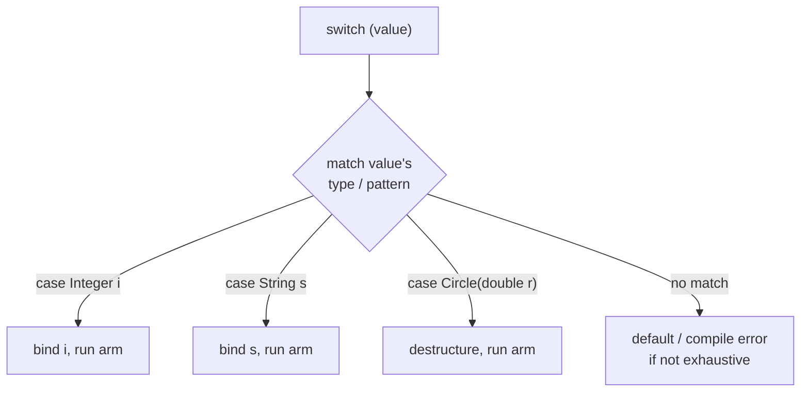

# Chapter 2: Control Flow & Loops

**Control flow** is what turns a straight-line list of statements into a program that makes decisions and repeats work. By default a Java program executes top-to-bottom, one statement after another; control-flow constructs let you alter that order based on data. There are two broad families:

- **Selection** (`if`/`else`, `switch`, the ternary `?:`) — choose *which* code runs.
- **Iteration** (`for`, `while`, `do-while`, enhanced `for`) — choose *how many times* code runs.

Two ideas underpin all of them. First, every condition must be a **`boolean`** expression. Unlike C++, Java does **not** contextually convert numbers or references to `boolean` — `if (5)` or `if (ptr)` is a compile error; you must write `if (n != 0)` or `if (ref != null)`. Second, a **block** `{ ... }` groups statements and introduces a scope; variables declared inside a block are gone when the block ends. Always brace your conditionals and loops even when the body is a single line — it prevents a whole class of bugs when the body later grows.

> **C++ contrast:** The single biggest difference in this chapter is that Java conditions must be `boolean`. There is no truthiness; `0`, `null`, and empty are not "false." This eliminates the classic `if (x = 5)` assignment-instead-of-comparison bug — `x = 5` yields an `int`, not a `boolean`, so it won't compile in a condition.

---

## 2.1 If-Else Statements

The `if` statement evaluates a `boolean` condition and runs its block only when the condition is `true`. Adding `else` provides an alternative block, and chaining `else if` lets you test mutually exclusive conditions — the first one that is `true` wins, and the rest are skipped. Order your conditions from most specific to most general, because once a branch matches, evaluation stops.

### Basic If Statement
```java
public class IfDemo {
    public static void main(String[] args) {
        int age = 20;

        if (age >= 18) {
            System.out.println("You are an adult");
        }
    }
}
```

### If-Else Statement
```java
if (condition) {
    // executed if condition is true
} else {
    // executed if condition is false
}

// Example
int score = 75;

if (score >= 90) {
    System.out.println("Grade: A");
} else if (score >= 80) {
    System.out.println("Grade: B");
} else if (score >= 70) {
    System.out.println("Grade: C");
} else if (score >= 60) {
    System.out.println("Grade: D");
} else {
    System.out.println("Grade: F");
}
```

### Nested If Statements

An `if` placed inside another lets you test a second condition only after the first has passed. Nesting more than two or three levels deep quickly becomes hard to read; consider combining conditions with `&&`, returning early, or extracting a helper method.

```java
int age = 25;
int income = 50000;

if (age >= 18) {
    if (income >= 40000) {
        System.out.println("Eligible for loan");
    } else {
        System.out.println("Income too low");
    }
} else {
    System.out.println("Too young");
}
```

### Ternary Operator

The ternary (conditional) operator `?:` is Java's only three-operand operator. It is an **expression**, not a statement, so it produces a value you can assign or pass directly — ideal for picking between two values in a single line. Prefer it over a full `if`/`else` only when both branches are short and side-effect-free; nesting ternaries is legal but should be used sparingly.

```java
int x = 10, y = 20;
int max = (x > y) ? x : y;   // max = 20

// Can be nested but use sparingly
String result = (x > y) ? "x is larger"
              : (x < y) ? "y is larger"
              : "equal";
```

> **C++ contrast:** Identical syntax and semantics. The only behavioral difference is that the condition must be `boolean`.

---

## 2.2 Switch Statement

A `switch` compares a single expression against a list of constant `case` labels and jumps to the match. Traditional Java `switch` works on `byte`, `short`, `int`, `char`, their wrappers, **`enum`** constants, and — crucially, unlike C++ — **`String`** (since Java 7). Compilers can implement it as an efficient jump table or hash lookup. The traditional (statement) form has the same two rules as C++: each `case` **falls through** to the next unless ended with `break`, and an optional `default` catches unmatched values.

### Basic Switch (statement form, with `break`)
```java
int day = 3;
String dayName;

switch (day) {
    case 1:
        dayName = "Monday";
        break;
    case 2:
        dayName = "Tuesday";
        break;
    case 3:
        dayName = "Wednesday";
        break;
    case 4:
        dayName = "Thursday";
        break;
    case 5:
        dayName = "Friday";
        break;
    case 6:
        dayName = "Saturday";
        break;
    case 7:
        dayName = "Sunday";
        break;
    default:
        dayName = "Invalid day";
}

System.out.println(dayName);   // Wednesday
```

### Switch on `String`
```java
String command = "start";
switch (command) {
    case "start": startEngine(); break;
    case "stop":  stopEngine();  break;
    default:      System.out.println("Unknown command");
}
```

> **C++ contrast:** A C++ `switch` accepts only *integral* types — you cannot `switch` on a `std::string`. Java relaxes this to allow `String` and `enum`, removing the need for long `if/else` chains on strings.

### Switch with Fall-Through

**Fall-through** — execution continuing into the next case when `break` is omitted — is usually a bug, but stacking several `case` labels with no code between them lets multiple values share one block. Use it deliberately and comment it.

```java
char grade = 'B';
int points = 0;

switch (grade) {
    case 'A':
    case 'B':
        points = 10;   // both A and B get 10
        break;
    case 'C':
        points = 5;
        break;
    case 'D':
        points = 2;
        break;
    case 'F':
        points = 0;
        break;
    default:
        System.out.println("Invalid grade");
}
```

---

## 2.3 Switch Expressions & Pattern Matching (Java 14 / 21)

Modern Java upgrades `switch` from a statement into an **expression** that produces a value, using the arrow form `case L -> ...`. The arrow form has **no fall-through** (no `break` needed) and the compiler can enforce **exhaustiveness**. This is a significant improvement over both old Java and C++ `switch`.

### Switch Expression (arrow form)
```java
int day = 3;

String dayName = switch (day) {
    case 1 -> "Monday";
    case 2 -> "Tuesday";
    case 3 -> "Wednesday";
    case 4, 5 -> "Late week";      // multiple labels, comma-separated
    default -> "Other";
};                                  // note: the whole thing is an expression -> semicolon

System.out.println(dayName);        // Wednesday
```

Each arm is a single expression; for multi-statement arms, use a block and `yield` to produce the value:

```java
int score = 85;
String grade = switch (score / 10) {
    case 10, 9 -> "A";
    case 8 -> "B";
    case 7 -> "C";
    default -> {
        System.out.println("low score: " + score);
        yield "F";          // 'yield' returns a value from a block arm
    }
};
```

> **C++ contrast:** C++ has no switch *expression* and no exhaustiveness checking — its `switch` is always a statement with fall-through. The Java arrow form removes the missing-`break` footgun entirely.

### Pattern Matching for `switch` (Java 21)

Java 21 lets `switch` match on the **runtime type** of a value, binding a typed variable in each case. This replaces long `if (x instanceof ...)` chains and is exhaustiveness-checked for sealed hierarchies.

```java
Object obj = 42;

String description = switch (obj) {
    case Integer i  -> "integer: " + i;
    case Long l     -> "long: " + l;
    case String s   -> "string of length " + s.length();
    case int[] arr  -> "int array of size " + arr.length;
    case null       -> "null value";          // Java 21 can match null explicitly
    default         -> "unknown type";
};
```

**Guarded patterns** add a `when` clause for extra conditions:

```java
String classify = switch (obj) {
    case Integer i when i < 0  -> "negative int";
    case Integer i when i == 0 -> "zero";
    case Integer i             -> "positive int";
    default                    -> "not an int";
};
```

**Record patterns** (Java 21) destructure records directly inside the `case`:

```java
sealed interface Shape permits Circle, Rectangle { }
record Circle(double radius) implements Shape { }
record Rectangle(double w, double h) implements Shape { }

double area(Shape shape) {
    return switch (shape) {                    // exhaustive: no default needed (sealed)
        case Circle(double r)        -> Math.PI * r * r;
        case Rectangle(double w, double h) -> w * h;
    };
}
```



> **C++ contrast:** C++ has nothing comparable; the nearest idiom is `std::variant` + `std::visit` with overloaded lambdas, which is far more verbose and not built into the language. Java's pattern-matching `switch` brings ML-style pattern matching into a mainstream imperative language.

---

## 2.4 For Loops

The `for` loop is the workhorse of counted iteration. Its header packs three parts: an **initialization** (run once), a **condition** (checked before each pass — the loop ends when `false`), and an **update** (run after each pass). Any part may be omitted. The loop variable's scope is confined to the loop.

### Traditional For Loop
```java
for (int i = 0; i < 5; i++) {
    System.out.print(i + " ");   // 0 1 2 3 4
}

// Counting down
for (int i = 5; i > 0; i--) {
    System.out.print(i + " ");   // 5 4 3 2 1
}

// Nested loops
for (int i = 1; i <= 3; i++) {
    for (int j = 1; j <= 3; j++) {
        System.out.print(i + "," + j + " ");
    }
    System.out.println();
}
// 1,1 1,2 1,3
// 2,1 2,2 2,3
// 3,1 3,2 3,3
```

### Enhanced For Loop (for-each, Java 5+)

Java's enhanced `for` iterates directly over the elements of any array or any `Iterable` (all the collections). It removes index arithmetic and the off-by-one errors that come with it — the direct analog of C++11's range-based `for`.

```java
import java.util.List;

int[] arr = {10, 20, 30};
for (int val : arr) {
    System.out.print(val + " ");   // 10 20 30
}

List<Integer> list = List.of(1, 2, 3, 4, 5);
for (int num : list) {
    System.out.print(num + " ");   // 1 2 3 4 5
}

// With var (Java 10+), the element type is inferred
for (var num : list) {
    System.out.print(num + " ");
}
```

> **C++ contrast:** The C++ range-`for` lets you choose `auto`, `auto&`, or `const auto&` to control copying and mutability. Java has no such choice because the loop variable is **always a copy of the reference (or the primitive value)**:
> - For **primitives** (`int val : arr`), you get a copy — assigning to `val` does *not* change the array, just like C++ by-value.
> - For **objects**, you get a copy of the *reference*, so you can mutate the pointed-to object but cannot replace the element. To *replace* elements you must use an indexed loop or a list iterator.

```java
// To modify array elements, use an indexed loop (enhanced-for can't reassign):
int[] nums = {1, 2, 3};
for (int i = 0; i < nums.length; i++) {
    nums[i] *= 2;     // {2, 4, 6}
}
```

---

## 2.5 While & Do-While Loops

When you don't know in advance how many iterations are needed, a `while` loop repeats as long as its condition stays `true`, checking *before* each pass. Ideal for reading input until a sentinel, polling until a state changes, or any condition-driven loop. Your responsibility is ensuring the condition eventually becomes `false`.

### While Loop
```java
int i = 0;
while (i < 5) {
    System.out.print(i + " ");
    i++;
}
// 0 1 2 3 4

// Reading input
import java.util.Scanner;
Scanner sc = new Scanner(System.in);
int num = 0;
while (num != -1) {
    System.out.print("Enter number (-1 to quit): ");
    num = sc.nextInt();
    if (num != -1) {
        System.out.println("You entered: " + num);
    }
}
```

### Do-While Loop

The `do-while` loop runs its body **first** and checks the condition **afterward**, guaranteeing the body executes at least once — perfect for prompting for input until it is valid, or driving a menu that should display at least once. Note the required semicolon after `while (...)`.

```java
int i = 0;
do {
    System.out.print(i + " ");
    i++;
} while (i < 5);
// 0 1 2 3 4

// Menu example
Scanner sc = new Scanner(System.in);
int choice = 0;
do {
    System.out.println("\n1. Add\n2. Delete\n3. Exit");
    System.out.print("Choice: ");
    choice = sc.nextInt();

    if (choice == 1) addItem();
    else if (choice == 2) deleteItem();

} while (choice != 3);
```

### While vs Do-While
```java
// While: checks condition first
int i = 10;
while (i < 5) {
    System.out.println(i);   // never executes
}

// Do-While: executes body first
int j = 10;
do {
    System.out.println(j);   // executes once!
} while (j < 5);
```

> **C++ contrast:** Identical to C++ in every respect except the `boolean`-condition requirement.

---

## 2.6 Loop Control

Two keywords alter a loop mid-stream: `break` **terminates** the loop entirely and resumes after it, while `continue` **abandons the current iteration** and jumps to the next condition check (or update, in a `for`). By default both act only on the **innermost** enclosing loop.

### Break Statement
```java
for (int i = 0; i < 10; i++) {
    if (i == 5) {
        break;   // exit when i == 5
    }
    System.out.print(i + " ");
}
// 0 1 2 3 4

// Search example
int[] arr = {1, 2, 3, 4, 5, 6};
boolean found = false;
for (int i = 0; i < arr.length; i++) {
    if (arr[i] == 4) {
        found = true;
        break;   // stop searching
    }
}
```

### Continue Statement

`continue` is the tool for "skip the ones I don't care about." Test for the unwanted case at the top and `continue` past it, keeping the main logic at a single readable indentation level — the "guard clause" style.

```java
for (int i = 0; i < 10; i++) {
    if (i % 2 == 0) {
        continue;   // skip even numbers
    }
    System.out.print(i + " ");
}
// 1 3 5 7 9

// Skip invalid input
Scanner sc = new Scanner(System.in);
while (true) {
    System.out.print("Enter positive number: ");
    int num = sc.nextInt();
    if (num <= 0) {
        System.out.println("Invalid! Try again.");
        continue;
    }
    process(num);
    break;
}
```

### Labeled Break & Continue — escaping nested loops

This is where Java diverges sharply from C++. Because `break`/`continue` affect only the innermost loop, C++ programmers must use a boolean flag or refactor into a function. **Java provides labeled `break` and `continue`**, which let you jump out of (or continue) a specifically *labeled* outer loop directly.

```java
// Labeled break: exit BOTH loops at once
outer:
for (int i = 0; i < 3; i++) {
    for (int j = 0; j < 3; j++) {
        if (i * j > 2) {
            break outer;          // jumps completely out of the outer loop
        }
        System.out.print("(" + i + "," + j + ") ");
    }
}

// Labeled continue: skip to the next iteration of the OUTER loop
search:
for (int i = 0; i < 3; i++) {
    for (int j = 0; j < 3; j++) {
        if (grid[i][j] == 0) {
            continue search;      // abandon this row, move to next i
        }
        process(i, j);
    }
}
```

> **C++ contrast:** The source C++ chapter explicitly notes *"C++ has no labeled `break` (unlike Java)"* and recommends a boolean flag or a `return` from a helper. Java has exactly the labeled construct C++ lacks. A label is just an identifier followed by `:` placed immediately before a loop; `break label;` exits that loop, `continue label;` continues it. Use sparingly — deep nesting is still a code smell — but it is cleaner than the flag workaround.

The flag workaround still works and is occasionally clearer:

```java
boolean done = false;
for (int i = 0; i < 3 && !done; i++) {
    for (int j = 0; j < 3; j++) {
        if (condition(i, j)) {
            done = true;
            break;
        }
    }
}
```

---

## 2.7 Infinite Loops

A loop whose condition never becomes `false` runs forever. Sometimes intentional — event loops in games, servers accepting connections — relying on a deliberate `while (true)` (or `for (;;)`) that runs until told to stop via an internal `break` or `return`. The danger is the *accidental* infinite loop: a missing update, an unreachable condition, or a counter that never crosses its bound. When a program hangs and pins the CPU, suspect an unintended infinite loop first.

### Intentional Infinite Loops
```java
// Event loop (common in games, servers)
while (true) {
    handleEvent();
    render();
}

// Server loop
for (;;) {
    Socket socket = server.accept();
    handleClient(socket);
}

// With break to exit
Scanner sc = new Scanner(System.in);
while (true) {
    System.out.print("Enter command: ");
    String cmd = sc.next();
    if (cmd.equals("quit")) break;
    processCommand(cmd);
}
```

### Accidental Infinite Loops (Avoid!)
```java
// ❌ Forgot to update i
for (int i = 0; i < 10; ) {   // missing i++
    System.out.print(i);
    // loops forever!
}

// ❌ Wrong condition
int i = 0;
while (i >= 0) {
    i++;   // never becomes < 0 (until it overflows and wraps — still a bug)
}

// ✅ Correct
for (int i = 0; i < 10; i++) {
    System.out.print(i);
}
```

---

## 2.8 Best Practices

Control-flow code is read far more often than it is written. Keep the **logic obvious** (favor the simplest construct; prefer the enhanced `for` when just visiting elements; prefer switch *expressions* for value selection), avoid **hidden costs** inside loop bodies (don't build strings by repeated `+`), and lean on **recognizable patterns** (sum, find-max, count, all-match) — many of which have direct Stream API equivalents (covered in [Chapter 11](../11_stl_algorithms/README.md)): `IntStream.sum()`, `stream().max(...)`, `count()`, `allMatch(...)`.

### Readability
```java
// ✅ Clear loop logic
for (int i = 0; i < arr.length; i++) {
    process(arr[i]);
}

// ✅ Enhanced for (simpler when available)
for (int val : arr) {
    process(val);
}

// ✅ Switch expression instead of a chain of if/else for value selection
String label = switch (status) {
    case ACTIVE   -> "running";
    case PAUSED   -> "on hold";
    case STOPPED  -> "done";
};

// ❌ Confusing loop update
for (int i = 0; i < 100; i += (i % 2 == 0) ? 1 : 3) { /* hard to read */ }
```

### Performance
```java
// ❌ Inefficient: String concatenation in a loop creates a new String each time
String result = "";
for (int i = 0; i < 1_000_000; i++) {
    result += i;           // O(n^2) — avoid
}

// ✅ Efficient: StringBuilder
StringBuilder sb = new StringBuilder();
for (int i = 0; i < 1_000_000; i++) {
    sb.append(i);
}
String result2 = sb.toString();

// Note: in Java, list.size() / array.length are O(1) and cheap to call in a
// condition, so caching them (a common C++ habit) is rarely necessary.
```

> **C++ contrast:** The C++ chapter advises caching `vec.size()` because calling it each iteration *can* matter. In Java, `array.length` is a field access and `List.size()` is O(1); caching is usually unnecessary. The `StringBuilder` advice mirrors C++'s `stringstream` recommendation exactly.

### Common Patterns
```java
int[] vec = {4, 1, 9, 2, 7};
int target = 9;

// Sum elements
int sum = 0;
for (int val : vec) sum += val;

// Find maximum
int max = Integer.MIN_VALUE;
for (int val : vec) if (val > max) max = val;

// Count occurrences
int count = 0;
for (int val : vec) if (val == target) count++;

// Check if all meet a condition
boolean allPositive = true;
for (int val : vec) {
    if (val <= 0) { allPositive = false; break; }
}

// Stream equivalents (Chapter 11):
int sum2          = java.util.Arrays.stream(vec).sum();
int max2          = java.util.Arrays.stream(vec).max().orElseThrow();
long count2       = java.util.Arrays.stream(vec).filter(v -> v == target).count();
boolean allPos2   = java.util.Arrays.stream(vec).allMatch(v -> v > 0);
```

---

## Summary

| Construct | Use Case |
|-----------|----------|
| **if-else** | Boolean conditions (must be `boolean`) |
| **switch (statement)** | Discrete `int`/`char`/`enum`/**`String`** matching, with fall-through |
| **switch expression** | Value-producing selection, no fall-through, exhaustiveness (Java 14+) |
| **pattern-matching switch** | Match on type + destructure records, guards (Java 21) |
| **for** | Fixed/counted repetitions |
| **enhanced for** | Iterate arrays/`Iterable` (Java 5+) |
| **while** | Condition-based repetition |
| **do-while** | At least one execution needed |
| **break / continue** | Exit / skip innermost loop |
| **labeled break / continue** | Exit / skip a specific outer loop — Java has this, C++ does not |

---

## Next Steps
- Practice writing conditional logic with `boolean`-only conditions
- Rewrite `if/else` value-selection chains as `switch` expressions
- Try pattern-matching `switch` over a small `sealed` type hierarchy
- Move to [Chapter 3: Functions](../03_functions/README.md)
