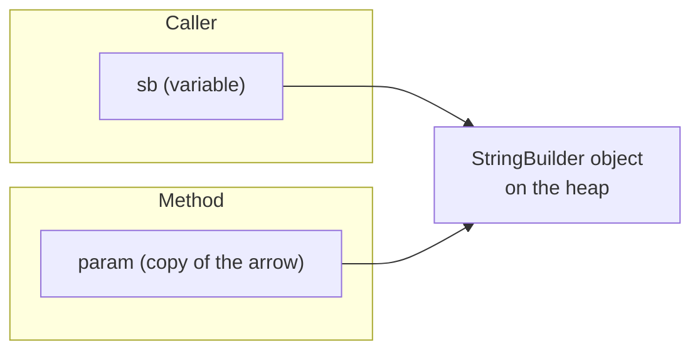

# Chapter 3: Methods

In Java, the named, reusable block of code that C++ calls a *function* is called a **method**, because it always belongs to a class or interface — Java has no free-standing functions. Methods are the primary tool for managing complexity: they let you write logic once and call it from many places, give that logic a meaningful name, and hide its implementation behind a simple interface. Breaking a program into small, single-purpose methods makes it easier to read, test, and change.

Every method has a **signature** — its name plus the number and types of its parameters — and a **return type** describing the value it hands back (or `void` if it returns nothing). Three distinctions will make the rest of this chapter click: a **parameter** (the variable in the method header) versus an **argument** (the actual value passed at the call site); a **`static`** method (belongs to the class) versus an **instance** method (belongs to an object); and — the subtlest point — Java's **pass-by-value** semantics, which apply to references too. This chapter builds from basics up to recursion, lambdas, method references, and modern interface methods.

> **C++ contrast:** Java has no separate declaration/prototype step. There are no header files and no need to declare a method before calling it — the compiler sees the whole class at once, so methods can be defined and called in any order. There are also no free functions: even `main` lives inside a class.

---

## 3.1 Method Basics

### Method Definition

A method is defined inside a class. There is no prototype: definition *is* declaration.

```java
public class Calculator {

    // Method definition (no separate prototype needed)
    static int add(int a, int b) {
        return a + b;
    }

    public static void main(String[] args) {
        int result = add(5, 3);   // result = 8
        System.out.println(result);
    }
}
```

### Method Components
```java
// modifiers returnType methodName(paramType p1, paramType p2) { body }

// Example with no return value
static void printMessage(String message) {
    System.out.println(message);
    // no return needed for void methods
}

// Example with no parameters
static int getRandom() {
    return (int) (Math.random() * 100);
}

// Multiple parameters
static double calculateArea(double length, double width) {
    return length * width;
}
```

> **C++ contrast:** `void` works the same. `Math.random()` replaces `rand()`. The big structural difference is that all of these must sit inside a class, and access modifiers (`public`, `private`, `protected`, or package-private by default) gate visibility — there is no global namespace.

---

## 3.2 Parameters & Argument Passing

This is the most important — and most misunderstood — topic in the chapter. **Java is strictly pass-by-value.** When you call a method, each argument's *value* is copied into the parameter. The subtlety is what "value" means:

- For a **primitive**, the value is the number itself — the method gets a copy and cannot affect the caller's variable.
- For a **reference type**, the value is the **reference** (the arrow pointing at the object), and *that arrow* is copied. The method gets its own arrow pointing at the **same object**. So it *can* mutate the shared object, but it *cannot* make the caller's variable point somewhere else.



### Primitives: caller is never modified
```java
static void increment(int x) {
    x++;   // modifies the local copy only
}

public static void main(String[] args) {
    int num = 5;
    increment(num);
    System.out.println(num);   // still 5
}
```

### References: the object can be mutated, but the variable can't be repointed
```java
static void addItem(List<Integer> list) {
    list.add(99);              // mutates the SHARED object — visible to caller
}

static void reassign(List<Integer> list) {
    list = new ArrayList<>();  // repoints the LOCAL copy only — caller unaffected
    list.add(1000);
}

public static void main(String[] args) {
    List<Integer> data = new ArrayList<>(List.of(1, 2, 3));

    addItem(data);
    System.out.println(data);   // [1, 2, 3, 99]  -- object was mutated

    reassign(data);
    System.out.println(data);   // [1, 2, 3, 99]  -- still the same list!
}
```

> **C++ contrast — read carefully.** C++ offers three mechanisms; Java has only the first, applied uniformly:
> - **Pass by value** (`int x`): C++ copies the value. Java does the same for primitives.
> - **Pass by reference** (`int& x`, `vector<int>& v`): C++ binds the parameter to the caller's *actual variable*, so the function can both mutate the object **and reassign the caller's variable**. **Java has no equivalent.** A Java method can mutate a shared object but can *never* reassign the caller's variable. This is why the saying "Java passes object references by value" is precise: the reference is copied.
> - **Pass by const reference** (`const T&`): C++'s efficient read-only passing. Java has no `const`, so you cannot make a parameter read-only at the language level. To pass an immutable view you pass an immutable type (e.g. `List.copyOf(...)`, a `record`, or `String`).

### There are no output parameters, no default arguments

C++'s "return multiple values via reference parameters" and "default argument values" idioms do not exist in Java. Use these idioms instead:

```java
// ❌ No C++-style out parameters. Instead return an object/record:
record DivResult(int quotient, int remainder) { }

static DivResult divide(int dividend, int divisor) {
    return new DivResult(dividend / divisor, dividend % divisor);
}

var r = divide(17, 5);
System.out.println(r.quotient() + " " + r.remainder());   // 3 2

// ❌ No default arguments. Instead use method OVERLOADING:
static void greet(String name, String greeting) {
    System.out.println(greeting + ", " + name + "!");
}
static void greet(String name) { greet(name, "Hello"); }   // "default" greeting
static void greet()            { greet("Guest"); }         // "default" name

// greet();              -> Hello, Guest!
// greet("Alice");       -> Hello, Alice!
// greet("Bob", "Hi");   -> Hi, Bob!
```

> **C++ contrast:** Java deliberately omits default arguments; the idiomatic replacement is a chain of overloads (or a builder for many optional params). Multiple return values become a small `record` (Java 16+) — cleaner and self-documenting compared to C++ output parameters.

---

## 3.3 Varargs (Variable-Length Argument Lists)

Java's varargs (`Type... name`, Java 5+) let a method accept any number of trailing arguments, which arrive as an array. This is Java's safe, type-checked answer to C's `printf`-style `...`.

```java
static int sum(int... numbers) {     // numbers is an int[]
    int total = 0;
    for (int n : numbers) total += n;
    return total;
}

sum();              // 0
sum(1, 2, 3);       // 6
sum(1, 2, 3, 4, 5); // 15

int[] arr = {10, 20};
sum(arr);           // 30 — an array can be passed directly

// A varargs parameter must be LAST in the parameter list:
static void log(String level, String... messages) { /* ... */ }
```

> **C++ contrast:** Far safer than C-style `va_list`/`...`, and closer in spirit to C++ variadic templates (`template<typename... Args>`) — but varargs are runtime arrays of a single type, not compile-time-expanded parameter packs, so they are simpler and less powerful.

---

## 3.4 Method Overloading

**Overloading** lets several methods share a name as long as their parameter lists differ in number or type. The compiler performs *overload resolution* at compile time, picking the best match from the arguments. The crucial constraint matches C++: overloads must differ in their **parameters** — the **return type alone is not enough**, because the compiler chooses the overload from the call's arguments, not from what you do with the result.

```java
// Version 1: two ints
static int add(int a, int b) { return a + b; }

// Version 2: two doubles
static double add(double a, double b) { return a + b; }

// Version 3: three ints
static int add(int a, int b, int c) { return a + b + c; }

public static void main(String[] args) {
    System.out.println(add(5, 3));      // version 1 -> 8
    System.out.println(add(5.5, 3.2));  // version 2 -> 8.7
    System.out.println(add(5, 3, 2));   // version 3 -> 10
}
```

### Overloading Rules
```java
// ✅ Different parameter count
static void process(int x) { }
static void process(int x, int y) { }

// ✅ Different parameter types
static void process(double x) { }

// ❌ Return type alone is NOT enough — won't compile:
// static int    getValue() { ... }
// static double getValue() { ... }   // ERROR: clash
```

A subtle interaction: with autoboxing and varargs, the compiler prefers (1) an exact/widening primitive match, then (2) a boxing match, then (3) a varargs match. When overloads are ambiguous, an explicit cast disambiguates.

> **C++ contrast:** Conceptually identical to C++ overload resolution, including "return type doesn't count." Note Java has **no operator overloading** (covered, by its absence, in Chapter 8) — `+` works for `String` and numerics only, and you cannot define `operator+` for your own type.

---

## 3.5 `static` vs Instance Methods

A **`static`** method belongs to the class itself and is called as `ClassName.method()`. It cannot use `this` or touch instance fields. An **instance** method belongs to an object, is called as `object.method()`, and operates on that object's fields via the implicit `this`.

```java
public class BankAccount {
    private double balance;                 // instance field

    static double interestRate = 0.05;      // static field (shared by all)

    // instance method: operates on THIS account's balance
    void deposit(double amount) {
        this.balance += amount;
    }

    double getBalance() { return balance; }

    // static method: utility, no object needed
    static double applyInterest(double principal) {
        return principal * (1 + interestRate);
    }

    public static void main(String[] args) {
        BankAccount acc = new BankAccount();
        acc.deposit(100);                   // instance call
        System.out.println(acc.getBalance());

        double total = BankAccount.applyInterest(1000);  // static call
        System.out.println(total);
    }
}
```

> **C++ contrast:** Java `static` methods ≈ C++ `static` member functions or free functions in a namespace. Java instance methods ≈ C++ non-static member functions, with `this` being a *reference* in spirit (never null inside a normal call) rather than a pointer. There is no `inline` keyword — the JIT compiler decides inlining at runtime based on profiling, far more aggressively and accurately than a static `inline` hint could. (The C++ chapter's section on `inline` therefore has no Java counterpart: you simply don't think about it.)

---

## 3.6 Recursion

**Recursion** is when a method calls itself to solve a problem by reducing it to smaller instances. Every recursive method needs **base case(s)** that stop the recursion by returning directly, and a **recursive case** that does a little work and calls itself on a smaller input, moving toward a base case. Recursion shines on self-similar structures — factorials, tree traversals, divide-and-conquer. The trade-off is the **call stack**: each pending call consumes stack space, so unbounded recursion throws `StackOverflowError`, and naive recursion can repeat work exponentially (as Fibonacci shows), which **memoization** fixes by caching results.

### Simple Recursion
```java
static long factorial(int n) {
    if (n <= 1) return 1;            // base case
    return n * factorial(n - 1);     // recursive case
}

factorial(5);   // 120
```

### Call Stack

Each recursive call is suspended until the calls it makes return, so partially-finished calls stack up. The diagram traces `factorial(3)` unwinding — calls descend to the base case, then resolve back up, each multiplying its result by the value returned from beneath it.

```text
factorial(3)
├─ 3 * factorial(2)
│  ├─ 2 * factorial(1)
│  │  ├─ return 1
│  │  └─ return 2 * 1 = 2
│  └─ return 3 * 2 = 6
└─ return 6
```

### More Complex Recursion
```java
// Fibonacci: 1, 1, 2, 3, 5, 8, 13, ...
static int fibonacci(int n) {
    if (n <= 2) return 1;
    return fibonacci(n - 1) + fibonacci(n - 2);
}

// Binary search
static int binarySearch(int[] arr, int target, int left, int right) {
    if (left > right) return -1;          // not found
    int mid = left + (right - left) / 2;  // avoids overflow
    if (arr[mid] == target)      return mid;
    else if (arr[mid] < target)  return binarySearch(arr, target, mid + 1, right);
    else                         return binarySearch(arr, target, left, mid - 1);
}

// Tree traversal (pre-order). Node is a reference type; null is the empty case.
static void traverseTree(Node node) {
    if (node == null) return;
    System.out.print(node.value + " ");   // process
    traverseTree(node.left);              // left
    traverseTree(node.right);             // right
}
```

> **C++ contrast:** `nullptr` becomes `null`; `node->left` becomes `node.left` (Java has one access operator, `.`, for references). Stack overflow throws a catchable `StackOverflowError` rather than crashing with undefined behavior. Note: **Java does not guarantee tail-call optimization**, so deep linear recursion that C++ might optimize into a loop can still overflow in Java — convert to an explicit loop when depth is large.

### Recursion Considerations & Memoization
```java
// ❌ No base case -> StackOverflowError
static void bad() { bad(); }

// ✅ Always have a base case
static void good(int n) {
    if (n <= 0) return;
    System.out.print(n + " ");
    good(n - 1);
}

// ✅ Memoization with a Map (or an array)
static Map<Integer, Long> memo = new HashMap<>();
static long fibMemo(int n) {
    if (n <= 2) return 1;
    if (memo.containsKey(n)) return memo.get(n);   // cached
    long result = fibMemo(n - 1) + fibMemo(n - 2);
    memo.put(n, result);
    return result;
}
// computeIfAbsent is the idiomatic one-liner, but recursion inside it is awkward,
// so the explicit containsKey/put form above is clearest here.
```

---

## 3.7 Method References to Functions: Functional Interfaces

C++ uses **function pointers** (`int (*fp)(int,int)`) and `std::function` to treat behavior as data. Java has no raw function pointers and no `std::function`; instead, *any* "function value" is an object implementing a **functional interface** — an interface with exactly one abstract method. The `java.util.function` package provides ready-made ones (`Function<T,R>`, `BiFunction`, `Predicate<T>`, `Consumer<T>`, `Supplier<T>`, `IntBinaryOperator`, ...).

```java
import java.util.function.IntBinaryOperator;

static int add(int a, int b)      { return a + b; }
static int multiply(int a, int b) { return a * b; }

public static void main(String[] args) {
    // Hold a "function" in a variable via a method reference:
    IntBinaryOperator op = Calc::add;     // points at the add method
    int result = op.applyAsInt(5, 3);     // 8
    System.out.println(result);

    op = Calc::multiply;                  // switch to a different method
    System.out.println(op.applyAsInt(5, 3));  // 15

    // Pass behavior as an argument (callback):
    execute(Calc::add, 10, 20);           // 30
    execute(Calc::multiply, 10, 20);      // 200
}

static void execute(IntBinaryOperator operation, int x, int y) {
    System.out.println(operation.applyAsInt(x, y));
}
```

> **C++ contrast:** `IntBinaryOperator` (or `BiFunction<Integer,Integer,Integer>`) plays the role of `std::function<int(int,int)>`; a **method reference** `Calc::add` plays the role of `&add`. The dense C++ syntax `int (*fp)(int,int)` and the `typedef`/`using` aliases for it are simply unnecessary — you name the functional interface instead. There is no calling-through-a-pointer (`(*func)(...)`); you invoke the interface's single method.

---

## 3.8 Lambdas (Java 8+)

A **lambda** is an anonymous function written inline, implementing a functional interface — perfect for short, one-off callbacks passed to Stream/collection operations. Its anatomy is `(parameters) -> expressionOrBlock`. Java lambdas, like C++ lambdas, can use variables from the enclosing scope, but the **capture rules differ sharply**.

```java
import java.util.function.*;

// (parameters) -> body
BiFunction<Integer, Integer, Integer> add = (a, b) -> a + b;
int result = add.apply(5, 3);   // 8

// Block body with explicit return
Function<String, String> greet = name -> {
    return "Hello, " + name;
};

// Capturing a variable from the enclosing scope
int multiplier = 3;
IntUnaryOperator times = x -> x * multiplier;   // captures 'multiplier'
System.out.println(times.applyAsInt(5));        // 15

// With a collection operation (sort descending)
List<Integer> v = new ArrayList<>(List.of(1, 2, 3, 4, 5));
v.sort((a, b) -> b - a);        // or (a,b) -> Integer.compare(b, a)
System.out.println(v);          // [5, 4, 3, 2, 1]
```

### Capture semantics: the big difference from C++

Java lambdas capture **by value only**, and captured local variables must be **effectively final** (assigned once, never reassigned). There is no `[&]`/`[=]`/`[x]` choice — Java always copies, and you cannot mutate a captured *local*. To accumulate state, capture a reference to a mutable object (array, list, `AtomicInteger`) and mutate *through* it.

```java
// ❌ Cannot reassign a captured local — won't compile:
int counter = 0;
// Runnable bad = () -> counter++;   // ERROR: must be effectively final

// ✅ Capture a mutable holder and mutate the object it points to:
int[] counter2 = {0};
Runnable inc = () -> counter2[0]++;   // captures the array reference (by value),
inc.run();                            // but mutates the shared array object
System.out.println(counter2[0]);      // 1

// AtomicInteger is the clean idiom for this:
var count = new java.util.concurrent.atomic.AtomicInteger();
Runnable inc2 = count::incrementAndGet;
inc2.run();
System.out.println(count.get());      // 1
```

> **C++ contrast:** This is one of the deepest differences. C++ lets you choose `[x]` (copy), `[&x]` (reference — can read and modify the original local), and the catch-alls `[=]`/`[&]`. **Java offers none of these knobs**: capture is always by value, captured locals must be effectively final, and a dangling-reference capture (a notorious C++ bug) is *impossible* because the garbage collector keeps captured objects alive. The trade-off is that mutating outer state requires an explicit mutable holder.

---

## 3.9 Method References (Java 8+)

A **method reference** (`::`) is shorthand for a lambda that just calls an existing method. There are four forms, all interchangeable with the equivalent lambda.

```java
import java.util.function.*;

// 1) Static method:           ClassName::staticMethod
Function<String, Integer> parse = Integer::parseInt;       // s -> Integer.parseInt(s)

// 2) Instance method of a particular object:  obj::method
String prefix = "Log: ";
Supplier<Integer> len = prefix::length;                    // () -> prefix.length()

// 3) Instance method of an arbitrary object of a type:  ClassName::method
Function<String, String> upper = String::toUpperCase;      // s -> s.toUpperCase()

// 4) Constructor reference:    ClassName::new
Supplier<ArrayList<Integer>> maker = ArrayList::new;       // () -> new ArrayList<>()

System.out.println(parse.apply("42"));      // 42
System.out.println(upper.apply("hi"));      // HI
```

> **C++ contrast:** There is no direct C++ analog; method references are pure Java sugar over functional interfaces, roughly serving the role C++ would fill with `&func`, a lambda forwarding to a member, or `std::bind(&Class::method, obj)`.

---

## 3.10 Modern Interface Methods: `default`, `static`, `private`

Java interfaces evolved well beyond pure abstract contracts. These features let you add behavior to interfaces without breaking implementers — there is no C++ equivalent because C++ uses abstract base classes and multiple inheritance instead.

### `default` methods (Java 8+)

A `default` method provides a body inside an interface. Existing implementers inherit it automatically, so a library can grow an interface without breaking older code.

```java
interface Greeter {
    String name();

    default String greet() {                 // has a body; optional to override
        return "Hello, " + name();
    }
}

class Person implements Greeter {
    private final String n;
    Person(String n) { this.n = n; }
    public String name() { return n; }
    // inherits greet() automatically
}

System.out.println(new Person("Alice").greet());   // Hello, Alice
```

### `static` interface methods (Java 8+)

Utility methods that belong to the interface itself, called as `Interface.method()`. Great for factory methods.

```java
interface Shape {
    double area();
    static Shape unitSquare() {              // factory, called as Shape.unitSquare()
        return () -> 1.0;                    // lambda implements the single method
    }
}
System.out.println(Shape.unitSquare().area());   // 1.0
```

### `private` interface methods (Java 9+)

Helper methods that share code between `default` methods without exposing it to implementers.

```java
interface Validator {
    boolean isValid(String s);

    default boolean isValidTrimmed(String s) {
        return check(s.strip());             // calls the private helper
    }
    private boolean check(String s) {        // hidden helper, Java 9+
        return s != null && !s.isEmpty();
    }
}
```

> **C++ contrast:** C++ achieves shared interface behavior through abstract base classes with implemented (non-pure-virtual) methods and multiple inheritance. Java forbids state in interfaces (no fields beyond constants) but allows behavior via `default`/`static`/`private` methods, sidestepping the "diamond problem" complexity that plagues C++ multiple inheritance (resolved in Java by an explicit override rule when two interfaces supply the same default).

---

## 3.11 Best Practices

Good methods are small, focused, and predictable. Give each method a **single responsibility** so its name fully describes what it does; prefer **immutable parameters and return types** (records, `List.copyOf`) since Java lacks `const`; and make **error behavior** explicit — return an `Optional<T>` for "maybe absent," throw an exception for genuine errors (Chapter 13), and document any side effects.

```java
// ✅ Single Responsibility
static int calculateSum(List<Integer> v) {
    int sum = 0;
    for (int val : v) sum += val;
    return sum;
}

// ✅ Document side effects; prefer returning new values over mutating arguments
static List<Integer> withoutNegatives(List<Integer> v) {
    return v.stream().filter(x -> x >= 0).toList();   // returns a new list
}

// ✅ Use Optional for "maybe no result" instead of magic values like -1
static Optional<Integer> firstEven(List<Integer> v) {
    return v.stream().filter(x -> x % 2 == 0).findFirst();
}

// ✅ Overloads instead of default arguments; records instead of out-parameters
record MinMax(int min, int max) { }
static MinMax minMax(int[] a) {
    int min = Integer.MAX_VALUE, max = Integer.MIN_VALUE;
    for (int x : a) { min = Math.min(min, x); max = Math.max(max, x); }
    return new MinMax(min, max);
}
```

> **C++ contrast:** The C++ chapter recommends `const` references and signaling errors via a `bool` + output parameter. Java's idioms are `Optional<T>` (for absence), exceptions (for errors), and returning fresh immutable values (for "don't mutate my input") — because there is no `const` to lean on. C++11's `constexpr` and `noexcept` function modifiers have **no Java equivalent**: there is no compile-time function evaluation and no checked no-throw guarantee (Java's checked-exception system documents *what* a method may throw via `throws`, a different mechanism covered in Chapter 13).

---

## Summary

| Concept | Details |
|---------|---------|
| **Method (not function)** | Always belongs to a class; no prototypes, no headers |
| **Pass-by-value (always)** | Primitives copy the value; references copy the arrow (object shared, variable not repointable) |
| **No pass-by-reference** | Cannot reassign caller's variable; mutate shared objects instead |
| **No default args** | Use overloading; multiple returns → a `record` |
| **Varargs** | `Type...` — safe variable-length args (Java 5+) |
| **Overloading** | Same name, different params; return type alone insufficient |
| **`static` vs instance** | Class-level vs object-level; no `inline` (JIT decides) |
| **Recursion** | Base + recursive case; no guaranteed TCO; `StackOverflowError` |
| **Functional interfaces** | Replace function pointers / `std::function` |
| **Lambdas** | `(p) -> body`; capture by value only, effectively-final locals |
| **Method references** | `Class::method`, `obj::method`, `Class::new` (Java 8+) |
| **`default`/`static`/`private` interface methods** | Behavior in interfaces (Java 8/9+) |

**No Java equivalent:** function pointers, `std::function`/`std::bind`, pass-by-reference, default arguments, `const` parameters, `inline`, `constexpr`, `noexcept`, capture-by-reference lambdas, operator overloading.

---

## Next Steps
- Write methods, then refactor a default-argument-style API into overloads
- Practice the pass-by-value distinction: mutate a list vs. try to reassign it inside a method
- Use lambdas and method references with `List.sort`, `stream().map`, and `filter`
- Move to [Chapter 4: References (and the absence of pointers)](../04_pointers_references/README.md)
