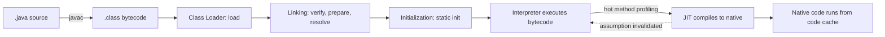
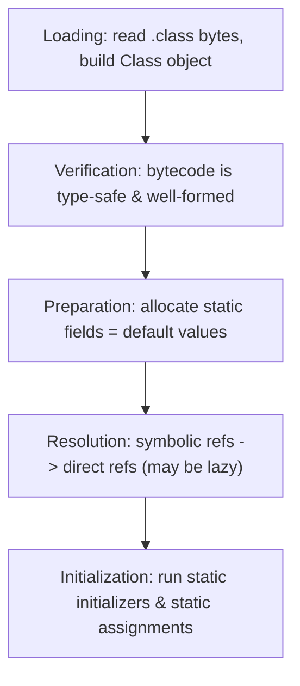

# Chapter 19: JVM Internals -- Java

## What This Chapter Covers

The **Java Virtual Machine (JVM)** is the abstract computing machine that runs
every Java program. Earlier chapters used it implicitly — Chapter 1 mentioned
that `javac` produces bytecode, Chapter 12 described the garbage-collected heap,
and Chapter 18 described the Java Memory Model. This chapter pulls those threads
together and explains, end to end, **what actually happens between `javac` and a
running program**:

- The compile → load → verify → interpret → JIT-compile pipeline
- The `.class` file format and Java **bytecode** (a stack-based instruction set)
- The **class-loading subsystem** (loading, linking, initialization, class loaders)
- The JVM **runtime data areas** (heap, metaspace, stacks, PC register, code cache)
- The **execution engine**: the interpreter and the **HotSpot JIT** (C1/C2, tiered compilation)
- JVM **tooling** (`javap`, `jcmd`, `jstat`, `jmap`, `jstack`, JFR) and **flags**
- Ahead-of-time options: **Class Data Sharing** and **GraalVM native image**

> **Why this matters even if you never tune a JVM:** understanding bytecode,
> class loading, and the JIT explains many real-world behaviors — why the first
> few runs of a method are slow ("warmup"), why `static` initializers run when
> they do, why `NoClassDefFoundError` differs from `ClassNotFoundException`, why
> reflection is slower, and why microbenchmarks lie unless you defeat the JIT.

> **C++ contrast:** A C++ compiler emits **native machine code** ahead of time;
> there is no runtime VM, no class loading, and no JIT. Java instead compiles to
> a **portable bytecode** that the JVM loads lazily, verifies for safety, and
> compiles to native code *at runtime* based on observed behavior. "Write once,
> run anywhere" is a property of this bytecode + VM design.

---

## 19.1 JDK vs JRE vs JVM

These three terms are often confused. They are nested:

```
┌─────────────────────────────────────────────────────────┐
│ JDK  (Java Development Kit)                               │
│   javac, javap, jar, jlink, jcmd, jstat, jfr, jshell ...  │
│  ┌─────────────────────────────────────────────────────┐ │
│  │ JRE  (Java Runtime Environment)                      │ │
│  │   Class libraries (java.base, java.sql, ...)         │ │
│  │  ┌────────────────────────────────────────────────┐  │ │
│  │  │ JVM (the virtual machine: loader, GC, JIT, ...) │  │ │
│  │  └────────────────────────────────────────────────┘  │ │
│  └─────────────────────────────────────────────────────┘ │
└───────────────────────────────────────────────────────────┘
```

- **JVM** — the engine that loads classes, executes bytecode, manages memory.
  It is a **specification** (the *Java Virtual Machine Specification*); HotSpot
  (in OpenJDK) is the dominant **implementation**. Others: Eclipse OpenJ9, GraalVM.
- **JRE** — JVM **plus** the standard class libraries needed to *run* programs.
  (Since Java 11 there is no separate downloadable JRE; you ship a runtime image
  built with `jlink` instead.)
- **JDK** — JRE **plus** development tools (`javac`, `javap`, `jar`, profilers).

> The JVM is **language-agnostic**. Anything that emits valid `.class` bytecode
> runs on it: Kotlin, Scala, Clojure, Groovy, and JVM-targeting compilers.

---

## 19.2 The Execution Pipeline: From Source to Native Code



1. **Compile** — `javac` translates `.java` to `.class` files of **bytecode**.
   This is a *light* compile: no machine code, mostly syntax/type checking and a
   straightforward lowering to bytecode (very few optimizations).
2. **Load** — when a class is first needed, a **class loader** reads its `.class`
   bytes and creates a `Class` object in the method area.
3. **Link** — **verify** (bytecode safety), **prepare** (allocate statics with
   defaults), **resolve** (symbolic references → direct references).
4. **Initialize** — run static initializers and static field assignments.
5. **Execute** — the **interpreter** runs bytecode immediately. Meanwhile the JVM
   **profiles** which methods/loops are "hot."
6. **JIT-compile** — hot methods are compiled to optimized **native code** and
   cached. If a speculative assumption later proves false, the method is
   **deoptimized** back to the interpreter.

> The key idea: Java is **both** interpreted **and** compiled. Startup uses the
> interpreter (fast to start, slow to run); steady state uses JIT-compiled native
> code (slow to "warm up," fast to run).

---

## 19.3 Bytecode and the `.class` File

`javac` produces a `.class` file with a strict, well-documented binary layout:

```
ClassFile {
    u4             magic;            // 0xCAFEBABE
    u2             minor_version;
    u2             major_version;    // e.g. 65 = Java 21
    u2             constant_pool_count;
    cp_info        constant_pool[];  // strings, class/method/field refs, constants
    u2             access_flags;     // public, final, abstract, interface...
    u2             this_class; u2 super_class;
    u2             interfaces[]; field_info fields[]; method_info methods[];
    attribute_info attributes[];     // Code, LineNumberTable, etc.
}
```

The **constant pool** is a per-class symbol table: every class name, method
signature, field reference, and literal is stored once and referenced by index.

Bytecode itself is a **stack-based** instruction set (unlike register-based x86):
operands are pushed onto an **operand stack**, instructions consume them, and
results are pushed back.

### Reading bytecode with `javap`

Given this method:

```java
// Adder.java
public class Adder {
    public int add(int a, int b) {
        return a + b;
    }
}
```

Compile and disassemble:

```bash
javac Adder.java
javap -c -p -v Adder.class      # -c = code, -p = private too, -v = verbose
```

The `add` method disassembles to roughly:

```
public int add(int, int);
  Code:
     0: iload_1        // push local var 1 (a) onto the operand stack
     1: iload_2        // push local var 2 (b)
     2: iadd           // pop two ints, push their sum
     3: ireturn        // pop int, return it
```

Notes:
- `iload_1`/`iload_2`: local variable slot 1 and 2 (slot 0 is `this` for instance
  methods). `i` = int; there are typed variants (`aload` for references, `dload`
  for double, etc.).
- `iadd`: integer add — operates purely on the operand stack.
- `ireturn`: return an int.

> **Common opcode families:** `*load`/`*store` (locals ↔ stack), `*const`/`bipush`/
> `ldc` (push constants), arithmetic (`iadd`, `imul`, `ddiv`…), `if*`/`goto`
> (branches), `invokevirtual`/`invokestatic`/`invokespecial`/`invokeinterface`/
> `invokedynamic` (method calls), `new`/`getfield`/`putfield` (objects), `athrow`,
> `checkcast`, `instanceof`.

### `invokedynamic` — how lambdas and string concatenation work

Lambdas (Chapter 3/15) do **not** compile to anonymous inner classes. They use
the `invokedynamic` instruction, which defers "how to create this function
object" to a **bootstrap method** (`LambdaMetafactory`) called once at the first
execution, then linked. Modern string concatenation (`"a" + x`) similarly uses
`invokedynamic` with `StringConcatFactory` instead of `StringBuilder` chains.

> **C++ contrast:** there is no equivalent of a portable, verifiable instruction
> set you can inspect after the fact; C++ goes straight to machine code, and
> `objdump` shows target-specific assembly, not a portable ISA.

---

## 19.4 The Class-Loading Subsystem

A class moves through three phases the first time it is actively used.



### 19.4.1 Loading

A **class loader** locates the `.class` bytes (from the module path, classpath,
a JAR, or even generated in memory) and defines a `Class<?>` in the method area.
A class is identified by **(fully-qualified name + defining class loader)** — the
same bytes loaded by two different loaders are two **distinct** runtime types.

### 19.4.2 Linking: Verify, Prepare, Resolve

- **Verify** — the **bytecode verifier** proves the code cannot violate JVM safety
  (no stack overflow/underflow, types match, no jumping into the middle of an
  instruction, `final` not overridden). This is why you cannot "segfault" the JVM
  with ordinary bytecode. (Skippable with `-Xverify:none`/`-noverify` — *deprecated
  and unsafe*; never do this in production.)
- **Prepare** — static fields get **default** values (`0`, `false`, `null`) — *not*
  their initializers yet.
- **Resolve** — symbolic references in the constant pool (e.g. "the method
  `println` of `PrintStream`") are resolved to direct references. May be **lazy**
  (on first use of each reference).

### 19.4.3 Initialization

Static initializers (`static { ... }`) and static field assignments run **once**,
**lazily**, the first time the class is *actively* used, and in a **thread-safe**
way guaranteed by the JVM.

```java
public class Config {
    static { System.out.println("Config initialized"); }   // runs once, lazily
    static final int MAX = computeMax();                    // runs at init time
    static int computeMax() { return 100; }
}
```

A class is initialized on: first `new`, first access to a static method/field
(non-constant), reflection, or initialization of a subclass. It is **not**
initialized merely by referencing a compile-time constant (`static final`
primitives/Strings are inlined into callers at compile time).

### 19.4.4 The Class-Loader Hierarchy and Parent Delegation

```
Bootstrap ClassLoader   (native; loads java.base — String, Object, ...)
        ▲
Platform ClassLoader    (loads other JDK modules: java.sql, java.xml, ...)
        ▲
Application ClassLoader  (loads YOUR classes from the classpath / module path)
        ▲
(custom ClassLoaders: app servers, plugins, hot-reload frameworks)
```

By default loaders follow **parent-delegation**: before loading a class itself, a
loader asks its parent. This guarantees core classes (`java.lang.String`) are
always loaded by the bootstrap loader and can't be spoofed by your classpath.

```java
ClassLoader appCl = Main.class.getClassLoader();        // application loader
System.out.println(appCl);                              // jdk.internal.loader.ClassLoaders$AppClassLoader
System.out.println(appCl.getParent());                  // PlatformClassLoader
System.out.println(appCl.getParent().getParent());      // null == bootstrap (native)
System.out.println(String.class.getClassLoader());      // null == loaded by bootstrap
```

### 19.4.5 Custom Class Loaders

Frameworks (Tomcat, OSGi, Spring Boot, IDEs, hot-reload tools) write custom
loaders to isolate applications, load classes from unusual sources, or reload
code without restarting the JVM.

```java
class InMemoryLoader extends ClassLoader {
    @Override
    protected Class<?> findClass(String name) throws ClassNotFoundException {
        byte[] bytes = loadBytesFrom(name);   // e.g. from a DB, network, generator
        return defineClass(name, bytes, 0, bytes.length);
    }
}
```

### 19.4.6 `ClassNotFoundException` vs `NoClassDefFoundError`

A frequent source of confusion:

| | `ClassNotFoundException` | `NoClassDefFoundError` |
|---|---|---|
| Type | checked **Exception** | **Error** |
| When | explicit lookup (`Class.forName`, `loadClass`) can't find the class | class was present at **compile** time but missing/failed at **runtime** |
| Typical cause | dynamic loading with a wrong name / missing jar | jar missing at runtime, or a static initializer threw earlier |

---

## 19.5 Runtime Data Areas

When the JVM starts it carves memory into several regions. Some are **shared**
across all threads; some are **per-thread**.

```
┌───────────────────────── JVM Process Memory ─────────────────────────┐
│  SHARED ACROSS THREADS                                                │
│  ┌─────────────────────────┐  ┌──────────────────────────────────┐   │
│  │ Heap                     │  │ Method Area (Metaspace)          │   │
│  │  - all objects & arrays  │  │  - class metadata, method code   │   │
│  │  - Young (Eden+S0/S1)    │  │  - runtime constant pool         │   │
│  │  - Old (Tenured)         │  │  - static fields                 │   │
│  │  - GC works here         │  │  (native memory, not the heap)   │   │
│  └─────────────────────────┘  └──────────────────────────────────┘   │
│  ┌──────────────────────────────────────────────────────────────┐    │
│  │ Code Cache (JIT-compiled native methods)                      │    │
│  └──────────────────────────────────────────────────────────────┘    │
│                                                                       │
│  PER THREAD                                                           │
│  ┌──────────────┐ ┌──────────────┐ ┌──────────────┐ ┌─────────────┐  │
│  │ JVM Stack     │ │ PC Register  │ │ Native Method│ │ ...one set  │  │
│  │ (frames:      │ │ (current     │ │ Stack        │ │ per thread  │  │
│  │  locals,      │ │  bytecode    │ │ (JNI/native) │ │             │  │
│  │  operand stk) │ │  address)    │ │              │ │             │  │
│  └──────────────┘ └──────────────┘ └──────────────┘ └─────────────┘  │
└───────────────────────────────────────────────────────────────────────┘
```

- **Heap** — every object and array lives here; the only area the **garbage
  collector** manages (see Chapter 12). Split into generations (Young/Old).
- **Method Area / Metaspace** — class metadata, method bytecode, the runtime
  constant pool, and **static fields**. Since Java 8 this is **Metaspace**,
  allocated from **native** memory (not the Java heap), replacing the old
  fixed-size *PermGen*. Sized with `-XX:MaxMetaspaceSize`.
- **Code Cache** — native code produced by the JIT. If it fills up, the JIT stops
  compiling and performance degrades (`-XX:ReservedCodeCacheSize`).
- **JVM Stack** (per thread) — a stack of **frames**, one per method call. Each
  frame holds the method's **local variable array** and its **operand stack**.
  Overflow → `StackOverflowError`; size set with `-Xss`.
- **PC Register** (per thread) — address of the bytecode instruction currently
  executing.
- **Native Method Stack** (per thread) — for `native`/JNI calls into C/C++.

> **`StackOverflowError` vs `OutOfMemoryError`:** the former means a **thread
> stack** ran out of frames (usually unbounded recursion); the latter means the
> **heap** (or Metaspace, or "GC overhead limit") is exhausted. They are different
> regions and different failures.

> **C++ contrast:** in C++ you choose stack vs heap explicitly (`int x;` vs
> `new int`). In Java **all objects are on the heap** and locals/references live
> on the stack; you do not get to place an object on the stack (though **escape
> analysis**, §19.6, may let the JIT do so invisibly).

---

## 19.6 The Execution Engine: Interpreter + JIT

The execution engine runs the bytecode. HotSpot uses a **mixed mode**:

1. **Interpreter** — executes bytecode directly. Starts instantly, runs slowly.
2. **Just-In-Time (JIT) compiler** — compiles **hot** methods to optimized native
   code. HotSpot ships two JITs used together via **tiered compilation**:
   - **C1 (client compiler)** — compiles quickly, light optimization; also inserts
     profiling counters.
   - **C2 (server compiler)** — compiles slowly, aggressive optimization, for the
     hottest code.

### Tiered compilation levels

```
Level 0: interpreter
Level 1: C1, no profiling          (trivial methods)
Level 2/3: C1 + profiling          (gathering data about types/branches)
Level 4: C2, fully optimized       (the hottest methods)
```

Methods are promoted up the tiers as invocation/back-edge counters cross
thresholds. This is why a method is slow the first thousands of calls and then
suddenly fast — **JIT warmup**.

### What the JIT optimizes

- **Method inlining** — replace a call with the callee's body (the single most
  important optimization; enables the others).
- **Escape analysis** — if an object never "escapes" a method, the JIT may
  **scalar-replace** it (allocate its fields in registers/stack) and even elide
  the allocation entirely, or remove unneeded locks (**lock elision**).
- **Loop optimizations** — unrolling, range-check elimination, hoisting.
- **Devirtualization** — turn a virtual call into a direct/inlined call when
  profiling shows only one receiver type (monomorphic).
- **Dead-code elimination, constant folding, branch prediction** from profiles.

### Speculation and deoptimization

The JIT makes **speculative** assumptions ("this call site only ever saw type
`Cat`"). If reality later breaks the assumption (a `Dog` shows up), the method is
**deoptimized** — discarded and re-executed in the interpreter, then possibly
recompiled. **On-Stack Replacement (OSR)** lets a long-running loop switch from
interpreted to compiled code *mid-execution*.

### Consequences you can observe

```java
// Microbenchmark trap: the first measurement includes interpretation + JIT warmup.
long t0 = System.nanoTime();
for (int i = 0; i < 10_000; i++) work();   // mostly interpreted — SLOW, misleading
long t1 = System.nanoTime();
for (int i = 0; i < 10_000_000; i++) work(); // now JIT-compiled — fast
// Lesson: benchmark with JMH, which handles warmup and prevents dead-code elimination.
```

> Inspect JIT decisions with `-XX:+PrintCompilation`, and inlining with
> `-XX:+UnlockDiagnosticVMOptions -XX:+PrintInlining`.

> **C++ contrast:** C++ optimizes **ahead of time** with full program knowledge
> for one target CPU. The JIT optimizes **at runtime** with *profile* knowledge it
> can't have at compile time (actual types, hot branches), and can re-specialize
> as behavior changes — but pays a warmup cost C++ does not.

---

## 19.7 Garbage Collection (Where It Lives in the JVM)

Memory reclamation is the JVM's job, covered in depth in **Chapter 12**. In
summary, the heap is **generational** (most objects die young), and you choose a
collector to match your latency/throughput goals:

| Collector | Flag | Best for |
|-----------|------|----------|
| **G1** (default since Java 9) | `-XX:+UseG1GC` | balanced latency/throughput, large heaps |
| **Parallel** | `-XX:+UseParallelGC` | maximum throughput (batch jobs) |
| **ZGC** | `-XX:+UseZGC` | very large heaps, sub-millisecond pauses |
| **Shenandoah** | `-XX:+UseShenandoahGC` | low-pause, concurrent compaction |
| **Serial** | `-XX:+UseSerialGC` | tiny heaps, single-core, containers |
| **Epsilon** | `-XX:+UseEpsilonGC` | no-op GC (benchmarks/short-lived jobs) |

See **[Chapter 12: Memory Management](../12_memory_management/README.md)** for
generations, GC roots, reference types, and tuning.

---

## 19.8 The Java Memory Model (Where It Lives)

The **JMM** specifies how threads see each other's writes — `happens-before`,
`volatile`, `final` field semantics, and atomicity. It is the contract the JIT
and CPU must respect when reordering instructions. Covered fully in **Chapter
18**.

See **[Chapter 18: Memory Model](../18_memory_model/README.md)**.

---

## 19.9 Class Path, Module Path, and JARs

### JAR files

A **JAR** is a ZIP archive of `.class` files plus a `META-INF/MANIFEST.MF`. An
*executable* JAR names its entry point in the manifest:

```
Main-Class: com.example.Main
```

```bash
jar --create --file app.jar --main-class com.example.Main -C out .
java -jar app.jar
```

### Class path vs module path

- **Class path** (`-cp` / `-classpath` / `CLASSPATH`) — the classic flat search
  path for classes and JARs. The "unnamed module."
- **Module path** (`-p` / `--module-path`) — for the **Java Platform Module
  System** (JPMS, Java 9+; see §15.14). Modules declare dependencies and exported
  packages in `module-info.java`, giving **strong encapsulation** and reliable
  configuration.

```bash
java -p mods -m my.module/com.example.Main     # run a modular app
jlink --module-path $JDK/jmods:mods --add-modules my.module --output runtime
```

`jlink` builds a **custom, minimal runtime image** containing only the modules
your app needs — smaller containers, faster startup.

---

## 19.10 JVM Tooling and Observability

The JDK ships a rich toolbox for inspecting a live or crashed JVM:

| Tool | Purpose |
|------|---------|
| `javap` | disassemble `.class` files / inspect signatures |
| `jps` | list running JVMs and their PIDs |
| `jcmd <pid> <command>` | the Swiss-army knife: GC, thread dumps, JFR, heap dumps |
| `jstat -gc <pid>` | live GC / generation statistics |
| `jmap` / `jcmd GC.heap_dump` | heap dump (analyze with Eclipse MAT, VisualVM) |
| `jstack` / `jcmd Thread.print` | thread dump (find deadlocks, stuck threads) |
| `jconsole` / VisualVM | GUI monitoring (heap, threads, MBeans) |
| **JDK Flight Recorder (JFR)** | low-overhead always-on profiling/event recording |
| `jhsdb` | post-mortem debugging of crashes / core dumps |

```bash
jcmd <pid> GC.run                       # request a GC
jcmd <pid> Thread.print                 # full thread dump
jcmd <pid> JFR.start duration=60s filename=rec.jfr   # record 60s of events
jcmd <pid> GC.heap_dump /tmp/heap.hprof # heap snapshot
```

Programmatically, the **`java.lang.management`** API (used in this chapter's code
example) exposes the same data via MXBeans (`MemoryMXBean`,
`GarbageCollectorMXBean`, `ClassLoadingMXBean`, `ThreadMXBean`, ...).

---

## 19.11 JVM Flags and Ergonomics

The JVM auto-tunes ("ergonomics") based on machine/container size, but you can
override:

```bash
# Heap sizing
java -Xms512m -Xmx4g MyApp          # initial / maximum heap
java -XX:MaxMetaspaceSize=256m MyApp

# Thread stack size
java -Xss1m MyApp                   # per-thread JVM stack

# GC selection & logging
java -XX:+UseZGC MyApp
java -Xlog:gc*:file=gc.log MyApp    # unified logging (Java 9+)

# JIT diagnostics
java -XX:+PrintCompilation MyApp
java -XX:+UnlockDiagnosticVMOptions -XX:+PrintInlining MyApp

# Crash diagnostics
java -XX:+HeapDumpOnOutOfMemoryError -XX:HeapDumpPath=/tmp MyApp
```

Flag conventions:
- `-X...` — non-standard but stable (`-Xmx`, `-Xss`, `-Xlog`).
- `-XX:...` — advanced/diagnostic; boolean form `-XX:+Flag` / `-XX:-Flag`,
  valued form `-XX:Name=value`.

> **Container awareness:** modern JVMs detect cgroup CPU/memory limits, so heap
> ergonomics and thread pools size to the *container*, not the host. Prefer
> `-XX:MaxRAMPercentage=75.0` over a hard `-Xmx` in containers.

---

## 19.12 Ahead-of-Time Options: CDS and Native Image

The JIT gives great peak throughput but pays a **startup/warmup** cost — painful
for short-lived CLIs and serverless functions. Two mitigations:

- **Class Data Sharing (CDS / AppCDS)** — pre-parse classes into a shared archive
  the JVM memory-maps at startup, cutting startup time. Default CDS for the JDK
  classes is on; **AppCDS** extends it to your classes.

  ```bash
  java -XX:+AutoCreateSharedArchive -XX:SharedArchiveFile=app.jsa -jar app.jar
  ```

- **GraalVM Native Image** — an **ahead-of-time** compiler that produces a
  standalone native executable via closed-world static analysis. Near-instant
  startup and low memory, at the cost of build-time complexity and limited
  runtime reflection/dynamic class loading (needs configuration).

  ```bash
  native-image -jar app.jar app     # produces a native ./app binary
  ```

> **Project Leyden** (in progress) aims to standardize a spectrum of AOT/startup
> optimizations in mainline OpenJDK.

---

## 19.13 Worked Example: From Source to Disassembly

```java
// Demo.java
public class Demo {
    static final int FACTOR = 3;          // compile-time constant -> inlined
    public static int scale(int x) {
        return x * FACTOR + 1;
    }
}
```

```bash
javac Demo.java
javap -c Demo
```

```
  static int scale(int);
    Code:
       0: iload_0          // push x
       1: iconst_3         // push 3  (FACTOR was inlined as a constant)
       2: imul             // x * 3
       3: iconst_1         // push 1
       4: iadd             // (x*3) + 1
       5: ireturn
```

Observe that `FACTOR` does **not** appear as a field reference — because it is a
`static final` compile-time constant, `javac` **inlined** its value (`iconst_3`).
This is also why changing a `public static final` constant in a library requires
**recompiling callers**, not just the library.

---

## 19.14 Best Practices

- **Don't fight the JIT.** Write clear code; the JIT inlines and optimizes far
  better than hand "optimizations" that hurt readability. Measure with **JMH**.
- **Account for warmup.** Latency-sensitive services should warm up hot paths
  before taking traffic; never trust a single cold measurement.
- **Right-size memory in containers** with `-XX:MaxRAMPercentage`, and enable
  `-XX:+HeapDumpOnOutOfMemoryError` so failures are diagnosable.
- **Pick a GC for your goal** (throughput vs pause time) — see Chapter 12.
- **Learn `jcmd` and JFR.** They answer "what is my JVM doing right now?" with
  almost no overhead and no extra dependencies.
- **Prefer the module path** for new applications to get strong encapsulation and
  smaller `jlink` runtimes.
- **Use `javap`** when a behavior is surprising (autoboxing, string concat,
  lambda capture, constant inlining) — the bytecode never lies.

---

## Summary

- The JVM turns portable **bytecode** into native code through a pipeline of
  **load → verify → prepare → resolve → initialize → interpret → JIT**.
- **Bytecode** is a verified, stack-based instruction set; inspect it with `javap`.
- The **class-loading subsystem** loads classes lazily by **(name + loader)**,
  follows **parent delegation**, and runs `static` initializers exactly once.
- **Runtime data areas**: shared **heap** and **metaspace** + **code cache**, and
  per-thread **stacks**, **PC register**, and native stacks.
- The **execution engine** mixes an **interpreter** with **tiered C1/C2 JIT**
  compilation, driven by runtime **profiling**, with **deoptimization** when
  speculation fails (hence **warmup**).
- **GC** (Chapter 12) and the **JMM** (Chapter 18) are the JVM subsystems for
  memory reclamation and thread visibility.
- The JDK's **tooling** (`javap`, `jcmd`, `jstat`, JFR, MXBeans) and **flags**
  make the JVM one of the most observable runtimes in existence.

> **C++ contrast in one line:** C++ decides everything at compile/link time for a
> fixed target; the JVM defers loading, safety verification, optimization, and
> even memory layout to **runtime**, trading warmup and footprint for portability,
> safety, and profile-guided peak performance.

---

## Next Steps

- Revisit **[Chapter 12: Memory Management](../12_memory_management/README.md)**
  for the GC details this chapter references.
- Revisit **[Chapter 18: Memory Model](../18_memory_model/README.md)** for the
  threading/visibility contract the JIT must honor.
- See **[Chapter 17: Reflection & Annotations](../17_template_metaprogramming/README.md)**
  for the runtime metaprogramming built on class metadata.
- Try the runnable demo: `code_examples/chapter19_jvm_internals.java`
  (introspects the JVM via the `java.lang.management` MXBeans and the class-loader
  hierarchy).
