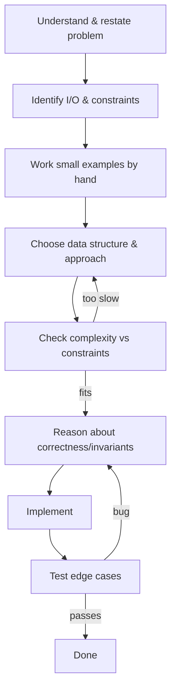

# Problem Solving Pipeline

## Concept

The problem solving pipeline is a repeatable sequence of steps that turns a vague problem statement into a correct, efficient program. The stages are: understand the problem and restate it, identify inputs/outputs and constraints, work small examples by hand, choose a data structure and algorithmic approach, reason about correctness (invariants) and complexity, implement, then test against edge cases. The most important early step is reading the constraints: an `n <= 20` problem invites exponential search, while `n <= 1e6` rules out anything worse than `O(n log n)`. Each stage feeds the next, and discovering a flaw late (e.g. a complexity wall) sends you back to an earlier stage. Following the pipeline prevents the common failure of coding before the approach is understood.

## Mermaid



## Complexity

- Time: The pipeline is a methodology, not an algorithm; the goal is to derive the lowest feasible complexity for the chosen approach (e.g. `O(n)`, `O(n log n)`).
- Space: Likewise chosen to fit the stated memory limits.
- Rule of thumb: match the algorithm to the constraint bound (`n <= 1e6` -> aim for `O(n)`/`O(n log n)`; `n <= 20` -> exponential search is acceptable).

## Java Code

```java
import java.util.Arrays;

public final class TwoLargest {

    // Worked example of the pipeline on "find the two largest values".
    // Step 1: understand  -> return the two greatest elements, largest first.
    // Step 2: constraints -> single pass desired (a may be large), n >= 2 assumed.
    // Step 3: example     -> {3,9,2,9} -> (9, 9).
    // Step 4: approach    -> track best and secondBest in one scan: O(n) time, O(1) space.
    public static int[] twoLargest(int[] a) {
        int best   = a[0] > a[1] ? a[0] : a[1];   // initialize with first two
        int second = a[0] > a[1] ? a[1] : a[0];   // so the invariant holds from i=2
        // Invariant: (best >= second) are the two largest among a[0..i-1].
        for (int i = 2; i < a.length; i++) {
            if (a[i] > best) { second = best; best = a[i]; }
            else if (a[i] > second) { second = a[i]; }
        }
        return new int[] { best, second };
    }
}
```

## Mini Usage Example

```java
int[] data = {3, 9, 2, 9, 5};
int[] top = TwoLargest.twoLargest(data); // top[0] == 9, top[1] == 9
```

## Code Snippet Flow

```mermaid
flowchart LR
    A[Seed best & second from a[0..1]] --> B[Scan a[i] for i>=2]
    B --> C{a[i] > best?}
    C -->|yes| D[second = best; best = a[i]]
    C -->|no| E{a[i] > second?}
    E -->|yes| F[second = a[i]]
    D --> B
    F --> B
    E -->|no| B
    B --> G[Return (best, second)]
```
