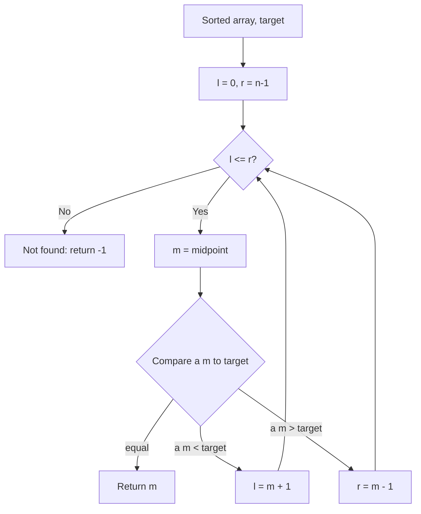

# Binary Search

## Concept

Binary Search finds a target value in a **sorted** array by repeatedly halving the search range. It compares the target to the middle element: if they match it returns the index; if the target is larger it discards the left half, otherwise it discards the right half. The invariant is that the target, if present, always lies within the current `[l, r]` window, and that window shrinks by about half each step. This makes it O(log n) instead of the O(n) of a linear scan, but it requires the data to be sorted first.

## Mermaid



## Complexity

- Time (Best): O(1) — target is at the first midpoint
- Time (Average): O(log n)
- Time (Worst): O(log n)
- Space: O(1) — iterative, no extra storage

## Java Code

```java
public final class BinarySearch {

    // Returns an index of target in the SORTED array a, or -1 if absent.
    public static int binarySearch(int[] a, int target) {
        int l = 0, r = a.length - 1;        // inclusive search window [l, r]
        while (l <= r) {
            int m = l + (r - l) / 2;        // midpoint, avoids l+r overflow
            if (a[m] == target) return m;   // found it
            if (a[m] < target) l = m + 1;   // target is in the right half
            else               r = m - 1;   // target is in the left half
        }
        return -1;                          // window emptied: not present
    }
}
```

> JDK equivalent: `java.util.Arrays.binarySearch(int[], int)` performs the same
> search on a sorted array (its return value for an absent key differs: it
> returns `-(insertion point) - 1`).

## Mini Usage Example

```java
int[] a = {1, 3, 5, 7, 9};            // must be sorted
int idx = BinarySearch.binarySearch(a, 7);   // idx == 3
```

## Code Snippet Flow

```mermaid
flowchart LR
    A[Set l and r bounds] --> B{l <= r?}
    B -- Yes --> C[Compute mid]
    C --> D{a[mid] == target?}
    D -- Yes --> E[Return mid index]
    D -- No --> F{a[mid] < target?}
    F -- Yes --> G[l = mid + 1]
    F -- No --> H[r = mid - 1]
    G --> B
    H --> B
    B -- No --> I[Return -1]
```
