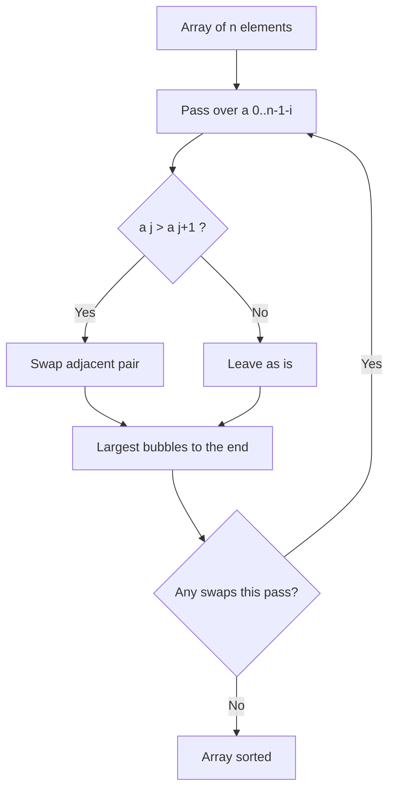
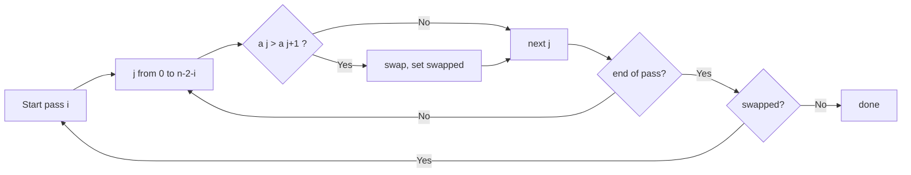

# Bubble Sort

## Concept

Bubble Sort repeatedly steps through the array, comparing each adjacent pair and swapping them if they are out of order. Each full pass "bubbles" the largest remaining element up to its correct position at the end, so after pass *k* the last *k* elements are final and sorted. The invariant is that the unsorted region shrinks by one each pass while the sorted tail grows. With an early-exit flag, a pass that makes no swaps means the array is already sorted, giving an O(n) best case. It is simple and stable but quadratic, so it is used mainly for teaching or tiny / nearly-sorted inputs.

## Mermaid



## Complexity

- Time (Best): O(n) — already sorted, early exit on a swap-free pass
- Time (Average): O(n^2)
- Time (Worst): O(n^2) — reverse-sorted input
- Space: O(1) — in place
- Stable: Yes

## Java Code

```java
public final class BubbleSort {

    public static void bubbleSort(int[] a) {
        int n = a.length;
        for (int i = 0; i < n - 1; i++) {
            boolean swapped = false;         // detect an already-sorted array
            // After i passes the last i elements are in final position,
            // so we only compare up to n-1-i.
            for (int j = 0; j < n - 1 - i; j++) {
                if (a[j] > a[j + 1]) {       // adjacent pair out of order
                    int tmp = a[j];          // bubble the larger one rightward
                    a[j] = a[j + 1];
                    a[j + 1] = tmp;
                    swapped = true;
                }
            }
            if (!swapped) break;             // no swaps => fully sorted, stop
        }
    }
}
```

## Mini Usage Example

```java
int[] a = {5, 1, 4, 2, 8};
BubbleSort.bubbleSort(a);
// a is now {1, 2, 4, 5, 8}
```

## Code Snippet Flow


