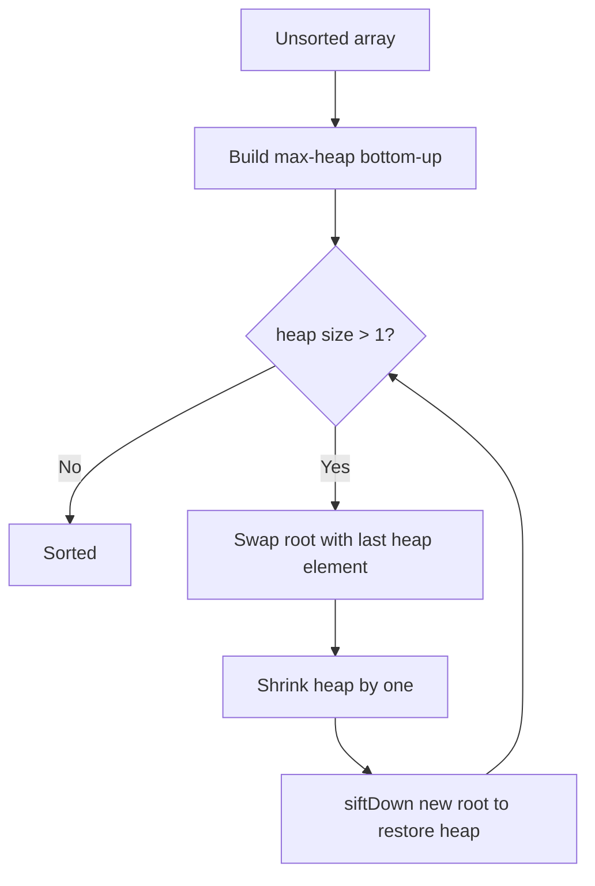
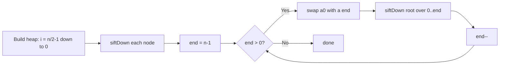

# Heap Sort

## Concept

Heap Sort treats the array as a binary max-heap stored implicitly: for a node at index *i*, its children are at `2i+1` and `2i+2`, and the max-heap property says every parent is >= its children. It first builds a max-heap from the unsorted array (bottom-up), so the largest element sits at the root (index 0). It then repeatedly swaps the root with the last element of the heap, shrinks the heap by one, and sifts the new root down to restore the heap property. Each extraction places the next-largest element into its final spot, sorting the array in place with a guaranteed O(n log n) worst case. It is not stable, but unlike quicksort it has no bad-case blowup and uses only O(1) extra space.

## Mermaid



## Complexity

- Time (Best): O(n log n)
- Time (Average): O(n log n)
- Time (Worst): O(n log n) — guaranteed
- Space: O(1) — in place
- Stable: No

## Java Code

```java
public final class HeapSort {

    // Restore the max-heap property for the subtree rooted at i,
    // considering only indices [0, n) as part of the heap.
    static void siftDown(int[] a, int n, int i) {
        while (true) {
            int largest = i;
            int left = 2 * i + 1;
            int right = 2 * i + 2;
            if (left  < n && a[left]  > a[largest]) largest = left;
            if (right < n && a[right] > a[largest]) largest = right;
            if (largest == i) break;        // heap property already holds
            int tmp = a[i];                 // push the larger child up
            a[i] = a[largest];
            a[largest] = tmp;
            i = largest;                    // continue sifting down
        }
    }

    public static void heapSort(int[] a) {
        int n = a.length;
        // Build a max-heap: sift down every internal node, last parent first.
        for (int i = n / 2 - 1; i >= 0; i--)
            siftDown(a, n, i);
        // Repeatedly move the current max (root) to the end of the heap.
        for (int end = n - 1; end > 0; end--) {
            int tmp = a[0];                 // largest goes to its final slot
            a[0] = a[end];
            a[end] = tmp;
            siftDown(a, end, 0);            // restore heap over the shrunk range
        }
    }
}
```

## Mini Usage Example

```java
int[] a = {5, 1, 4, 2, 8, 3};
HeapSort.heapSort(a);
// a is now {1, 2, 3, 4, 5, 8}
```

## Code Snippet Flow


