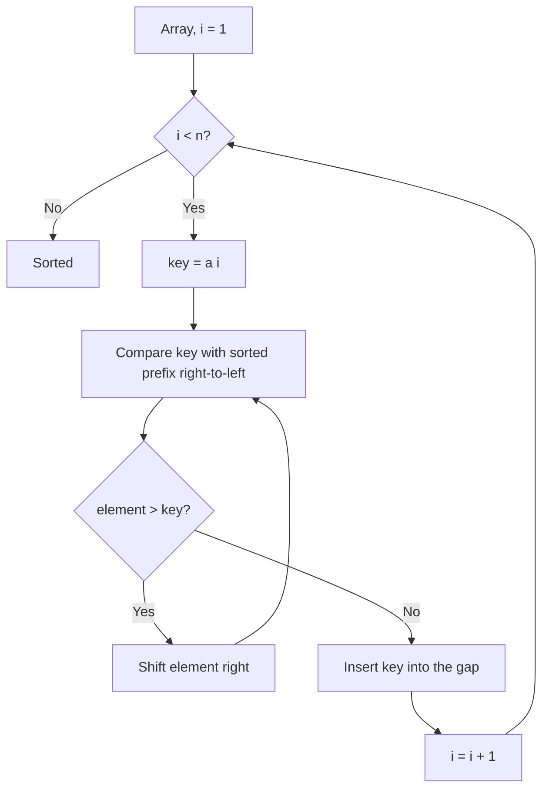
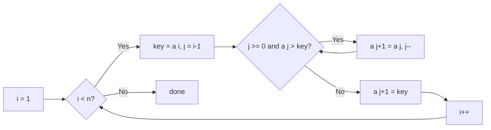

# Insertion Sort

## Concept

Insertion Sort builds the sorted array one element at a time, the way you sort a hand of playing cards. It takes the next element (the "key") and shifts every larger element in the already-sorted prefix one slot to the right, then drops the key into the gap. The invariant is that `a[0..i-1]` is always sorted before element *i* is inserted. It is stable, in place, and adaptive: on nearly-sorted data it runs in close to O(n), which is why it is used for small arrays and as the base case inside fast sorts like introsort/Timsort.

## Mermaid



## Complexity

- Time (Best): O(n) — already sorted, inner loop never shifts
- Time (Average): O(n^2)
- Time (Worst): O(n^2) — reverse-sorted input
- Space: O(1) — in place
- Stable: Yes

## Java Code

```java
public final class InsertionSort {

    public static void insertionSort(int[] a) {
        int n = a.length;
        for (int i = 1; i < n; i++) {          // a[0..i-1] is already sorted
            int key = a[i];                    // element to insert
            int j = i - 1;
            // Shift every element greater than key one slot to the right
            // to open a gap at the correct insertion point.
            while (j >= 0 && a[j] > key) {
                a[j + 1] = a[j];
                j--;
            }
            a[j + 1] = key;                    // drop key into the gap
        }
    }
}
```

## Mini Usage Example

```java
int[] a = {5, 1, 4, 2, 8};
InsertionSort.insertionSort(a);
// a is now {1, 2, 4, 5, 8}
```

## Code Snippet Flow


