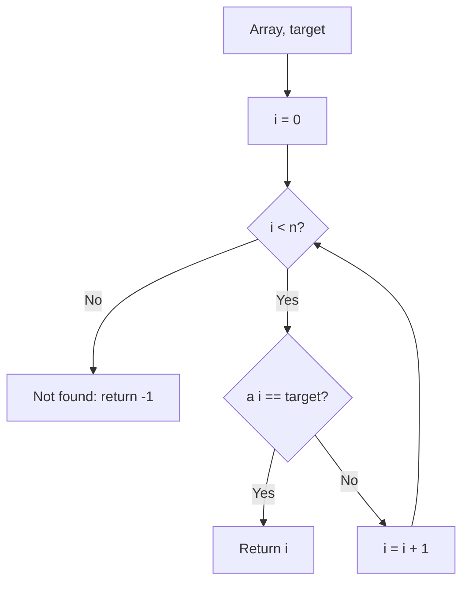

# Linear Search

## Concept

Linear Search scans the array element by element from the start until it finds the target or reaches the end. It makes no assumption about ordering, so it works on unsorted data, linked lists, and any sequence you can iterate. The trade-off is speed: it does up to *n* comparisons, which is fine for small or one-off scans but far slower than binary search on large sorted data. Use it when the data is unsorted, tiny, or only searched once (sorting first would not pay off).

## Mermaid



## Complexity

- Time (Best): O(1) — target is the first element
- Time (Average): O(n)
- Time (Worst): O(n) — target absent or last
- Space: O(1)

## Java Code

```java
public final class LinearSearch {

    // Returns the index of the first occurrence of target, or -1 if absent.
    // Works on UNSORTED data.
    public static int linearSearch(int[] a, int target) {
        for (int i = 0; i < a.length; i++) {
            if (a[i] == target) return i;   // first match wins
        }
        return -1;                          // scanned everything, not found
    }
}
```

## Mini Usage Example

```java
int[] a = {8, 4, 2, 9};            // need not be sorted
int idx = LinearSearch.linearSearch(a, 9);   // idx == 3
```

## Code Snippet Flow

```mermaid
flowchart LR
    A[Start i from 0] --> B{i < n?}
    B -- Yes --> C{a[i] == target?}
    C -- Yes --> D[Return i]
    C -- No --> E[i++]
    E --> B
    B -- No --> F[Return -1]
```
