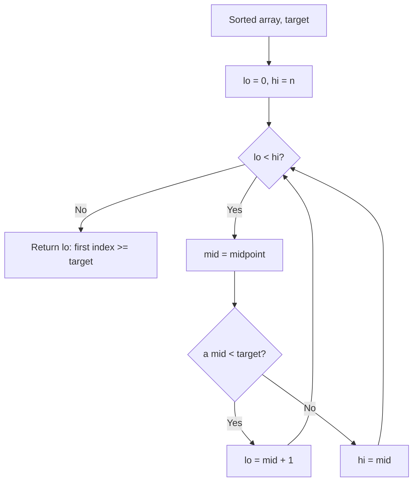
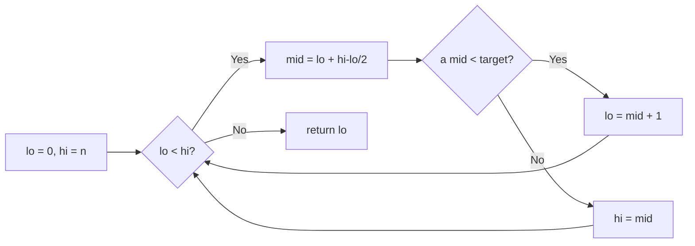

# Lower Bound

## Concept

Lower Bound is a binary-search variant that, in a **sorted** array, returns the index of the first element that is *not less than* the target (i.e. the first element `>= target`). Unlike plain binary search it does not stop at the first match: it keeps narrowing toward the leftmost valid position, returning the insertion point that keeps the array sorted. The invariant is that everything left of the returned index is strictly `< target` and everything from it onward is `>= target`. If the target is present it gives the index of its first occurrence; if not, it gives where the target would be inserted. It is the building block for range queries, counting duplicates, and ordered insertion.

## Mermaid



## Complexity

- Time (Best): O(log n)
- Time (Average): O(log n)
- Time (Worst): O(log n)
- Space: O(1) — iterative

## Java Code

```java
public final class LowerBound {

    // Returns the index of the first element >= target in the SORTED array a.
    // If every element is < target, returns a.length (the insertion point).
    public static int lowerBound(int[] a, int target) {
        int lo = 0, hi = a.length;           // half-open range [lo, hi)
        while (lo < hi) {
            int mid = lo + (hi - lo) / 2;
            if (a[mid] < target)
                lo = mid + 1;                // mid too small: answer is to its right
            else
                hi = mid;                    // mid is a candidate; keep it in range
        }
        return lo;                           // lo == hi == first index >= target
    }
}
```

## Mini Usage Example

```java
int[] a = {1, 3, 3, 5, 7};            // must be sorted
int i = LowerBound.lowerBound(a, 3);  // i == 1 (first element >= 3)
int j = LowerBound.lowerBound(a, 4);  // j == 3 (insertion point for 4)
```

## Code Snippet Flow


