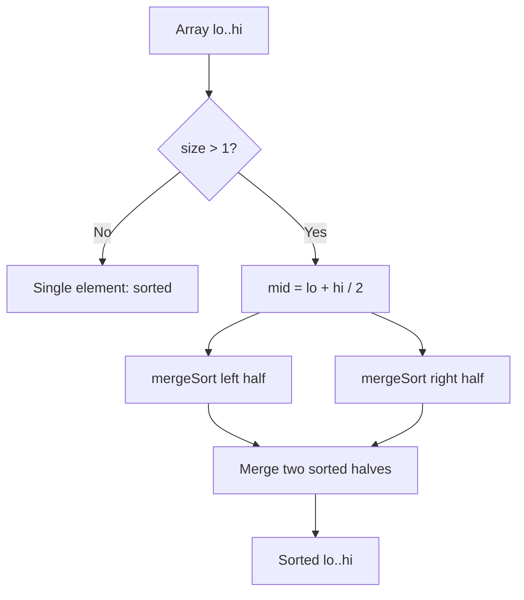
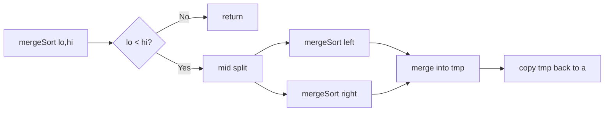

# Merge Sort

## Concept

Merge Sort is a divide-and-conquer sort. It splits the array into two halves, recursively sorts each half, then **merges** the two sorted halves into one sorted whole by repeatedly taking the smaller front element of the two. The key idea is the merge step: combining two already-sorted runs takes only linear time. This gives a guaranteed O(n log n) in every case, and the merge can be done in a way that preserves the relative order of equal elements, so Merge Sort is stable. It needs O(n) auxiliary space, which is its main drawback versus in-place sorts; it shines for linked lists and external/large-data sorting.

## Mermaid



## Complexity

- Time (Best): O(n log n)
- Time (Average): O(n log n)
- Time (Worst): O(n log n) — guaranteed, input-independent
- Space: O(n) — auxiliary buffer for merging
- Stable: Yes

## Java Code

```java
import java.util.Arrays;

public final class MergeSort {

    // Merge the two sorted runs a[lo..mid] and a[mid+1..hi] back into a.
    static void merge(int[] a, int lo, int mid, int hi) {
        int[] tmp = new int[hi - lo + 1];
        int i = lo, j = mid + 1, k = 0;
        // Repeatedly take the smaller front element of the two runs.
        while (i <= mid && j <= hi) {
            if (a[i] <= a[j]) tmp[k++] = a[i++];  // <= keeps it stable
            else              tmp[k++] = a[j++];
        }
        while (i <= mid) tmp[k++] = a[i++];       // leftover from left run
        while (j <= hi)  tmp[k++] = a[j++];       // leftover from right run
        for (int t = 0; t < tmp.length; t++)      // copy merged run back
            a[lo + t] = tmp[t];
    }

    static void mergeSort(int[] a, int lo, int hi) {
        if (lo >= hi) return;                 // 0 or 1 element: already sorted
        int mid = lo + (hi - lo) / 2;
        mergeSort(a, lo, mid);                // sort left half
        mergeSort(a, mid + 1, hi);            // sort right half
        merge(a, lo, mid, hi);                // combine the two sorted halves
    }

    public static void mergeSort(int[] a) {
        if (a.length > 0) mergeSort(a, 0, a.length - 1);
    }
}
```

## Mini Usage Example

```java
int[] a = {5, 1, 4, 2, 8, 3};
MergeSort.mergeSort(a);
// a is now {1, 2, 3, 4, 5, 8}
```

## Code Snippet Flow


