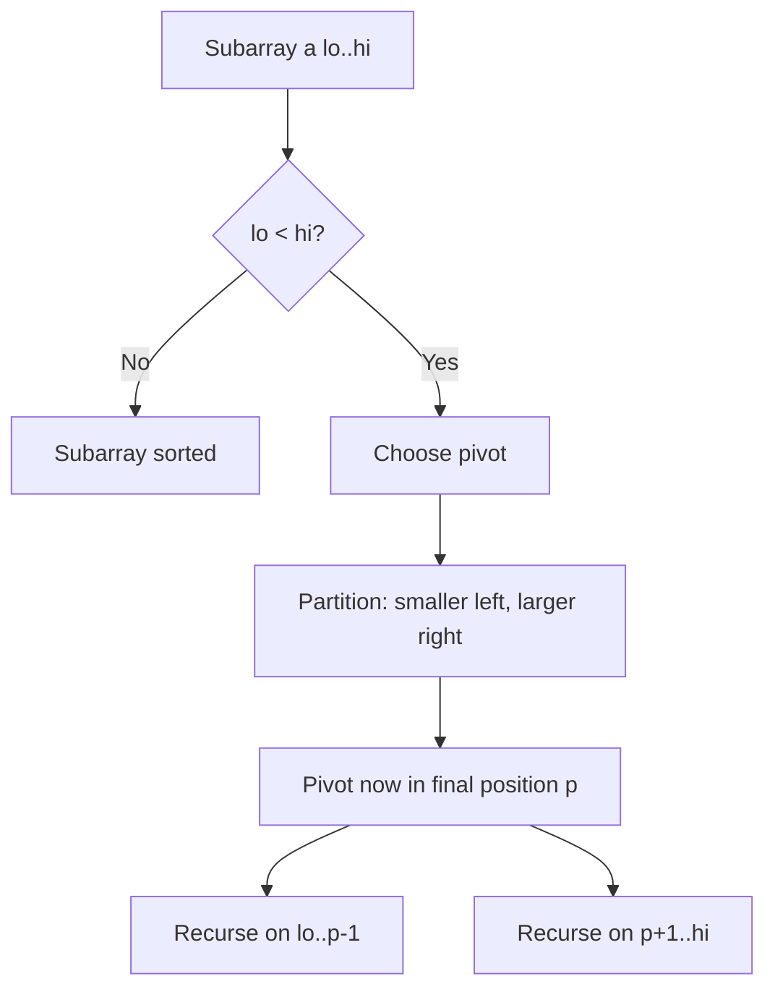
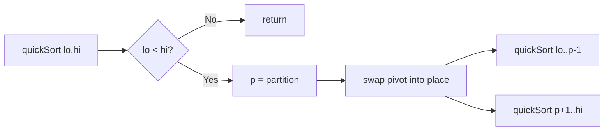

# Quick Sort

## Concept

Quick Sort is a divide-and-conquer comparison sort. It picks one element as a *pivot* and partitions the array so that every element less than the pivot ends up on its left and every element greater ends up on its right; the pivot is then in its final sorted position. It then recursively sorts the two partitions. The key invariant is that after partitioning, the pivot never moves again and the two sides are independent subproblems. Quick Sort sorts in place and is very fast on average (good cache behavior, small constant factors), so it is the typical choice for general-purpose in-memory sorting, but its worst case is O(n^2) when pivots are chosen poorly (e.g. already-sorted input with a naive last-element pivot).

## Mermaid



## Complexity

- Time (Best): O(n log n) — balanced partitions
- Time (Average): O(n log n)
- Time (Worst): O(n^2) — consistently unbalanced partitions (e.g. sorted input, naive pivot)
- Space: O(log n) average recursion stack, O(n) worst case
- Stable: No

## Java Code

```java
public final class QuickSort {

    // Lomuto partition: uses a[hi] as the pivot, places it in its final
    // sorted slot, and returns that index. Everything left of it is <= pivot,
    // everything right is > pivot.
    static int partition(int[] a, int lo, int hi) {
        int pivot = a[hi];
        int i = lo - 1;              // boundary of the "<= pivot" region
        for (int j = lo; j < hi; j++) {
            if (a[j] <= pivot) {     // element belongs on the left side
                i++;
                int tmp = a[i];
                a[i] = a[j];
                a[j] = tmp;
            }
        }
        int tmp = a[i + 1];          // move pivot just past the left region
        a[i + 1] = a[hi];
        a[hi] = tmp;
        return i + 1;                // pivot's final resting index
    }

    static void quickSort(int[] a, int lo, int hi) {
        if (lo >= hi) return;        // 0 or 1 element: already sorted
        int p = partition(a, lo, hi);
        quickSort(a, lo, p - 1);     // sort the smaller-than-pivot side
        quickSort(a, p + 1, hi);     // sort the greater-than-pivot side
    }

    public static void quickSort(int[] a) {
        if (a.length > 0) quickSort(a, 0, a.length - 1);
    }
}
```

## Mini Usage Example

```java
int[] a = {5, 1, 4, 2, 8, 3};
QuickSort.quickSort(a);
// a is now {1, 2, 3, 4, 5, 8}
```

## Code Snippet Flow


