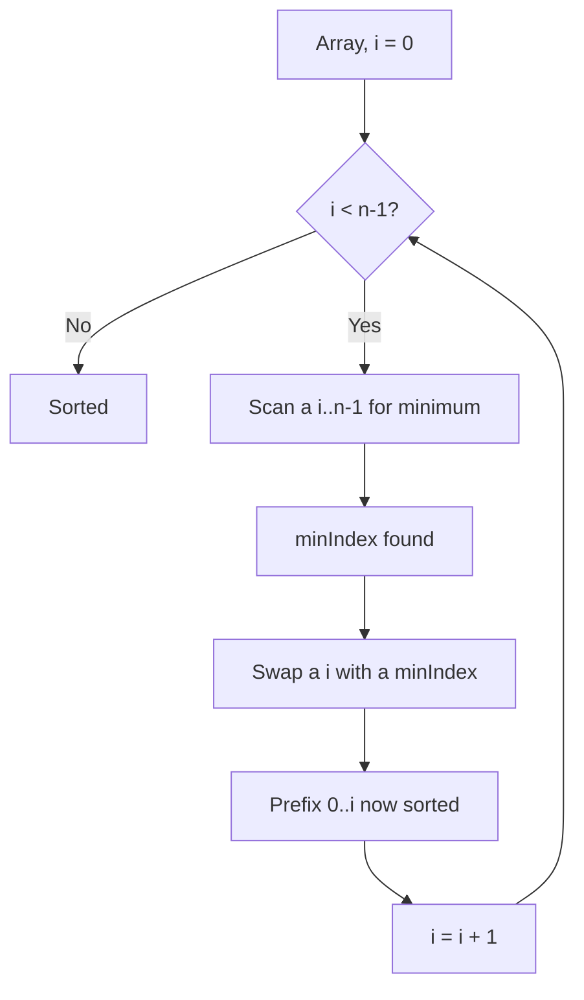
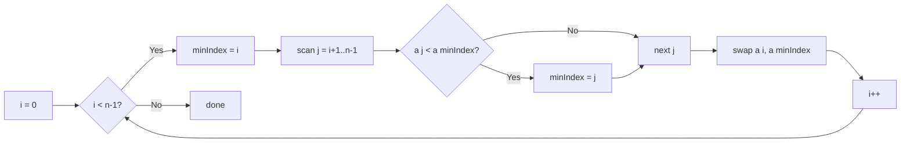

# Selection Sort

## Concept

Selection Sort divides the array into a sorted prefix and an unsorted suffix. On each step it scans the unsorted suffix to find the minimum element and swaps it into the first unsorted slot, growing the sorted prefix by one. The invariant is that the prefix `a[0..i-1]` is always sorted and contains the *i* smallest elements in their final positions. It always performs O(n^2) comparisons regardless of input, but it does at most n-1 swaps — useful when writes are far more expensive than reads. The classic swap-based version is not stable.

## Mermaid



## Complexity

- Time (Best): O(n^2)
- Time (Average): O(n^2)
- Time (Worst): O(n^2) — always scans the full suffix
- Space: O(1) — in place
- Stable: No (the classic swap version)

## Java Code

```java
public final class SelectionSort {

    public static void selectionSort(int[] a) {
        int n = a.length;
        for (int i = 0; i < n - 1; i++) {
            int minIndex = i;                  // assume current slot holds the min
            // Find the smallest element in the unsorted suffix a[i..n-1].
            for (int j = i + 1; j < n; j++) {
                if (a[j] < a[minIndex]) minIndex = j;
            }
            if (minIndex != i) {               // place that minimum at position i
                int tmp = a[i];
                a[i] = a[minIndex];
                a[minIndex] = tmp;
            }
        }
    }
}
```

## Mini Usage Example

```java
int[] a = {5, 1, 4, 2, 8};
SelectionSort.selectionSort(a);
// a is now {1, 2, 4, 5, 8}
```

## Code Snippet Flow


