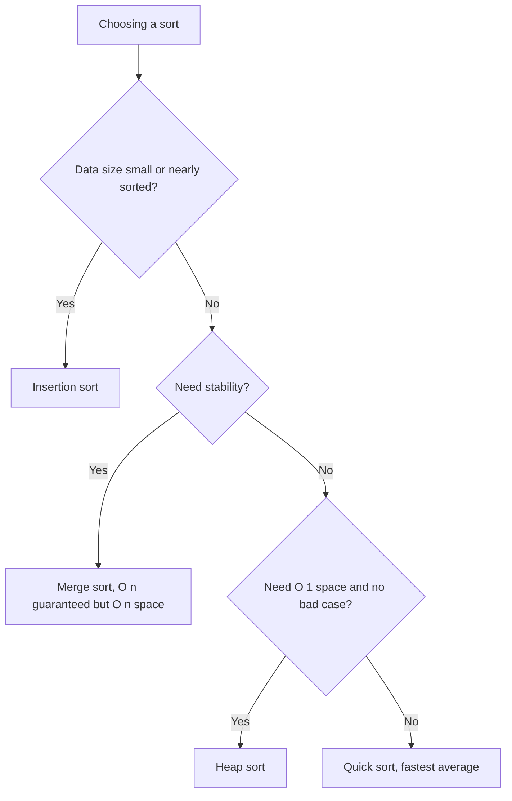
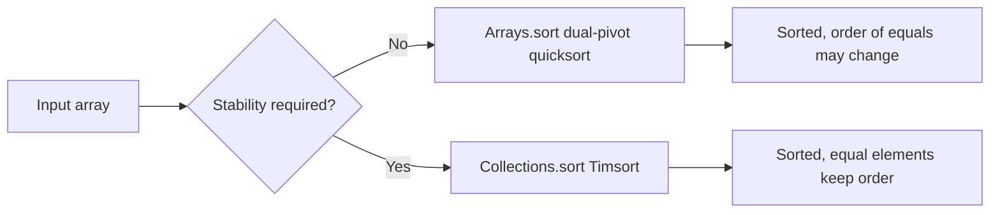

# Sorting Complexity Table

## Concept

This is a reference comparing the common comparison-based sorting algorithms in this chapter by time complexity (best / average / worst), auxiliary space, and stability. "Stable" means equal elements keep their original relative order — important when sorting records by a secondary key. Use it to pick the right algorithm: insertion sort for tiny or nearly-sorted inputs, merge sort when you need a stable guaranteed O(n log n), quick sort for fast average in-memory sorting, and heap sort when you need O(n log n) worst case with O(1) extra space.

## Mermaid



## Complexity

| Algorithm      | Best        | Average     | Worst       | Space     | Stable? |
| -------------- | ----------- | ----------- | ----------- | --------- | ------- |
| Bubble Sort    | O(n)        | O(n^2)      | O(n^2)      | O(1)      | Yes     |
| Selection Sort | O(n^2)      | O(n^2)      | O(n^2)      | O(1)      | No      |
| Insertion Sort | O(n)        | O(n^2)      | O(n^2)      | O(1)      | Yes     |
| Merge Sort     | O(n log n)  | O(n log n)  | O(n log n)  | O(n)      | Yes     |
| Quick Sort     | O(n log n)  | O(n log n)  | O(n^2)      | O(log n)  | No      |
| Heap Sort      | O(n log n)  | O(n log n)  | O(n log n)  | O(1)      | No      |

Notes:
- `Arrays.sort(int[])` (and other primitive arrays) is a **dual-pivot quicksort**: O(n log n) on average and in place, but **not stable** and with an O(n^2) worst case. Stability does not matter for primitives, since equal `int` values are indistinguishable.
- `Arrays.sort(Object[])` and `Collections.sort(List)` use **Timsort**, a hybrid of merge sort and insertion sort that exploits existing sorted "runs"; it is **stable**, runs in O(n log n) worst case, O(n) on already-sorted data, and uses O(n) extra memory.
- **Timsort** (used by Java for objects and by Python) is the stable choice when you sort records by a key and must preserve the relative order of equal elements.

## Java Code

```java
import java.util.Arrays;
import java.util.List;
import java.util.Collections;

public final class LibrarySorts {

    public static void demoLibrarySorts(int[] primitives, List<Integer> objects) {
        // Dual-pivot quicksort: O(n log n) average, in place, NOT stable.
        // (Stability is irrelevant for primitive ints.)
        Arrays.sort(primitives);

        // Timsort: O(n log n) worst case, uses O(n) memory, IS stable.
        Collections.sort(objects);
    }
}
```

## Mini Usage Example

```java
int[] data = {4, 2, 8, 1, 2};
java.util.List<Integer> boxed = new java.util.ArrayList<>(
        java.util.List.of(4, 2, 8, 1, 2));
LibrarySorts.demoLibrarySorts(data, boxed);
// data is now {1, 2, 2, 4, 8}; boxed is now [1, 2, 2, 4, 8]
```

## Code Snippet Flow


