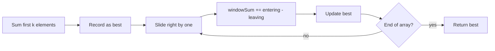

# Sliding Window

## Concept

A sliding window maintains a contiguous range `[left, right)` over a sequence and slides it forward instead of recomputing each subrange from scratch, turning an `O(n*k)` or `O(n^2)` approach into `O(n)`. In a fixed-size window you add the entering element and subtract the leaving element as the window shifts by one. In a variable-size window you expand `right` to include more elements and shrink `left` whenever a constraint is violated, tracking the best window seen. The key invariant is that the running aggregate (sum, count, frequency map) always reflects exactly the current window. It applies to problems about the best/shortest/longest contiguous subarray or substring satisfying some condition.

## Mermaid

```mermaid
flowchart TD
    A[windowSum = sum of first k elements] --> B[best = windowSum; i = k]
    B --> C{i < n?}
    C -->|no| F[Return best]
    C -->|yes| D[windowSum += a[i] - a[i-k]]
    D --> E[best = max(best, windowSum)]
    E --> G[++i]
    G --> C
```

## Complexity

- Time: `O(n)` — each element enters and leaves the window at most once.
- Space: `O(1)` for a numeric window (`O(k)` or `O(alphabet)` if a frequency map is needed).

## Java Code

```java
class SlidingWindow {
    // Maximum sum of any contiguous subarray of fixed size k (fixed-size window).
    // Assumes 1 <= k <= a.length.
    static long maxSumWindow(int[] a, int k) {
        long windowSum = 0;
        for (int i = 0; i < k; i++) windowSum += a[i];   // sum of the first window
        long best = windowSum;
        // Slide: add the entering element a[i], drop the leaving element a[i-k].
        for (int i = k; i < a.length; i++) {
            windowSum += a[i] - a[i - k];                // O(1) update, not a re-sum
            if (windowSum > best) best = windowSum;      // window invariant maintained
        }
        return best;
    }
}
```

## Mini Usage Example

```java
int[] a = {2, 1, 5, 1, 3, 2};
long best = SlidingWindow.maxSumWindow(a, 3); // windows: 8,7,9,6 -> best = 9 (5+1+3)
```

## Code Snippet Flow


