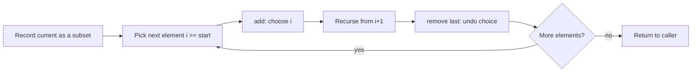

# Backtracking

## Concept

Backtracking is a systematic way to explore all candidate solutions by building them one choice at a time and abandoning a partial candidate ("pruning") as soon as it cannot lead to a valid solution. It is depth-first search over a decision tree: choose, recurse, then undo the choice (backtrack) so the next option can be tried with a clean state. The recurring template is "for each option: apply it, recurse, then revert it." Recording the answer at a base case and reverting after the recursive call are what separate backtracking from plain recursion. It is the standard tool for generating subsets, permutations, combinations, and for constraint problems like N-Queens or Sudoku.

## Mermaid

```mermaid
flowchart TD
    A[backtrack(state)] --> B{Solution complete?}
    B -->|yes| C[Record a copy of state]
    B -->|no| D[For each candidate choice]
    D --> E[Apply choice to state]
    E --> F[Recurse: backtrack(state)]
    F --> G[Undo choice: revert state]
    G --> D
```

## Complexity

- Generating all subsets: Time `O(n * 2^n)` (there are `2^n` subsets, each up to length `n` to copy), Space `O(n)` recursion depth plus output.
- General rule: bounded by the size of the explored decision tree; effective pruning cuts this dramatically.

## Java Code

```java
import java.util.ArrayList;
import java.util.List;

class Backtracking {
    // Generate all subsets (the power set) of nums using the backtracking template.
    static void backtrack(int[] nums, int start,
                          List<Integer> current, List<List<Integer>> out) {
        out.add(new ArrayList<>(current));       // every prefix state is a valid subset
        for (int i = start; i < nums.length; i++) {
            current.add(nums[i]);                // choose nums[i]
            backtrack(nums, i + 1, current, out);// explore with it included
            current.remove(current.size() - 1);  // undo the choice (backtrack)
        }
    }

    static List<List<Integer>> subsets(int[] nums) {
        List<List<Integer>> out = new ArrayList<>();
        List<Integer> current = new ArrayList<>();
        backtrack(nums, 0, current, out);
        return out;
    }
}
```

## Mini Usage Example

```java
int[] nums = {1, 2, 3};
List<List<Integer>> all = Backtracking.subsets(nums);
// all has 2^3 = 8 subsets: [], [1], [1,2], [1,2,3], [1,3], [2], [2,3], [3]
```

## Code Snippet Flow


