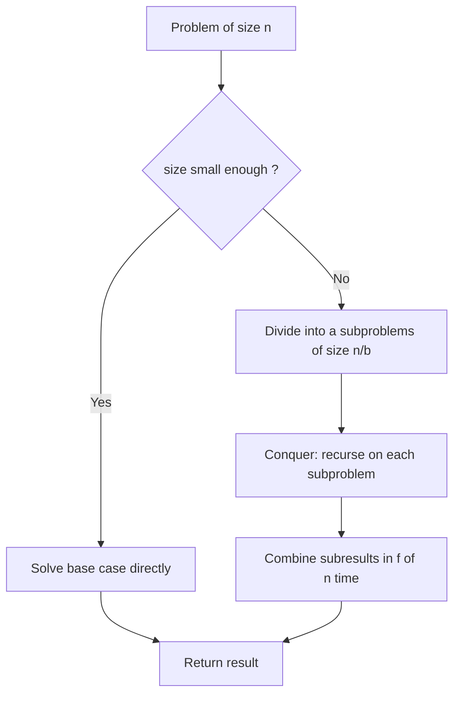
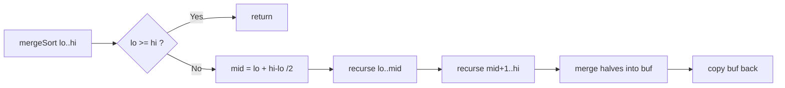

# Divide And Conquer Paradigm

## Concept

Divide and conquer solves a problem by breaking it into smaller independent subproblems of the same kind, solving those recursively, and then combining their results into the answer for the original problem. The template has three steps: **divide** the input into parts, **conquer** each part by recursing until a trivial base case, and **combine** the partial solutions. It shines when the subproblems do not overlap (unlike dynamic programming) and the combine step is cheap relative to the work saved. Classic examples are merge sort, quicksort, binary search, and Karatsuba multiplication. Running times follow a recurrence `T(n) = a*T(n/b) + f(n)`, which the Master theorem solves directly.

## Mermaid



## Complexity

- Recurrence: `T(n) = a*T(n/b) + f(n)` where `a` = number of subproblems, `n/b` = subproblem size, `f(n)` = divide plus combine cost.
- Master theorem compares `f(n)` with `n^(log_b a)`:
  - `f(n) = O(n^(log_b a - e))` -> `T(n) = Theta(n^(log_b a))` (leaves dominate).
  - `f(n) = Theta(n^(log_b a))` -> `T(n) = Theta(n^(log_b a) * log n)` (balanced; e.g. merge sort: a=2, b=2, f=n -> n log n).
  - `f(n) = Omega(n^(log_b a + e))` with regularity -> `T(n) = Theta(f(n))` (root dominates).
- Space: typically O(log n) recursion stack, plus any scratch buffers the combine step needs.

## Java Code

```java
class MergeSort {
    // Merge sort: a textbook divide-and-conquer routine.
    // Divide: split the range in half.
    // Conquer: sort each half recursively.
    // Combine: merge two sorted halves into one sorted run.
    static void merge(int[] a, int lo, int mid, int hi, int[] buf) {
        int i = lo, j = mid + 1, k = lo;
        while (i <= mid && j <= hi)                 // pick the smaller front element
            buf[k++] = (a[i] <= a[j]) ? a[i++] : a[j++];
        while (i <= mid) buf[k++] = a[i++];         // drain left half
        while (j <= hi)  buf[k++] = a[j++];         // drain right half
        for (int t = lo; t <= hi; t++) a[t] = buf[t];
    }

    static void mergeSort(int[] a, int lo, int hi, int[] buf) {
        if (lo >= hi) return;                       // base case: 0 or 1 element
        int mid = lo + (hi - lo) / 2;               // divide
        mergeSort(a, lo, mid, buf);                 // conquer left
        mergeSort(a, mid + 1, hi, buf);             // conquer right
        merge(a, lo, mid, hi, buf);                 // combine
    }

    static void mergeSort(int[] a) {
        if (a.length == 0) return;
        int[] buf = new int[a.length];
        mergeSort(a, 0, a.length - 1, buf);
    }
}
```

## Mini Usage Example

```java
import java.util.Arrays;

class Demo {
    public static void main(String[] args) {
        int[] v = {5, 2, 9, 1, 5, 6};
        MergeSort.mergeSort(v);
        System.out.println(Arrays.toString(v));  // [1, 2, 5, 5, 6, 9]
    }
}
```

## Code Snippet Flow


