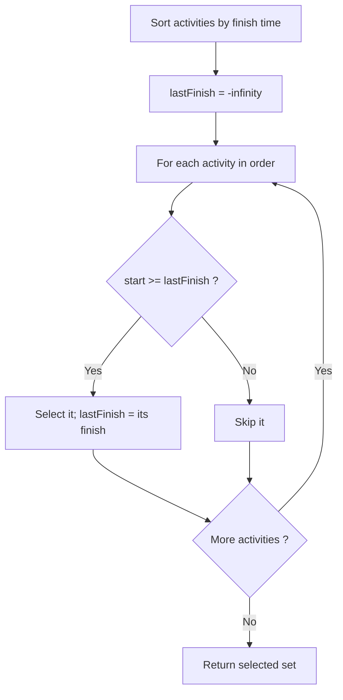
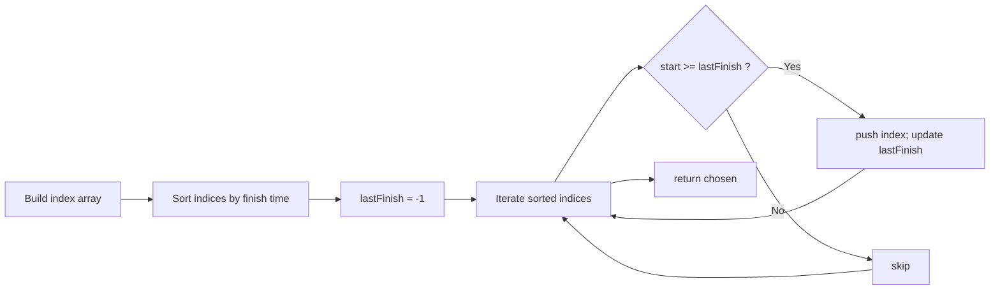

# Activity Selection

## Concept

Activity selection finds the maximum number of mutually compatible activities from a set, where each activity has a start and finish time and two activities conflict if their intervals overlap. The greedy strategy is to always pick the activity that finishes earliest among those still compatible: sort all activities by finish time, then scan left to right, selecting an activity whenever its start time is at least the finish time of the last selected one. Choosing the earliest finishing activity leaves the most room for future activities, which is why the greedy choice is optimal here (provable by an exchange argument). This is the canonical interval-scheduling problem and runs in O(n log n) dominated by the sort.

## Mermaid



## Complexity

- Time: O(n log n) for the sort by finish time; the greedy scan that follows is O(n).
- Space: O(n) for the index/order array (O(1) extra if sorted in place and only the count is needed).

## Java Code

```java
import java.util.ArrayList;
import java.util.Comparator;
import java.util.List;

class ActivitySelection {
    record Activity(int start, int finish) {}

    // Returns the indices (into the original array) of a maximum-size set
    // of mutually compatible activities.
    static List<Integer> selectActivities(Activity[] acts) {
        int n = acts.length;
        Integer[] order = new Integer[n];
        for (int i = 0; i < n; i++) order[i] = i;

        // Sort indices by finish time ascending (the greedy key).
        java.util.Arrays.sort(order,
                Comparator.comparingInt(i -> acts[i].finish()));

        List<Integer> chosen = new ArrayList<>();
        int lastFinish = -1;                 // finish time of last picked activity
        for (int idx : order) {
            // Compatible if it starts at or after the last selected finish.
            if (acts[idx].start() >= lastFinish) {
                chosen.add(idx);
                lastFinish = acts[idx].finish();
            }
        }
        return chosen;
    }
}
```

## Mini Usage Example

```java
class Demo {
    public static void main(String[] args) {
        ActivitySelection.Activity[] acts = {
            new ActivitySelection.Activity(1, 4),
            new ActivitySelection.Activity(3, 5),
            new ActivitySelection.Activity(0, 6),
            new ActivitySelection.Activity(5, 7),
            new ActivitySelection.Activity(3, 9),
            new ActivitySelection.Activity(5, 9),
            new ActivitySelection.Activity(6, 10),
            new ActivitySelection.Activity(8, 11),
            new ActivitySelection.Activity(8, 12),
            new ActivitySelection.Activity(2, 14),
            new ActivitySelection.Activity(12, 16)
        };
        var picked = ActivitySelection.selectActivities(acts);
        System.out.println("Count: " + picked.size());  // 4
        for (int i : picked)
            System.out.print("[" + acts[i].start() + "," + acts[i].finish() + "] ");
        System.out.println();  // e.g. [1,4] [5,7] [8,11] [12,16]
    }
}
```

## Code Snippet Flow


