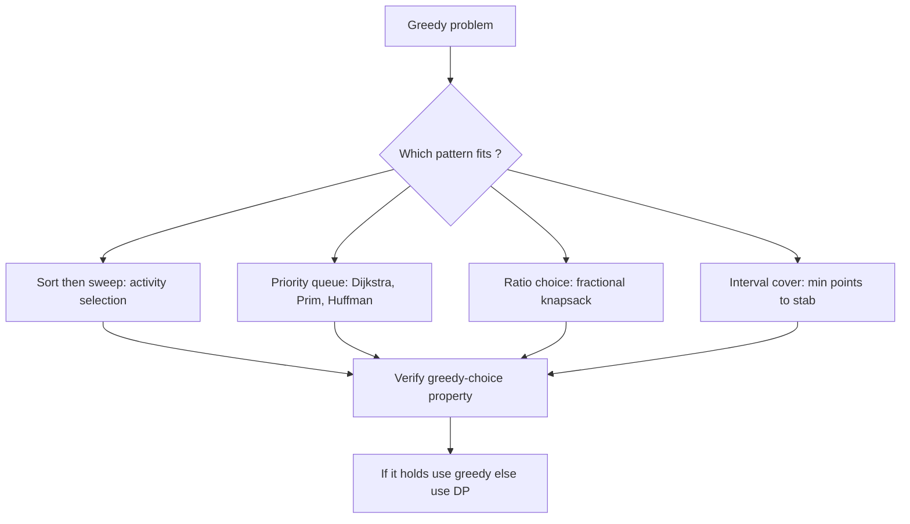
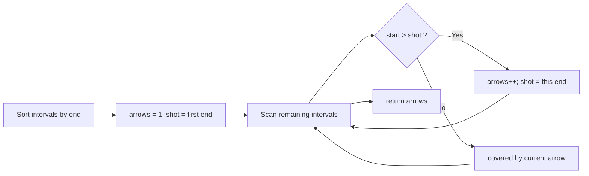

# Greedy Patterns

## Concept

Greedy algorithms recur in a handful of recognizable patterns, and learning the patterns helps you spot when greedy applies. The common shapes are: **sort then sweep** (order items by a key, then make one pass picking compatible ones, as in activity selection); **always take the best available** using a priority queue (Dijkstra, Prim, Huffman coding); **value-density / ratio choices** (fractional knapsack); and **interval scheduling and covering** (earliest-finish for max activities, fewest points to stab all intervals). Each pattern rests on the greedy-choice property, justified by an exchange argument. The recurring risk is applying greedy where it does not hold (0/1 knapsack, making change with arbitrary coin systems), so always verify optimality before trusting a greedy solution.

## Mermaid



## Complexity

- Sort-then-sweep patterns: O(n log n) for the sort, O(n) for the sweep.
- Priority-queue patterns: O((V + E) log V) for graph algorithms like Dijkstra/Prim; O(n log n) for Huffman over n symbols.
- Ratio / single-pass patterns: O(n log n) when a sort is needed, otherwise O(n).
- Space: O(n) typical for the ordering array or heap.

## Java Code

```java
import java.util.Arrays;
import java.util.Comparator;

class GreedyPatterns {
    // Pattern 1 -- sort then sweep: minimum number of arrows (points) to
    // burst all balloons, i.e. fewest points that stab every interval.
    // Greedy choice: sort by end, shoot at the end of the first interval,
    // reuse that arrow for every interval it already covers.
    static int minArrows(int[][] intervals) {
        if (intervals.length == 0) return 0;
        Arrays.sort(intervals, Comparator.comparingInt(a -> a[1])); // sort by end point

        int arrows = 1;
        int shot = intervals[0][1];                // first arrow at first end
        for (int i = 1; i < intervals.length; i++) {
            if (intervals[i][0] > shot) {          // current interval not covered
                arrows++;                          // need a new arrow
                shot = intervals[i][1];
            }
        }
        return arrows;
    }
}
```

## Mini Usage Example

```java
class Demo {
    public static void main(String[] args) {
        int[][] balloons = {{10, 16}, {2, 8}, {1, 6}, {7, 12}};
        System.out.println(GreedyPatterns.minArrows(balloons));  // 2
    }
}
```

## Code Snippet Flow


