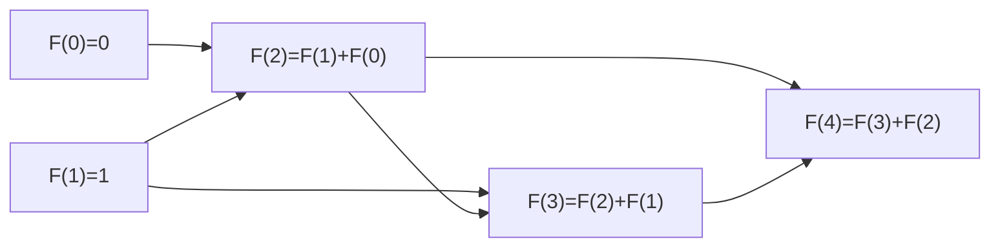
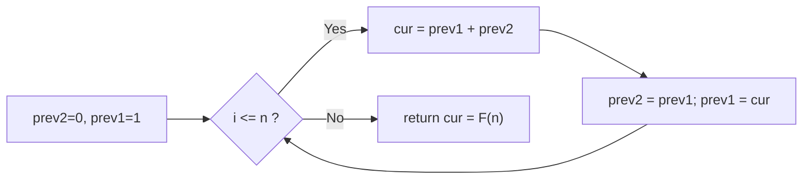

# Fibonacci DP

## Concept

The Fibonacci sequence is defined by `F(0)=0`, `F(1)=1`, and `F(n)=F(n-1)+F(n-2)`. A naive recursion recomputes the same subproblems exponentially many times. Dynamic programming fixes this by defining the **state** `dp[i] = F(i)`, using the **recurrence** `dp[i] = dp[i-1] + dp[i-2]`, with **base cases** `dp[0]=0` and `dp[1]=1`. Building the table bottom-up from `i=2` to `n` solves each subproblem exactly once. Because each state only depends on the previous two values, the full table is unnecessary: two rolling variables reduce space from O(n) to O(1).

## Mermaid



## Complexity

- Time: O(n) — each state computed once.
- Space: O(n) for the table form, O(1) with rolling variables.

## Java Code

```java
public final class FibDP {

    // Bottom-up Fibonacci with two rolling variables (O(1) space).
    // We never store the whole table because dp[i] depends only on the
    // two most recent values, so we slide a 2-element window forward.
    static long fibDP(int n) {
        if (n <= 1) return n;          // base cases F(0)=0, F(1)=1
        long prev2 = 0;                // holds F(i-2)
        long prev1 = 1;                // holds F(i-1)
        long cur = 0;
        for (int i = 2; i <= n; i++) {
            cur = prev1 + prev2;       // recurrence F(i) = F(i-1) + F(i-2)
            prev2 = prev1;             // slide window forward
            prev1 = cur;
        }
        return cur;                    // cur == F(n)
    }

    // Tabulated variant (O(n) space) for when intermediate values are needed:
    //   long[] dp = new long[n + 1];
    //   dp[0] = 0; dp[1] = 1;
    //   for (int i = 2; i <= n; i++) dp[i] = dp[i-1] + dp[i-2];
}
```

## Mini Usage Example

```java
public class Main {
    public static void main(String[] args) {
        System.out.println(FibDP.fibDP(10));  // prints 55
        System.out.println(FibDP.fibDP(20));  // prints 6765
    }
}
```

## Code Snippet Flow


