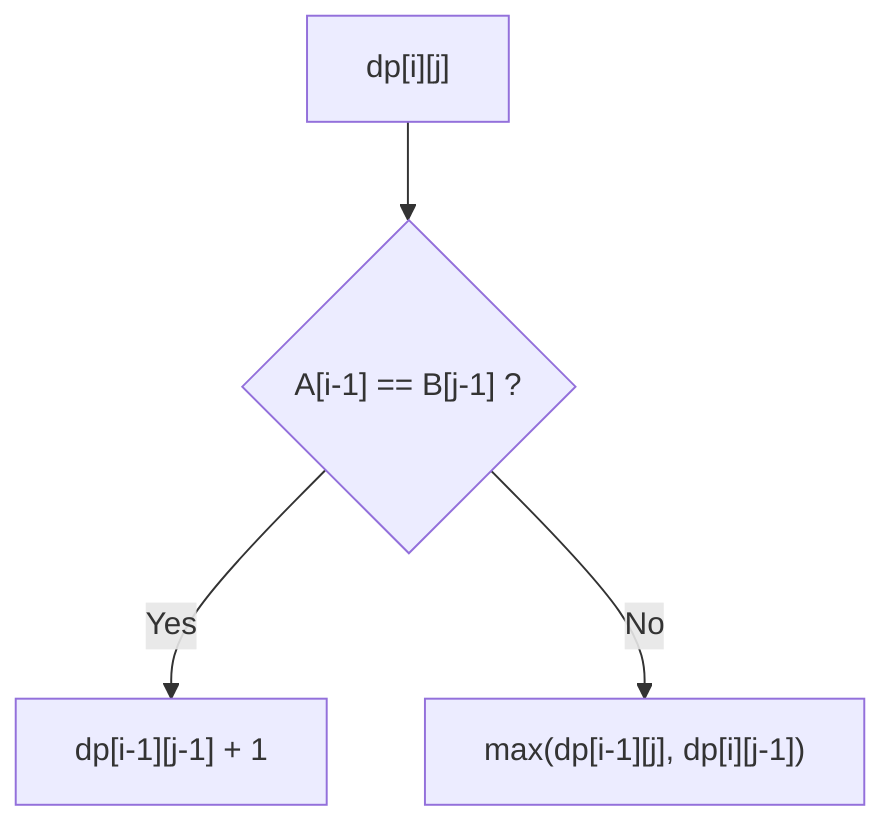
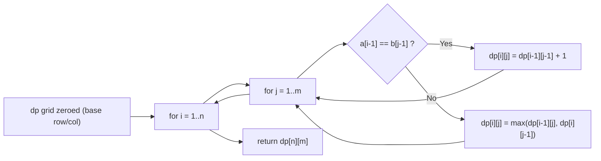

# Longest Common Subsequence

## Concept

Given two strings `A` (length `n`) and `B` (length `m`), the longest common subsequence (LCS) is the longest sequence of characters appearing in both in the same relative order, but not necessarily contiguously. Define the **state** `dp[i][j]` = length of the LCS of the prefixes `A[0..i-1]` and `B[0..j-1]`. The **recurrence**: if `A[i-1] == B[j-1]` then `dp[i][j] = dp[i-1][j-1] + 1`; otherwise `dp[i][j] = max(dp[i-1][j], dp[i][j-1])`. The **base case** is `dp[0][j] = dp[i][0] = 0` (an empty prefix shares nothing). The answer is `dp[n][m]`, and the actual subsequence can be recovered by backtracking through the table.

## Mermaid



## Complexity

- Time: O(n * m) — fill an `(n+1)` by `(m+1)` table.
- Space: O(n * m) for the table; O(min(n, m)) if only the length is needed (two rows).

## Java Code

```java
public final class LCS {

    // Bottom-up LCS length over prefixes of a and b.
    // dp[i][j] = LCS length of a[0..i-1] and b[0..j-1].
    static int lcsLength(String a, String b) {
        int n = a.length();
        int m = b.length();
        // Row/column 0 stay zero: empty prefix -> empty LCS (base case).
        int[][] dp = new int[n + 1][m + 1];
        for (int i = 1; i <= n; i++) {
            for (int j = 1; j <= m; j++) {
                if (a.charAt(i - 1) == b.charAt(j - 1)) {
                    // Characters match: extend the diagonal subproblem by 1.
                    dp[i][j] = dp[i - 1][j - 1] + 1;
                } else {
                    // No match: drop one character from either string.
                    dp[i][j] = Math.max(dp[i - 1][j], dp[i][j - 1]);
                }
            }
        }
        return dp[n][m];
    }
}
```

## Mini Usage Example

```java
public class Main {
    public static void main(String[] args) {
        // LCS of "ABCBDAB" and "BDCAB" is "BCAB" (length 4).
        System.out.println(LCS.lcsLength("ABCBDAB", "BDCAB"));  // prints 4
    }
}
```

## Code Snippet Flow


