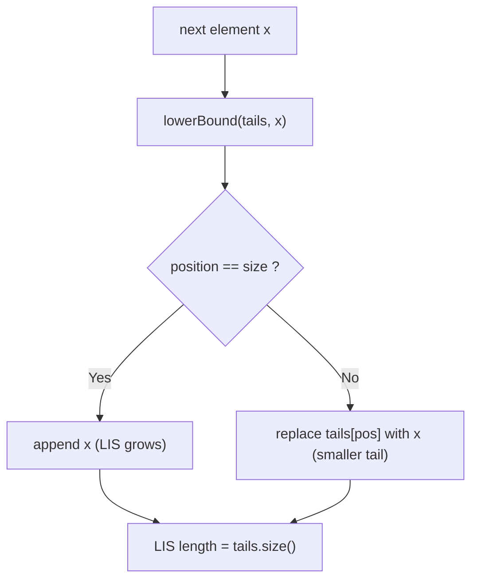
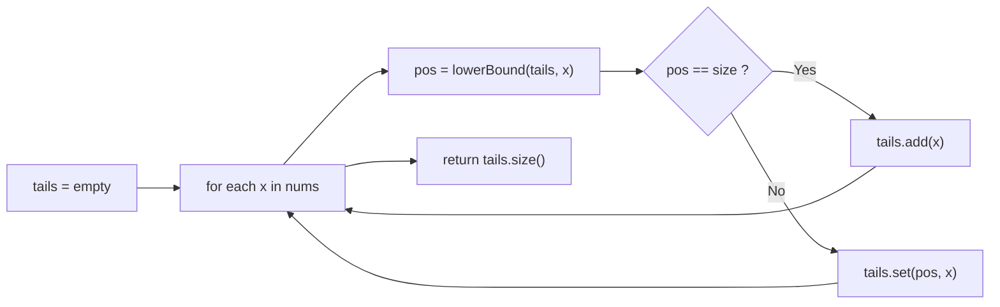

# Longest Increasing Subsequence

## Concept

Given an array of `n` numbers, the longest increasing subsequence (LIS) is the longest subsequence whose elements are strictly increasing (not necessarily contiguous). A simple O(n^2) DP defines `dp[i]` = length of the LIS ending at index `i`. The faster **patience-sorting** method maintains an auxiliary array `tails`, where `tails[k]` is the smallest possible tail value of any increasing subsequence of length `k+1`. For each element `x` we binary-search (a `lowerBound`) for the first tail `>= x`: if found we overwrite it (a better, smaller tail for that length), otherwise we append `x` (extending the longest subsequence). The final LIS length is the size of `tails`. The `tails` array is not itself a valid subsequence, but its length is always correct.

> JDK note: `java.util.Arrays.binarySearch` can locate an insertion point, but it does not return the clean lower-bound semantics we need here, so we implement `lowerBound` from scratch for clarity.

## Mermaid



## Complexity

- Time: O(n log n) — one binary search per element.
- Space: O(n) for the `tails` array.

## Java Code

```java
import java.util.ArrayList;
import java.util.List;

public final class LIS {

    // First index in tails[0..size) whose value is >= x (lower bound).
    // Returns tails.size() if every element is strictly less than x.
    private static int lowerBound(List<Integer> tails, int x) {
        int lo = 0, hi = tails.size();
        while (lo < hi) {
            int mid = lo + (hi - lo) / 2;
            if (tails.get(mid) < x) lo = mid + 1;
            else hi = mid;
        }
        return lo;
    }

    // Patience sorting: returns the length of the strictly-increasing LIS.
    // tails[k] = smallest possible tail of an increasing subsequence of
    // length k+1. tails is kept sorted, enabling binary search.
    static int lisLength(int[] nums) {
        List<Integer> tails = new ArrayList<>();
        for (int x : nums) {
            // First tail value >= x. lowerBound keeps it strictly increasing;
            // use an upper bound instead for a non-decreasing (>=) variant.
            int pos = lowerBound(tails, x);
            if (pos == tails.size()) {
                tails.add(x);          // x extends the longest subsequence
            } else {
                tails.set(pos, x);     // x is a smaller tail for that length
            }
        }
        return tails.size();
    }
}
```

## Mini Usage Example

```java
public class Main {
    public static void main(String[] args) {
        int[] nums = {10, 9, 2, 5, 3, 7, 101, 18};
        // One LIS is {2, 3, 7, 18} (or {2,3,7,101}), length 4.
        System.out.println(LIS.lisLength(nums));  // prints 4
    }
}
```

## Code Snippet Flow


