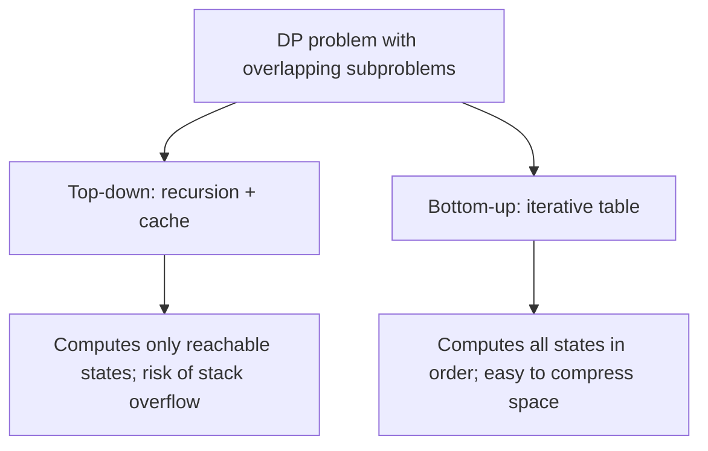
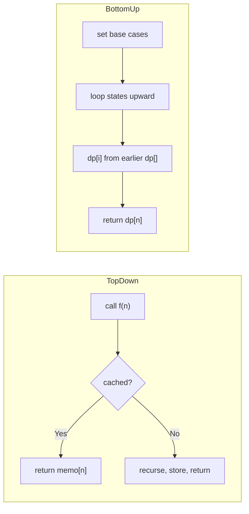

# Memoization Vs Tabulation

## Concept

Dynamic programming can be implemented in two directions. **Memoization (top-down)** keeps the natural recursive formulation but caches each subproblem's result the first time it is computed, so later calls return instantly. **Tabulation (bottom-up)** discards recursion and fills an explicit table in dependency order, from base cases up to the answer. Both solve every distinct subproblem once and share the same time complexity; they differ in control flow, memory overhead, and which subproblems get computed. Top-down only evaluates states actually reached (good for sparse state spaces); bottom-up has no recursion overhead and enables space optimizations like rolling arrays.

## Mermaid



## Complexity

- Time: identical for both — O(number of states * work per transition).
- Space: top-down needs the cache plus O(recursion depth) stack; bottom-up needs the table, often reducible to O(width of the frontier).

| Aspect | Memoization (top-down) | Tabulation (bottom-up) |
| --- | --- | --- |
| Control flow | Recursion + cache lookup | Iterative loops over states |
| States computed | Only those actually reached | All states in the table |
| Ordering | Implicit (recursion handles it) | Must define an explicit fill order |
| Stack risk | Can overflow on deep recursion | None |
| Space tricks | Harder | Easy (rolling rows / 1D arrays) |
| When preferred | Sparse/irregular state space, complex transitions | Dense state space, need space optimization |

## Java Code

```java
public final class FibTwoWays {

    // --- Top-down (memoization) ---
    // memo[i] == -1 means "not yet computed". First visit fills it.
    static long fibMemo(int n, long[] memo) {
        if (n <= 1) return n;                 // base case
        if (memo[n] != -1) return memo[n];    // cache hit: reuse stored result
        memo[n] = fibMemo(n - 1, memo) + fibMemo(n - 2, memo);
        return memo[n];
    }

    // --- Bottom-up (tabulation) ---
    // Fill the table in increasing order so dependencies are ready.
    static long fibTab(int n) {
        if (n <= 1) return n;                 // base case
        long[] dp = new long[n + 1];
        dp[1] = 1;
        for (int i = 2; i <= n; i++)
            dp[i] = dp[i - 1] + dp[i - 2];    // same recurrence, iterative
        return dp[n];
    }
}
```

## Mini Usage Example

```java
import java.util.Arrays;

public class Main {
    public static void main(String[] args) {
        long[] memo = new long[31];
        Arrays.fill(memo, -1);
        System.out.println(FibTwoWays.fibMemo(30, memo));  // top-down, prints 832040
        System.out.println(FibTwoWays.fibTab(30));         // bottom-up, prints 832040
    }
}
```

## Code Snippet Flow


