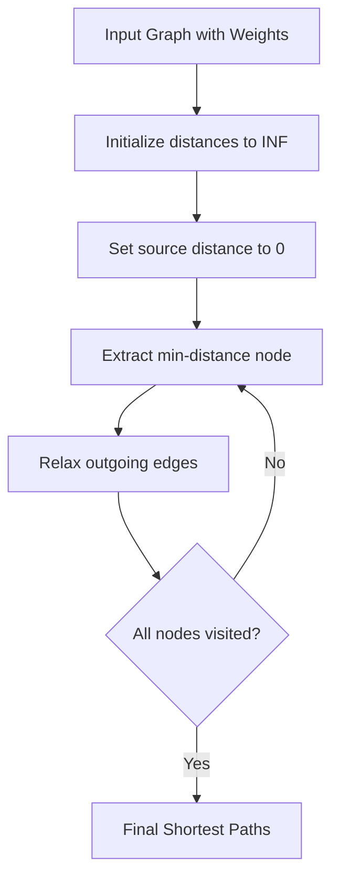

# Dijkstra

## Concept

Dijkstra's algorithm computes shortest paths from a single source in a graph with non-negative edge weights. It maintains a tentative distance array, repeatedly extracting the unsettled vertex with the smallest known distance and relaxing its outgoing edges (updating a neighbor's distance when a shorter path through the current vertex is found). A min-priority queue makes extraction efficient; because weights are non-negative, once a vertex is popped with its minimal distance that value is final. The lazy variant pushes duplicate entries and skips a popped entry whose stored distance exceeds the recorded distance. Use it for road networks, routing, and any non-negative weighted shortest-path query; for negative edges use Bellman-Ford instead.

## Mermaid



## Complexity

- Time: O((V+E) log V)
- Space: O(V+E)

## Java Code

```java
import java.util.Arrays;
import java.util.List;
import java.util.PriorityQueue;

// Java long is 64-bit; INF is halved so dist[u] + w cannot overflow.
static final long INF = Long.MAX_VALUE / 2;

// Each adjacency entry is {neighbor, weight}.
static long[] dijkstra(int src, int n, List<List<int[]>> g) {
    long[] dist = new long[n];
    Arrays.fill(dist, INF);

    // Min-heap ordered by distance; entries are {dist, vertex}.
    PriorityQueue<long[]> pq = new PriorityQueue<>((a, b) -> Long.compare(a[0], b[0]));

    dist[src] = 0;
    pq.add(new long[]{0, src});

    while (!pq.isEmpty()) {
        long[] top = pq.poll();
        long d = top[0];
        int u = (int) top[1];

        if (d > dist[u]) continue;   // stale lazy-deletion entry

        for (int[] edge : g.get(u)) {
            int v = edge[0];
            int w = edge[1];
            if (dist[u] + w < dist[v]) {
                dist[v] = dist[u] + w;
                pq.add(new long[]{dist[v], v});
            }
        }
    }

    return dist;
}
```

## Mini Usage Example

```java
List<List<int[]>> g = new ArrayList<>();
for (int i = 0; i < 4; i++) g.add(new ArrayList<>());
g.get(0).add(new int[]{1, 4});
g.get(0).add(new int[]{2, 2});
g.get(1).add(new int[]{2, 1});
g.get(1).add(new int[]{3, 5});
g.get(2).add(new int[]{3, 8});
long[] dist = dijkstra(0, 4, g);
```

## Code Snippet Flow

```mermaid
flowchart LR
    A[Initialize all distances to INF] --> B[Set source to 0]
    B --> C[Push source to priority queue]
    C --> D[While priority queue not empty]
    D --> E[Extract min-distance node u]
    E --> F{dist[current] > dist[u]?}
    F -- Yes --> G[Skip this node]
    F -- No --> H[For each neighbor v of u]
    H --> I{dist[u] + weight < dist[v]?}
    I -- Yes --> J[Update dist[v]]
    J --> K[Push v to priority queue]
    K --> L[Continue]
    G --> L
    I -- No --> L
    L --> M{More nodes in queue?}
    M -- Yes --> D
    M -- No --> N[Return final distances]
```
