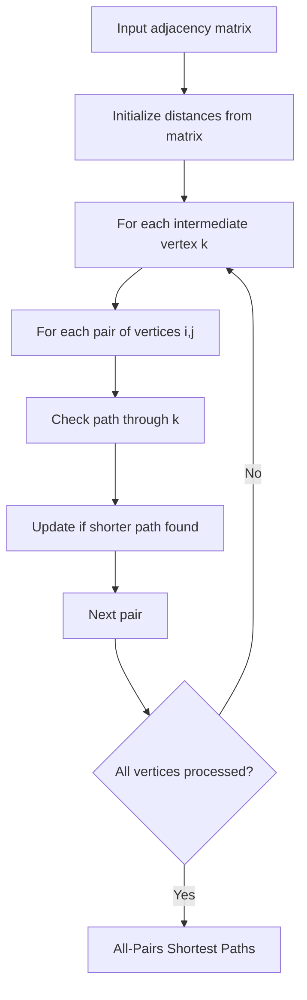

# Floyd Warshall

## Concept

Floyd-Warshall computes shortest paths between all pairs of vertices using dynamic programming over an intermediate-vertex set. Starting from the adjacency matrix, for each candidate intermediate vertex k it asks, for every pair (i, j), whether routing through k (dist[i][k] + dist[k][j]) beats the current dist[i][j]. After considering every k as a possible intermediate, dist holds the all-pairs shortest distances. It handles negative edges (a negative value on the diagonal flags a negative cycle) and runs in O(V^3) time with O(V^2) space. Prefer it for small dense graphs or when you genuinely need every pair, rather than running single-source algorithms V times.

## Mermaid



## Complexity

- Time: O(V^3)
- Space: O(V^2)

## Java Code

```java
// Java long is 64-bit; INF is halved so dist[i][k] + dist[k][j] cannot overflow.
static final long INF = Long.MAX_VALUE / 2;

static long[][] floydWarshall(long[][] adj) {
    int n = adj.length;
    long[][] dist = new long[n][n];
    for (int i = 0; i < n; i++) {
        dist[i] = adj[i].clone();   // copy each row so the input is untouched
    }

    for (int k = 0; k < n; k++) {
        for (int i = 0; i < n; i++) {
            for (int j = 0; j < n; j++) {
                if (dist[i][k] != INF && dist[k][j] != INF) {
                    dist[i][j] = Math.min(dist[i][j], dist[i][k] + dist[k][j]);
                }
            }
        }
    }

    return dist;
}
```

## Mini Usage Example

```java
int n = 4;
long[][] adj = new long[n][n];
for (long[] row : adj) Arrays.fill(row, INF);
adj[0][1] = 4; adj[0][2] = 2;
adj[1][2] = 1; adj[1][3] = 5;
adj[2][3] = 8;
for (int i = 0; i < n; i++) adj[i][i] = 0;
long[][] dist = floydWarshall(adj);
```

## Code Snippet Flow

```mermaid
flowchart LR
    A[Copy adjacency matrix to dist] --> B[For k = 0 to n-1]
    B --> C[For i = 0 to n-1]
    C --> D[For j = 0 to n-1]
    D --> E{dist[i][k] != INF?}
    E -- Yes --> F{dist[k][j] != INF?}
    E -- No --> G[No update]
    F -- Yes --> H{dist[i][k] + dist[k][j] < dist[i][j]?}
    F -- No --> G
    H -- Yes --> I[Update dist[i][j]]
    H -- No --> G
    I --> J[Next j]
    G --> J
    J --> K{j < n?}
    K -- Yes --> D
    K -- No --> L[Next i]
    L --> M{i < n?}
    M -- Yes --> C
    M -- No --> N[Next k]
    N --> O{k < n?}
    O -- Yes --> B
    O -- No --> P[Return shortest path matrix]
```
