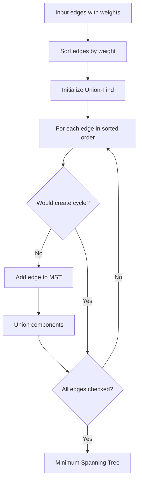

# Minimum Spanning Tree

## Concept

A minimum spanning tree (MST) of a connected, undirected weighted graph is a subset of edges that connects all vertices with the minimum possible total weight and no cycles (V-1 edges). Kruskal's algorithm sorts all edges by weight and greedily adds the next-cheapest edge whenever it joins two currently separate components, using a disjoint-set union (DSU) structure to test connectivity and skip edges that would form a cycle. The greedy choice is safe by the cut property: the lightest edge crossing any partition of the vertices belongs to some MST. Kruskal runs in O(E log E) dominated by the sort; Prim's alternative grows one tree with a priority queue in O(E log V). MSTs model least-cost network design such as laying cable, roads, or pipelines.

## Mermaid



## Complexity

- Time: O(E log E)
- Space: O(V)

## Java Code

```java
import java.util.List;

record Edge(int u, int v, int w) {}

static final class DSU {
    private final int[] parent;
    private final int[] rank;

    DSU(int n) {
        parent = new int[n];
        rank = new int[n];
        for (int i = 0; i < n; i++) parent[i] = i;
    }

    int find(int x) {
        if (parent[x] != x) parent[x] = find(parent[x]);   // path compression
        return parent[x];
    }

    boolean unite(int x, int y) {
        x = find(x);
        y = find(y);
        if (x == y) return false;
        if (rank[x] < rank[y]) { int t = x; x = y; y = t; }  // union by rank
        parent[y] = x;
        if (rank[x] == rank[y]) rank[x]++;
        return true;
    }
}

static long kruskal(int n, List<Edge> edges) {
    // Sort by weight; a fresh sorted copy keeps the caller's list untouched.
    List<Edge> sorted = new ArrayList<>(edges);
    sorted.sort((a, b) -> Integer.compare(a.w(), b.w()));
    DSU dsu = new DSU(n);
    long mstWeight = 0;

    for (Edge e : sorted) {
        if (dsu.unite(e.u(), e.v())) {
            mstWeight += e.w();
        }
    }

    return mstWeight;
}
```

## Mini Usage Example

```java
List<Edge> edges = List.of(
        new Edge(0, 1, 4),
        new Edge(0, 2, 2),
        new Edge(1, 2, 1),
        new Edge(1, 3, 5),
        new Edge(2, 3, 8));
long mstCost = kruskal(4, edges);
```

## Code Snippet Flow

```mermaid
flowchart LR
    A[Sort all edges by weight] --> B[Initialize DSU with n vertices]
    B --> C[mstWeight = 0]
    C --> D[For each edge u-v-w in sorted order]
    D --> E{find[u] != find[v]?}
    E -- No --> F[Skip edge creates cycle]
    E -- Yes --> G[Add weight to mstWeight]
    G --> H[Union find[u] and find[v]]
    H --> I{More edges?}
    F --> I
    I -- Yes --> D
    I -- No --> J[Return MST weight]
```
