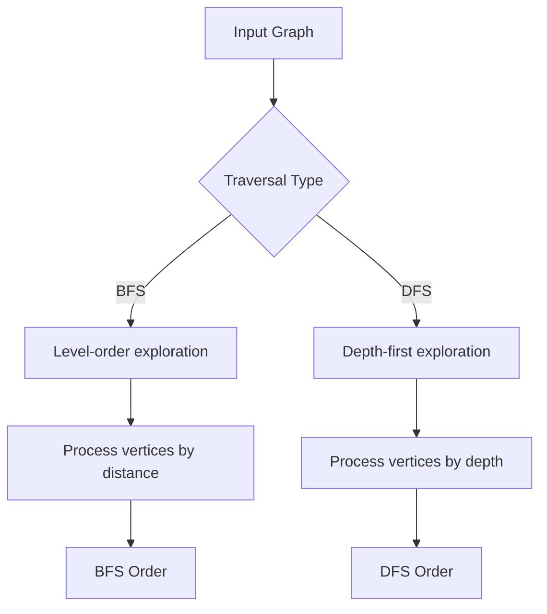
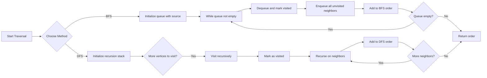

# Traversals

## Concept

Graph traversal systematically visits every reachable vertex from a source, using a "visited" set to avoid revisiting nodes (which also prevents infinite loops on cycles). Breadth-first search (BFS) uses a FIFO queue, exploring vertices in increasing order of edge-distance from the source, so it naturally yields shortest paths in unweighted graphs. Depth-first search (DFS) follows one branch as far as possible before backtracking, typically via recursion (an implicit stack) or an explicit stack. Both run in O(V+E) on an adjacency list. Use BFS for shortest-hop or level-order problems and DFS for cycle detection, topological ordering, and connectivity analysis.

## Mermaid



## Complexity

- Time: O(V+E)
- Space: O(V)

## Java Code

```java
import java.util.ArrayDeque;
import java.util.ArrayList;
import java.util.List;
import java.util.Queue;

static List<Integer> bfsTraversal(int src, List<List<Integer>> g) {
    boolean[] vis = new boolean[g.size()];
    List<Integer> order = new ArrayList<>();
    Queue<Integer> q = new ArrayDeque<>();
    vis[src] = true;
    q.add(src);

    while (!q.isEmpty()) {
        int u = q.poll();
        order.add(u);
        for (int v : g.get(u)) {
            if (!vis[v]) {
                vis[v] = true;
                q.add(v);
            }
        }
    }
    return order;
}

static void dfsHelper(int u, List<List<Integer>> g, boolean[] vis, List<Integer> order) {
    vis[u] = true;
    order.add(u);
    for (int v : g.get(u)) {
        if (!vis[v]) {
            dfsHelper(v, g, vis, order);
        }
    }
}

static List<Integer> dfsTraversal(int src, List<List<Integer>> g) {
    boolean[] vis = new boolean[g.size()];
    List<Integer> order = new ArrayList<>();
    dfsHelper(src, g, vis, order);
    return order;
}
```

## Mini Usage Example

```java
List<List<Integer>> g = List.of(
        List.of(1, 2),
        List.of(0, 3),
        List.of(0, 3),
        List.of(1, 2));
List<Integer> bfsOrder = bfsTraversal(0, g);
List<Integer> dfsOrder = dfsTraversal(0, g);
```

## Code Snippet Flow


