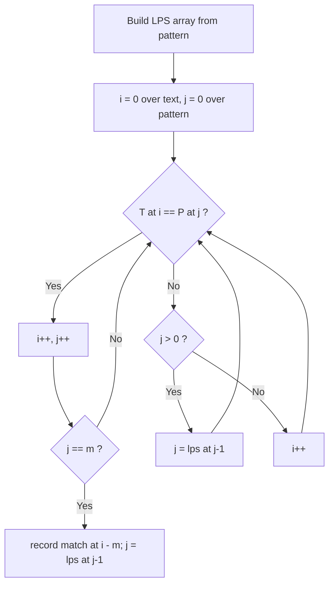
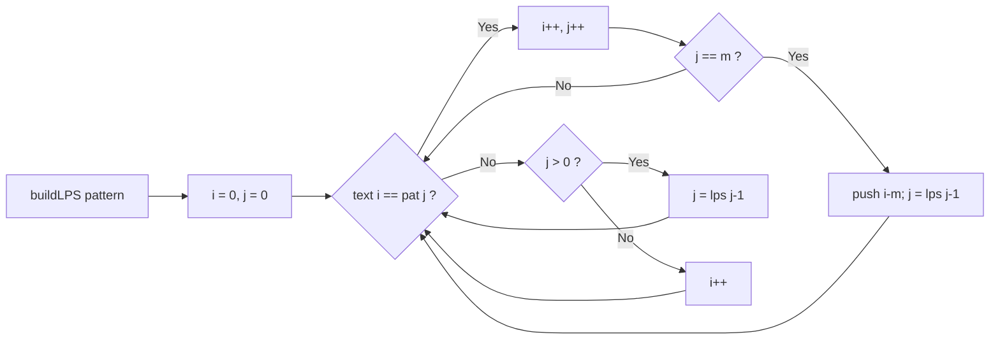

# KMP

## Concept

The Knuth-Morris-Pratt algorithm finds all occurrences of a pattern `P` (length `m`) in a text `T` (length `n`) in linear time by never re-examining text characters it has already matched. It precomputes a **longest-prefix-suffix (LPS)** array, where `lps[i]` is the length of the longest proper prefix of `P[0..i]` that is also a suffix of it. During the scan, when a mismatch occurs after matching `j` characters, instead of shifting by one, KMP falls back to `lps[j-1]`, reusing the known matched prefix and avoiding redundant comparisons. Because the text pointer only ever moves forward, the search is O(n + m). It is the standard choice when you need guaranteed linear matching without hashing.

## Mermaid



## Complexity

- Time: O(n + m) -- O(m) to build the LPS array, O(n) for the search.
- Space: O(m) for the LPS array.

## Java Code

```java
import java.util.ArrayList;
import java.util.List;

public final class KMP {

    // Build the longest-proper-prefix-which-is-also-suffix array for pat.
    static int[] buildLPS(String pat) {
        int m = pat.length();
        int[] lps = new int[m];
        int len = 0;                 // length of current matching prefix
        for (int i = 1; i < m; ) {
            if (pat.charAt(i) == pat.charAt(len)) {
                lps[i++] = ++len;    // extend the matched prefix
            } else if (len > 0) {
                len = lps[len - 1];  // fall back without advancing i
            } else {
                lps[i++] = 0;        // no prefix matches here
            }
        }
        return lps;
    }

    // Return every start index where pat occurs in text.
    static List<Integer> kmpSearch(String text, String pat) {
        List<Integer> matches = new ArrayList<>();
        int n = text.length();
        int m = pat.length();
        if (m == 0 || m > n) return matches;

        int[] lps = buildLPS(pat);
        int i = 0;                   // index into text
        int j = 0;                   // index into pattern
        while (i < n) {
            if (text.charAt(i) == pat.charAt(j)) {
                i++; j++;
                if (j == m) {                 // full pattern matched
                    matches.add(i - m);
                    j = lps[j - 1];           // continue searching
                }
            } else if (j > 0) {
                j = lps[j - 1];               // reuse matched prefix
            } else {
                i++;                          // nothing matched, advance text
            }
        }
        return matches;
    }
}
```

## Mini Usage Example

```java
public class Main {
    public static void main(String[] args) {
        for (int p : KMP.kmpSearch("ababcabcabababd", "ababd"))
            System.out.print(p + " ");  // 10
        System.out.println();
    }
}
```

## Code Snippet Flow


