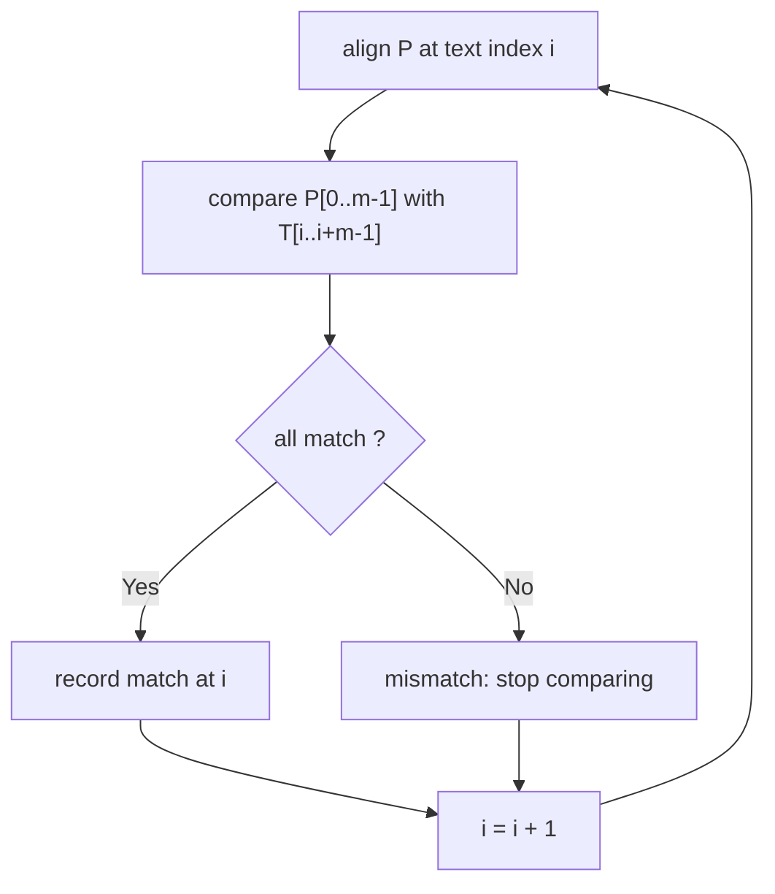
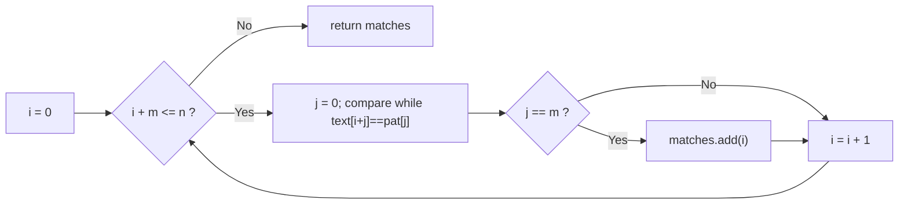

# Naive Pattern Matching

## Concept

Naive (brute-force) pattern matching finds every occurrence of a pattern `P` (length `m`) inside a text `T` (length `n`) by trying every possible alignment. For each starting index `i` from `0` to `n-m`, it compares `P` against the window `T[i..i+m-1]` character by character; on a mismatch it abandons that alignment and shifts the pattern one position to the right. It uses no preprocessing and no extra memory beyond the output, which makes it simple but slow when the text and pattern share long partial matches. It is the baseline that smarter algorithms (KMP, Z, Rabin-Karp) improve upon.

## Mermaid



## Complexity

- Time: O(n * m) worst case (e.g. `T = "aaaa...a"`, `P = "aaab"`); O(n) on typical text.
- Space: O(1) extra, plus the list of match positions returned.

## Java Code

```java
import java.util.ArrayList;
import java.util.List;

public final class NaiveSearch {

    // Brute-force search: returns every start index where pat occurs in text.
    // Outer loop tries each alignment; inner loop compares the window.
    static List<Integer> naiveSearch(String text, String pat) {
        List<Integer> matches = new ArrayList<>();
        int n = text.length();
        int m = pat.length();
        if (m == 0 || m > n) return matches;
        for (int i = 0; i + m <= n; i++) {                  // each candidate start
            int j = 0;
            while (j < m && text.charAt(i + j) == pat.charAt(j)) // compare char by char
                j++;
            if (j == m)                                     // full pattern matched
                matches.add(i);
            // On a mismatch we simply advance i by 1 (no shortcut).
        }
        return matches;
    }
}
```

## Mini Usage Example

```java
public class Main {
    public static void main(String[] args) {
        for (int p : NaiveSearch.naiveSearch("abxabcabcaby", "abcaby"))
            System.out.print(p + " ");  // prints 6
        System.out.println();
    }
}
```

## Code Snippet Flow


