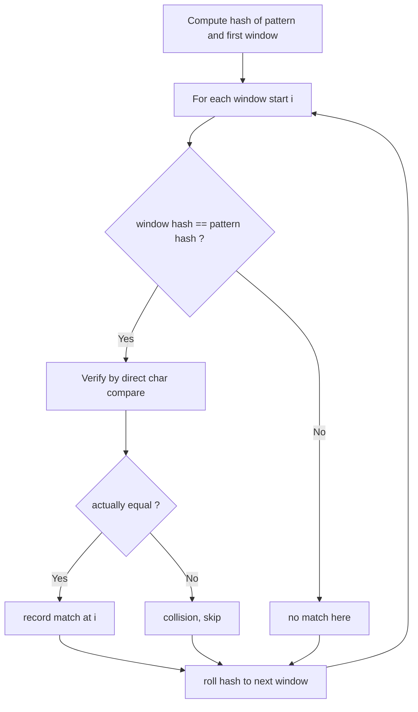
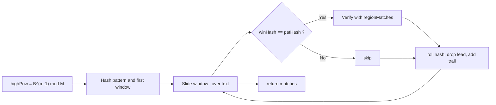

# Rolling Hash

## Concept

A rolling hash maps a string window to a number so that the hash of the next window can be derived from the current one in O(1), without rehashing every character. The standard form is a polynomial hash: treat the window as digits in base `B` and reduce modulo a large prime `M`, so `hash = (c0*B^(m-1) + c1*B^(m-2) + ... + c_{m-1}) mod M`. The Rabin-Karp pattern matcher computes the pattern hash once and rolls the text-window hash across the text: each step removes the leading character's contribution and adds the new trailing character. Because different strings can share a hash (a **collision**), every hash hit must be verified by a direct character comparison; using two independent moduli (double hashing) makes spurious collisions astronomically unlikely. Average and best-case search is O(n + m); the worst case degrades to O(n*m) only under adversarial hashing.

## Mermaid



## Complexity

- Time: O(n + m) average and best case (each roll is O(1), verification rare with a good modulus); O(n*m) worst case if hashes collide adversarially.
- Space: O(1) extra beyond the output list of match positions.

## Java Code

```java
import java.util.ArrayList;
import java.util.List;

public final class RabinKarp {

    // Rabin-Karp: find all occurrences of pat in text via a rolling
    // polynomial hash. Hash collisions are resolved by a direct compare.
    static List<Integer> rabinKarp(String text, String pat) {
        List<Integer> matches = new ArrayList<>();
        int n = text.length();
        int m = pat.length();
        if (m == 0 || m > n) return matches;

        final long B = 256;          // base (alphabet size)
        final long M = 1_000_000_007L; // large prime modulus

        // highPow = B^(m-1) mod M, used to drop the leading character.
        long highPow = 1;
        for (int i = 0; i < m - 1; i++)
            highPow = (highPow * B) % M;

        long patHash = 0, winHash = 0;
        for (int i = 0; i < m; i++) {     // hash pattern and first window
            patHash = (patHash * B + (pat.charAt(i) & 0xFF)) % M;
            winHash = (winHash * B + (text.charAt(i) & 0xFF)) % M;
        }

        for (int i = 0; i + m <= n; i++) {
            if (winHash == patHash) {     // hash hit: verify to rule out collision
                if (text.regionMatches(i, pat, 0, m))
                    matches.add(i);
            }
            if (i + m < n) {              // roll to next window
                // remove leading char, add new trailing char
                winHash = (winHash - (text.charAt(i) & 0xFF) * highPow % M + M) % M;
                winHash = (winHash * B + (text.charAt(i + m) & 0xFF)) % M;
            }
        }
        return matches;
    }
}
```

## Mini Usage Example

```java
public class Main {
    public static void main(String[] args) {
        for (int p : RabinKarp.rabinKarp("abracadabra", "abra"))
            System.out.print(p + " ");  // 0 7
        System.out.println();
    }
}
```

## Code Snippet Flow


