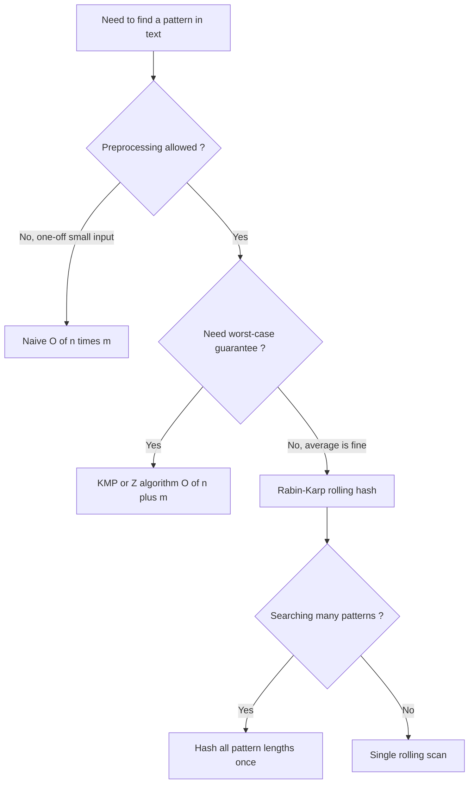
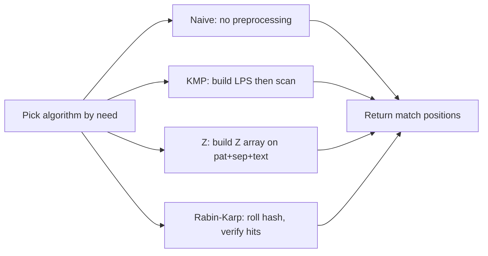

# String Algorithm Overview

## Concept

String algorithms answer questions about sequences of characters: where a pattern occurs, what structure repeats, and how strings relate. The chapter centers on **exact pattern matching** and the trade-offs between approaches. Naive matching needs no preprocessing but is O(n*m) in the worst case; KMP and the Z algorithm preprocess the pattern (or a combined string) to guarantee linear O(n+m) time; Rabin-Karp uses a rolling hash for O(n+m) average time and shines when searching for many patterns at once. Choosing among them depends on guarantees you need (worst-case vs average), whether you search repeatedly, and whether hashing collisions are acceptable. The table below summarizes when to reach for each.

## Mermaid



## Complexity

| Algorithm            | Best use case                                         | Preprocessing | Search time      | Space   |
|----------------------|-------------------------------------------------------|---------------|------------------|---------|
| Naive matching       | Tiny inputs, one-off search, baseline                 | none          | O(n*m) worst     | O(1)    |
| KMP                  | Guaranteed linear single-pattern search               | O(m) LPS      | O(n+m)           | O(m)    |
| Z algorithm          | Linear matching, prefix-structure queries             | O(n+m) combined | O(n+m)         | O(n+m)  |
| Rabin-Karp (hash)    | Multi-pattern / many queries, average-case speed      | O(m)          | O(n+m) avg, O(n*m) worst | O(1) |

Here `n` is the text length and `m` is the pattern length.

> JDK note: `String.indexOf` and `java.util.regex` provide built-in matching, but the implementations below are written from scratch for teaching.

## Java Code

```java
import java.util.ArrayList;
import java.util.List;

public final class StringMatch {

    // A convenience baseline used throughout the chapter: naive search that
    // returns every start index where pat occurs in text (O(n*m) worst case).
    // Smarter algorithms (KMP, Z, Rabin-Karp) optimize this with preprocessing.
    static List<Integer> findMatches(String text, String pat) {
        List<Integer> pos = new ArrayList<>();
        int n = text.length();
        int m = pat.length();
        if (m == 0 || m > n) return pos;
        for (int i = 0; i + m <= n; i++) {                  // each candidate alignment
            int j = 0;
            while (j < m && text.charAt(i + j) == pat.charAt(j)) // compare the window
                j++;
            if (j == m) pos.add(i);                         // full match
        }
        return pos;
    }
}
```

## Mini Usage Example

```java
public class Main {
    public static void main(String[] args) {
        for (int p : StringMatch.findMatches("aaaaa", "aa"))
            System.out.print(p + " ");  // 0 1 2 3
        System.out.println();
    }
}
```

## Code Snippet Flow


