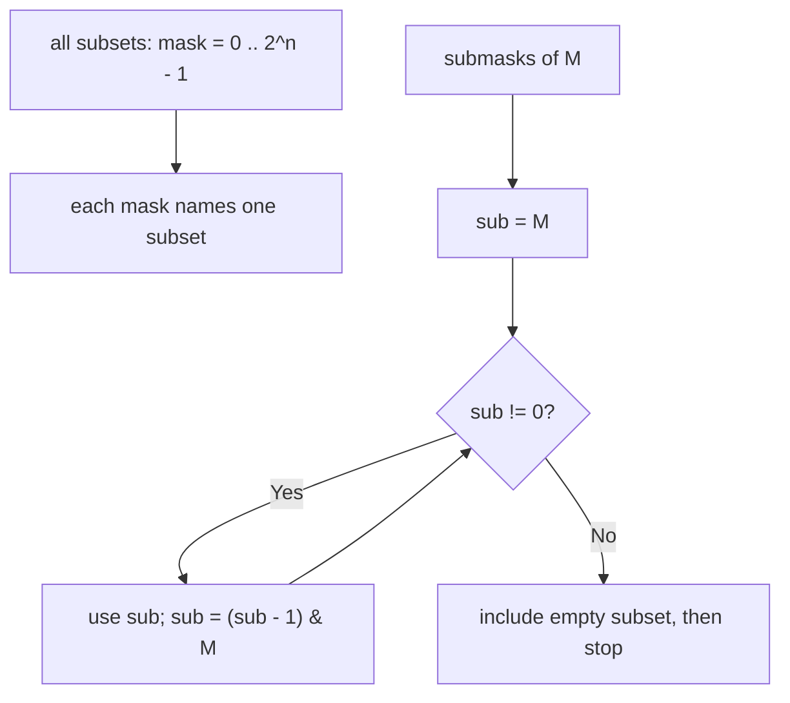
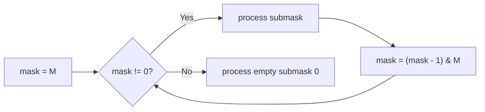

# Bitmask Subsets

## Concept

A bitmask represents a subset of `n` items as the bits of an integer: bit `i`
set means item `i` is included. Iterating all subsets of an `n`-element set is
then just counting `mask` from `0` to `2^n - 1`, since each value names a
distinct subset. A more subtle and very useful trick is enumerating only the
submasks of a given mask -- every subset of the items already present in `mask`.
The idiom `for (sub = mask; sub != 0; sub = (sub - 1) & mask)` walks those submasks
in decreasing order: subtracting 1 borrows through the low zero bits, and the
`& mask` re-confines the result to bits that exist in `mask`. This powers
subset-sum, SOS DP, and partition-style problems. Iterating submasks over all
masks costs O(3^n) total, not O(4^n).

## Mermaid



## Complexity

- Time: O(2^n) to iterate all subsets of an n-element set; O(3^n) to iterate every submask of every mask.
- Space: O(1) extra (just the loop variable).

## Java Code

```java
import java.util.ArrayList;
import java.util.List;

// Collect every subset of {0, 1, ..., n-1} as a bitmask (n must be <= ~20).
static List<Integer> allSubsets(int n) {
    List<Integer> subsets = new ArrayList<>();
    int total = 1 << n;                  // 2^n subsets in total
    for (int mask = 0; mask < total; mask++) {
        // To read members: for (int i = 0; i < n; i++) if ((mask & (1 << i)) != 0) ...
        subsets.add(mask);
    }
    return subsets;
}

// Collect every submask of `mask` (each subset of the bits set in mask).
static List<Integer> subMasks(int mask) {
    List<Integer> subs = new ArrayList<>();
    // Walk submasks in decreasing order. Subtracting 1 flips the lowest set bit
    // to 0 and lower zeros to 1; & mask drops bits not present in mask.
    for (int sub = mask; sub != 0; sub = (sub - 1) & mask)
        subs.add(sub);
    subs.add(0);                         // the loop stops before the empty submask
    return subs;
}
```

## Mini Usage Example

```java
List<Integer> s = allSubsets(3);    // 8 masks: 0,1,2,3,4,5,6,7
List<Integer> m = subMasks(0b101);  // submasks of {0,2}: 0b101, 0b100, 0b001, 0b000
```

## Code Snippet Flow


