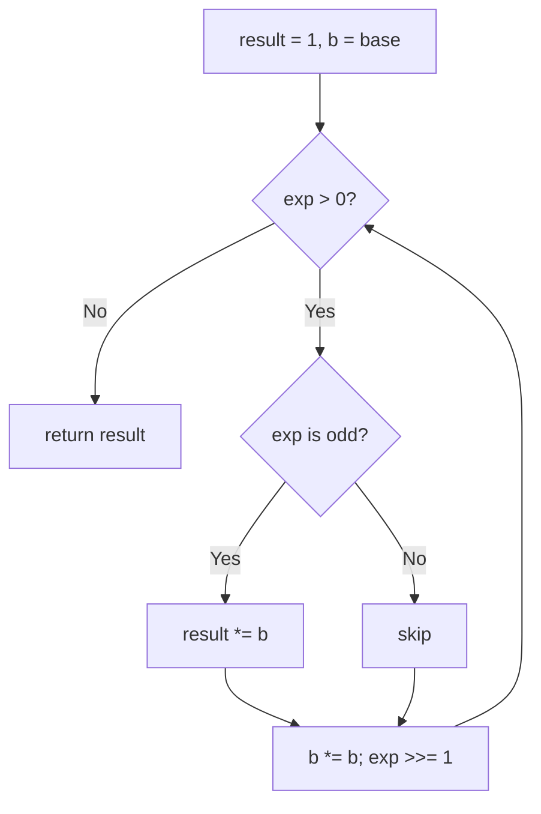
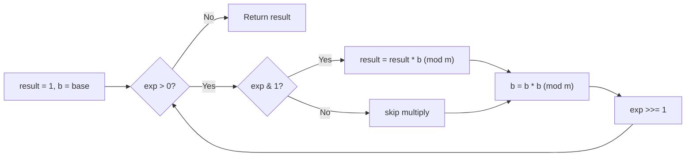

# Fast Exponentiation

## Concept

Fast exponentiation (binary exponentiation, or exponentiation by squaring)
computes `base^exp` in a logarithmic number of multiplications instead of the
naive linear loop. It reads the exponent in binary: repeatedly square the base
and, whenever the current low bit of the exponent is 1, fold the current base
into the result. This works because `base^exp` is the product of `base^(2^i)`
over the set bits `i` of the exponent. The same structure gives modular
exponentiation `base^exp mod m` by reducing after every multiply, which is
essential for cryptography and modular-arithmetic problems where the raw power
would overflow. Use it whenever the exponent is large.

## Mermaid



## Complexity

- Time: O(log exp) -- one squaring per bit of the exponent.
- Space: O(1) for the iterative form.

## Java Code

```java
// Plain binary exponentiation: base^exp (no modulus). Beware overflow for
// large results; Java long is 64-bit, so keep inputs small or use BigInteger.
static long power(long base, long exp) {
    long result = 1;
    while (exp > 0) {
        if ((exp & 1L) == 1)    // current low bit set -> multiply base in
            result *= base;
        base *= base;           // square the base for the next bit
        exp >>= 1L;             // move to the next exponent bit
    }
    return result;
}

// Modular exponentiation: base^exp mod m. Reduces after every multiply so
// intermediate values stay below m^2 and never overflow long for m < ~3e9.
// For larger moduli, use BigInteger.modPow.
static long modPow(long base, long exp, long m) {
    long result = 1 % m;        // handles m == 1 (everything is 0 mod 1)
    base %= m;
    while (exp > 0) {
        if ((exp & 1L) == 1)
            result = (result * base) % m;
        base = (base * base) % m;
        exp >>= 1L;
    }
    return result;
}
```

## Mini Usage Example

```java
long p = power(3, 10);                 // 59049
long m = modPow(2, 10, 1_000_000_007L); // 1024
```

## Code Snippet Flow


