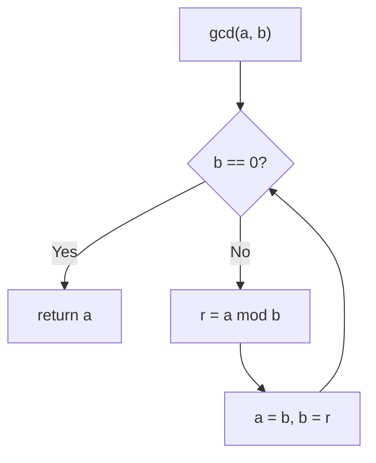
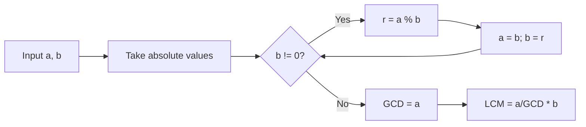

# GCD LCM

## Concept

The greatest common divisor (GCD) of two integers is the largest integer that
divides both of them. The Euclidean algorithm computes it by repeatedly
replacing the larger value with the remainder of dividing the two values:
`gcd(a, b) = gcd(b, a mod b)`, stopping when the remainder is zero. The least
common multiple (LCM) is then derived from the identity `a * b = gcd(a, b) * lcm(a, b)`.
Use the GCD to reduce fractions, find a common period, or simplify ratios, and
the LCM to align cycles or denominators. When computing the LCM, divide before
multiplying (`a / gcd * b`) so the intermediate product does not overflow.

## Mermaid



## Complexity

- Time: O(log min(a, b)) for the Euclidean GCD; LCM is the same since it makes one GCD call.
- Space: O(1) for the iterative version.

## Java Code

```java
// Euclidean GCD: gcd(a, b) = gcd(b, a mod b). Returns a non-negative result.
static long gcd(long a, long b) {
    a = Math.abs(a);
    b = Math.abs(b);
    while (b != 0) {           // loop until the remainder becomes 0
        long r = a % b;        // remainder of a divided by b
        a = b;                 // shift: old divisor becomes new dividend
        b = r;                 // remainder becomes new divisor
    }
    return a;                  // when b == 0, a holds the GCD
}

// LCM via the identity a*b = gcd(a,b)*lcm(a,b).
// Divide first (a / g) to avoid overflowing the intermediate product.
// For values beyond the 64-bit range, use BigInteger instead.
static long lcm(long a, long b) {
    if (a == 0 || b == 0) return 0; // lcm with 0 is defined as 0
    long g = gcd(a, b);
    return Math.abs(a / g * b);     // a/g is exact, then multiply by b
}
```

## Mini Usage Example

```java
long g = gcd(48, 18);   // g == 6
long l = lcm(4, 6);     // l == 12
```

## Code Snippet Flow


