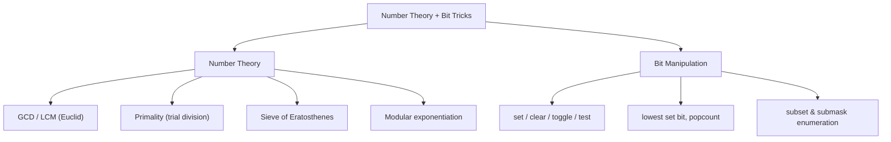
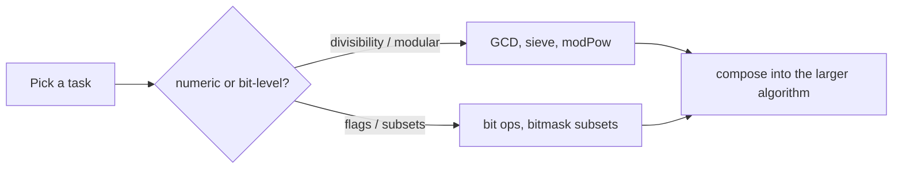

# Number Bit Overview

## Concept

This chapter pairs two toolkits that show up constantly in algorithm work:
elementary number theory (divisibility, primes, modular arithmetic) and bit
manipulation (treating an integer as a vector of flags). They reinforce each
other -- fast exponentiation is built from bit shifts, sieves use compact flag
arrays, and bitmasks encode subsets for combinatorial number problems. The
sections that follow drill into GCD/LCM, primality testing, the Sieve of
Eratosthenes, binary exponentiation, single-bit operations, and subset
enumeration. This overview collects the headline operations and one-line idioms
so you can recall the right tool at a glance before diving into each topic.

## Mermaid



## Complexity

- GCD (Euclid): O(log min(a, b)) time, O(1) space.
- Primality (trial division, 6k +/- 1): O(sqrt n) time, O(1) space.
- Sieve of Eratosthenes: O(n log log n) time, O(n) space.
- Fast / modular exponentiation: O(log exp) time, O(1) space.
- Single bit operations: O(1) time and space.
- All subsets: O(2^n); all submasks over all masks: O(3^n).

## Java Code

Cheat-table of the most-used idioms. Each expression is O(1) on a machine word
unless noted. Java has no unsigned int, so use `>>>` for logical right shifts and
`Integer.bitCount` / `Long.bitCount` for population count.

| Operation | Expression | Note |
|---|---|---|
| Is bit k set | `(x >>> k) & 1` | reads a single flag |
| Set bit k | `x \| (1 << k)` | turn flag on |
| Clear bit k | `x & ~(1 << k)` | turn flag off |
| Toggle bit k | `x ^ (1 << k)` | flip flag |
| Lowest set bit | `x & -x` | two's-complement isolate |
| Clear lowest set bit | `x & (x - 1)` | drops one bit |
| Is power of two | `x != 0 && (x & (x - 1)) == 0` | exactly one bit set |
| Count set bits | `Integer.bitCount(x)` | JDK intrinsic |
| Multiply / divide by 2^k | `x << k` / `x >>> k` | shift (use >>> for logical) |
| Even / odd test | `(x & 1) == 0` | low bit |
| GCD | `gcd(a, b) = gcd(b, a % b)` | Euclid, base case b == 0 |
| LCM (no overflow) | `a / gcd(a,b) * b` | divide before multiply |
| Modular reduce product | `(a % m) * (b % m) % m` | keep values bounded |
| Iterate all subsets | `for (m = 0; m < (1<<n); ++m)` | 2^n masks |
| Iterate submasks of m | `for (s = m; s != 0; s = (s-1) & m)` | excludes empty set |

```java
// Two anchor routines used throughout the chapter.
static long gcd(long a, long b) {              // Euclidean GCD
    while (b != 0) { long r = a % b; a = b; b = r; }
    return Math.abs(a);
}

static long modPow(long base, long exp, long m) { // base^exp mod m
    long r = 1 % m;
    base %= m;
    while (exp > 0) {
        if ((exp & 1L) == 1) r = (r * base) % m;   // fold in when low bit set
        base = (base * base) % m;                  // square for next bit
        exp >>= 1L;
    }
    return r;
}
```

## Mini Usage Example

```java
long g = gcd(24, 36);                    // 12
long e = modPow(7, 13, 1_000_000_007L);  // 7^13 mod 1e9+7
boolean odd = (g & 1) != 0;              // false
```

## Code Snippet Flow


