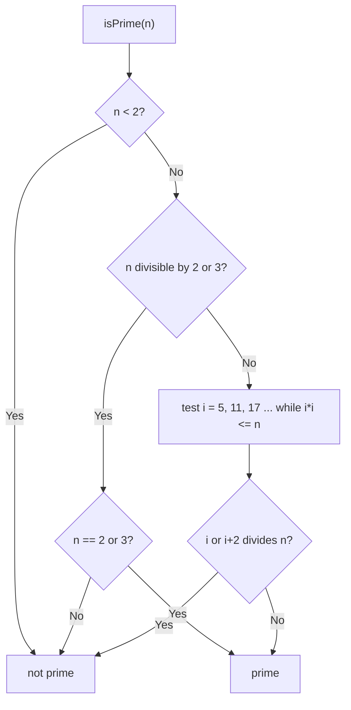
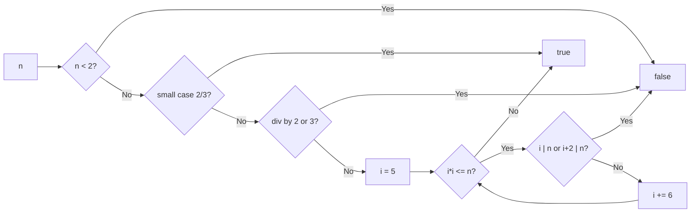

# Prime Checking

## Concept

A prime number is an integer greater than 1 whose only divisors are 1 and
itself. To test a single number `n`, trial division checks whether any integer
in a candidate set divides `n`; if none does, `n` is prime. A key optimization
is that we only need to test divisors up to `sqrt(n)`, because any factor larger
than the square root pairs with a smaller one already tested. The `6k +/- 1`
trick further skips multiples of 2 and 3: after handling 2 and 3 directly,
every prime is of the form `6k - 1` or `6k + 1`, so we step by 6 and only test
those two candidates. Use trial division for one-off checks on moderately sized
numbers; for testing many numbers up to a bound, prefer a sieve instead.

## Mermaid



## Complexity

- Time: O(sqrt n) -- we test candidate divisors only up to the square root of n.
- Space: O(1).

## Java Code

```java
// Trial division using the 6k +/- 1 optimization.
// Java long is 64-bit; i * i stays within range for n up to ~9.2e18.
static boolean isPrime(long n) {
    if (n < 2) return false;          // 0, 1, and negatives are not prime
    if (n < 4) return true;           // 2 and 3 are prime
    if (n % 2 == 0 || n % 3 == 0)     // eliminate multiples of 2 and 3
        return false;
    // Every prime > 3 is of the form 6k - 1 or 6k + 1. Start at 5 (= 6*1 - 1)
    // and check i and i + 2, then jump ahead by 6.
    for (long i = 5; i * i <= n; i += 6) {
        if (n % i == 0 || n % (i + 2) == 0)
            return false;             // found a divisor -> composite
    }
    return true;                      // no divisor up to sqrt(n) -> prime
}
```

## Mini Usage Example

```java
boolean a = isPrime(97);        // true
boolean b = isPrime(91);        // false (91 = 7 * 13)
```

## Code Snippet Flow


