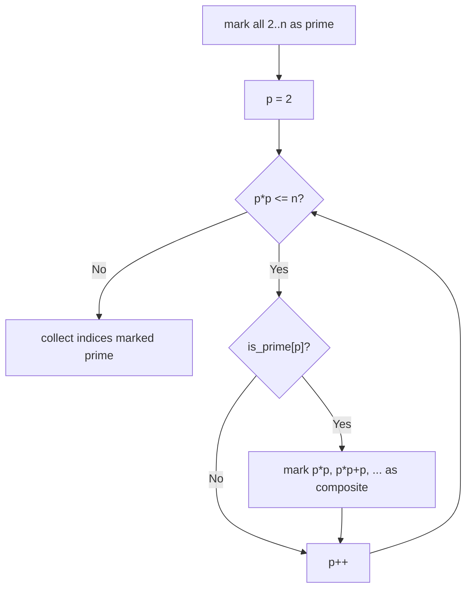
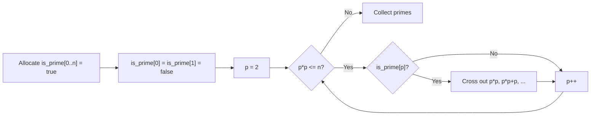

# Sieve

## Concept

The Sieve of Eratosthenes finds all prime numbers up to a limit `n` far faster
than testing each number individually. It keeps a boolean array marking every
integer as prime, then walks from the smallest prime upward: whenever it finds a
number still marked prime, it crosses out all of that number's multiples as
composite. Starting the inner crossing-out at `p*p` is correct because any
smaller multiple of `p` already has a smaller prime factor and was crossed out
earlier. After the sweep, every index still marked true is prime. Use a sieve
when you need many primes or repeated primality checks within a fixed range; for
a single large number, trial division is more memory-efficient.

## Mermaid



## Complexity

- Time: O(n log log n) -- the cost of crossing out multiples summed over all primes.
- Space: O(n) for the boolean prime-flag array.

## Java Code

```java
import java.util.ArrayList;
import java.util.Arrays;
import java.util.List;

// Returns isPrime flags for 0..n and fills `primes` with the actual primes.
static boolean[] sieve(int n, List<Integer> primes) {
    boolean[] isPrime = new boolean[n + 1];
    Arrays.fill(isPrime, true);       // true = prime candidate, false = composite
    if (n >= 0) isPrime[0] = false;   // 0 is not prime
    if (n >= 1) isPrime[1] = false;   // 1 is not prime
    for (int p = 2; (long) p * p <= n; p++) {
        if (isPrime[p]) {             // p is prime: cross out its multiples
            // Start at p*p; smaller multiples were handled by smaller primes.
            for (int m = p * p; m <= n; m += p)
                isPrime[m] = false;
        }
    }
    primes.clear();
    for (int i = 2; i <= n; i++)      // gather everything still marked prime
        if (isPrime[i]) primes.add(i);
    return isPrime;
}
```

## Mini Usage Example

```java
List<Integer> primes = new ArrayList<>();
boolean[] flag = sieve(30, primes);
// primes == [2, 3, 5, 7, 11, 13, 17, 19, 23, 29]
boolean is17 = flag[17];   // true
```

## Code Snippet Flow


