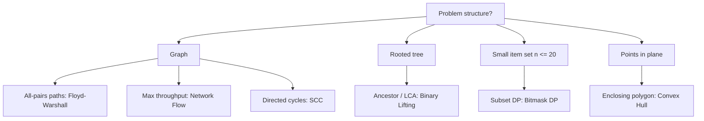
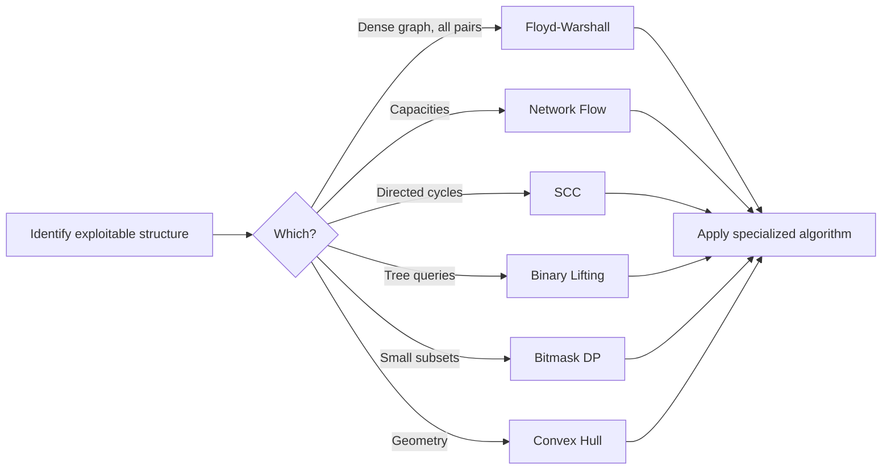

# Advanced Overview

## Concept

This chapter collects techniques that go beyond the standard sorting/searching/basic-graph toolkit, each tuned to a structural property of the problem. Several attack graphs from different angles: shortest paths between every pair (Floyd-Warshall), maximum throughput (network flow), and condensing directed cycles (strongly connected components). Others exploit small parameters or geometry: bitmask DP enumerates subsets when n is tiny, binary lifting answers ancestor/LCA queries on trees in logarithmic time, and convex hull frames problems geometrically. The shared lesson is to recognize the structure - a DAG, a tree, a small item set, points in a plane, a capacitated network - and reach for the matching specialized algorithm rather than a brute-force scan.

## Mermaid



## Complexity

| Technique | Typical Complexity | Use it when |
| --- | --- | --- |
| Floyd-Warshall | O(V^3) time, O(V^2) space | Need shortest paths between ALL pairs on a small/dense graph; handles negative edges |
| Network Flow (Edmonds-Karp) | O(V * E^2) | Maximizing throughput / matching / min-cut on a capacitated digraph |
| Strongly Connected Components (Kosaraju/Tarjan) | O(V + E) | Finding mutually-reachable groups, condensing a digraph, 2-SAT |
| Binary Lifting | O(n log n) build, O(log n) query | Repeated k-th ancestor or LCA queries on a static rooted tree |
| Bitmask DP | O(2^n * n) states (e.g. O(2^n * n^2) for TSP) | Subset-dependent optimization with small n (<= ~20) |
| Convex Hull (monotone chain) | O(n log n) | Smallest enclosing polygon, farthest pair, geometry preprocessing |

## Java Code

```java
public final class Geometry {

    // Illustrative geometry primitive shared by several advanced routines:
    // the 2D cross product, the building block of convex hull and orientation tests.
    // Returns >0 for a counter-clockwise turn, <0 clockwise, 0 collinear.
    // Use long (64-bit) for the products to avoid the silent overflow Python
    // never has but Java shares with C++ on large coordinates.
    public static long cross(long ox, long oy,
                             long ax, long ay,
                             long bx, long by) {
        return (ax - ox) * (by - oy) - (ay - oy) * (bx - ox);
    }
}
```

## Mini Usage Example

```java
// Orientation of the turn O(0,0) -> A(1,0) -> B(1,1): a left (CCW) turn.
long turn = Geometry.cross(0, 0, 1, 0, 1, 1);   // > 0  => counter-clockwise
boolean ccw = (turn > 0);
```

## Code Snippet Flow


