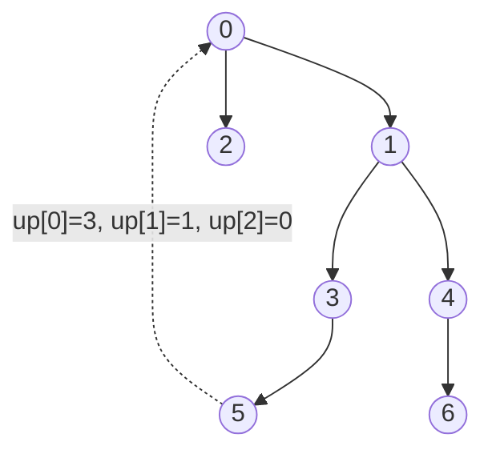

# Binary Lifting

## Concept

Binary lifting precomputes, for every node, its 2^k-th ancestor in a rooted tree so that any ancestor query jumps in powers of two. The key idea is the recurrence up[k][v] = up[k-1][ up[k-1][v] ]: the 2^k-th ancestor is the 2^(k-1)-th ancestor of the 2^(k-1)-th ancestor. With the table built in O(n log n), the k-th ancestor of any node is reached in O(log n) by decomposing k into its set bits. The lowest common ancestor (LCA) of two nodes uses the same table: first lift the deeper node to equal depth, then lift both together by decreasing powers of two until their parents coincide. It is the standard tool for fast LCA, k-th ancestor, and path aggregate queries on static trees.

## Mermaid



## Complexity

- Time: O(n log n) preprocessing, O(log n) per k-th ancestor or LCA query
- Space: O(n log n) for the ancestor table

## Java Code

```java
import java.util.ArrayDeque;
import java.util.Deque;
import java.util.List;

public final class BinaryLifting {
    private final int log;
    private final int[] depth;
    private final int[][] up;          // up[k][v] = 2^k-th ancestor of v (-1 if none)

    // adj: rooted tree as adjacency list; root has no parent
    public BinaryLifting(List<List<Integer>> adj, int root) {
        int n = adj.size();
        int lg = 1;
        while ((1 << lg) < n) lg++;    // smallest log with 2^log >= n
        this.log = lg;
        depth = new int[n];
        up = new int[log + 1][n];
        for (int[] row : up) java.util.Arrays.fill(row, -1);

        // DFS (iterative) to fill depth and direct parents up[0].
        // Each frame is {node, parent}.
        Deque<int[]> stk = new ArrayDeque<>();
        stk.push(new int[]{root, -1});
        while (!stk.isEmpty()) {
            int[] frame = stk.pop();
            int v = frame[0], p = frame[1];
            up[0][v] = p;
            for (int to : adj.get(v)) {
                if (to != p) {
                    depth[to] = depth[v] + 1;
                    stk.push(new int[]{to, v});
                }
            }
        }

        // Fill higher powers using the doubling recurrence.
        for (int k = 1; k <= log; k++)
            for (int v = 0; v < n; v++) {
                int mid = up[k - 1][v];
                up[k][v] = (mid == -1) ? -1 : up[k - 1][mid];
            }
    }

    // Return the ancestor of v that is 'dist' edges above it (-1 if out of range).
    public int kthAncestor(int v, int dist) {
        for (int k = 0; k <= log && v != -1; k++)
            if ((dist & (1 << k)) != 0) v = up[k][v];
        return v;
    }

    // Lowest common ancestor of u and v.
    public int lca(int u, int v) {
        if (depth[u] < depth[v]) {     // ensure u is the deeper node
            int t = u; u = v; v = t;
        }
        u = kthAncestor(u, depth[u] - depth[v]);   // bring u up to v's depth
        if (u == v) return u;
        for (int k = log; k >= 0; k--)             // lift both while ancestors differ
            if (up[k][u] != up[k][v]) {
                u = up[k][u];
                v = up[k][v];
            }
        return up[0][u];                           // parent is the LCA
    }
}
```

## Mini Usage Example

```java
//        0
//       / \
//      1   2
//     / \
//    3   4
List<List<Integer>> adj = new ArrayList<>();
for (int i = 0; i < 5; i++) adj.add(new ArrayList<>());
adj.get(0).add(1); adj.get(1).add(0);
adj.get(0).add(2); adj.get(2).add(0);
adj.get(1).add(3); adj.get(3).add(1);
adj.get(1).add(4); adj.get(4).add(1);

BinaryLifting bl = new BinaryLifting(adj, 0);
int anc  = bl.kthAncestor(3, 2);   // 2nd ancestor of 3 -> 0
int meet = bl.lca(3, 4);           // LCA(3,4) -> 1
int far  = bl.lca(3, 2);           // LCA(3,2) -> 0
```

## Code Snippet Flow

```mermaid
flowchart LR
    A[DFS: set depth and up[0] parent] --> B[For k = 1..LOG]
    B --> C["up[k][v] = up[k-1][ up[k-1][v] ]"]
    C --> D{More k?}
    D -- Yes --> B
    D -- No --> E[Table ready]
    E --> F[Query: equalize depths via kthAncestor]
    F --> G{Same node?}
    G -- Yes --> H[Return it as LCA]
    G -- No --> I[Lift both by decreasing powers]
    I --> J[Return up[0] of either node]
```
