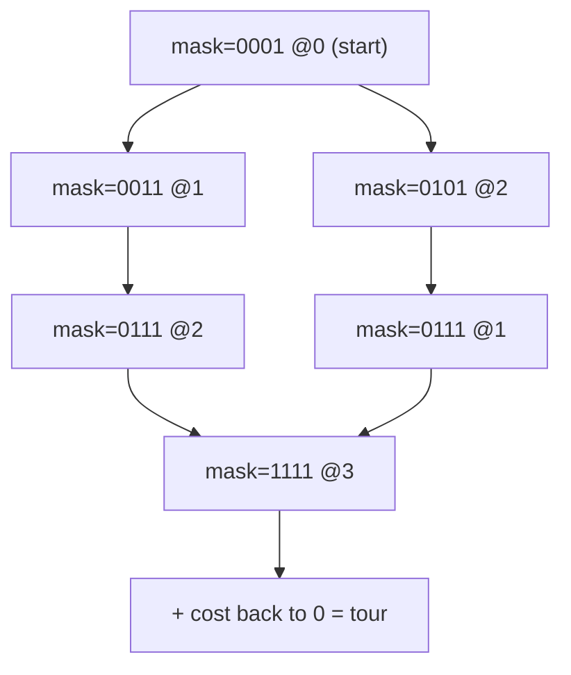
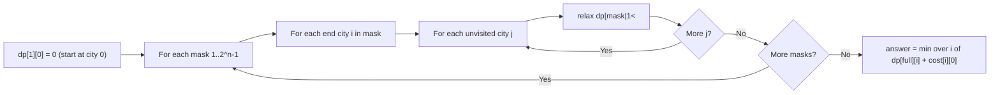

# Bitmask DP

## Concept

Bitmask dynamic programming encodes a subset of up to ~20 items as the bits of an integer, turning an exponential set-cover state into an array index. The canonical example is the Travelling Salesman Problem: dp[mask][i] is the minimum cost of a path that has visited exactly the set of cities in mask and currently sits at city i. Transitions extend the path to an unvisited city j: dp[mask | (1<<j)][j] = min(..., dp[mask][i] + cost[i][j]). Because each of the 2^n masks pairs with n endpoints and each transition scans n successors, the running time is O(2^n * n^2) for TSP (O(2^n * n) states). Use bitmask DP when n is small (typically <= 20) and the answer depends on which subset has been processed, not just how many.

## Mermaid



## Complexity

- Time: O(2^n * n^2) for TSP (states 2^n * n, each with n transitions)
- Space: O(2^n * n) for the dp table

## Java Code

```java
import java.util.Arrays;

public final class BitmaskTsp {

    // Minimum-cost Hamiltonian cycle (TSP) starting and ending at city 0.
    // cost[i][j] is the edge weight from city i to city j.
    public static int tsp(int[][] cost) {
        int n = cost.length;
        final int INF = Integer.MAX_VALUE / 2;     // halved so INF + cost cannot overflow
        int full = 1 << n;

        // dp[mask][i] = min cost to start at 0, visit exactly 'mask', end at i.
        int[][] dp = new int[full][n];
        for (int[] row : dp) Arrays.fill(row, INF);
        dp[1][0] = 0;                              // only city 0 visited, sitting at 0

        for (int mask = 1; mask < full; mask++) {
            for (int i = 0; i < n; i++) {
                if (dp[mask][i] == INF) continue;  // unreachable state
                if ((mask & (1 << i)) == 0) continue;  // i must be inside mask
                for (int j = 0; j < n; j++) {
                    if ((mask & (1 << j)) != 0) continue;  // skip already-visited city
                    int next = mask | (1 << j);
                    int cand = dp[mask][i] + cost[i][j];
                    if (cand < dp[next][j]) dp[next][j] = cand;
                }
            }
        }

        // Close the tour: from each end city back to 0 with all cities visited.
        int best = INF;
        for (int i = 0; i < n; i++)
            best = Math.min(best, dp[full - 1][i] + cost[i][0]);
        return best;
    }
}
```

## Mini Usage Example

```java
// 4 cities, symmetric distance matrix
int[][] cost = {
    {0, 10, 15, 20},
    {10, 0, 35, 25},
    {15, 35, 0, 30},
    {20, 25, 30, 0}
};
int minTour = BitmaskTsp.tsp(cost);   // shortest cycle 0 -> ... -> 0, returns 80
```

## Code Snippet Flow


