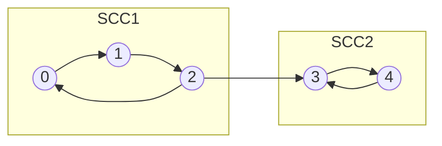

# Strongly Connected Components

## Concept

A strongly connected component (SCC) of a directed graph is a maximal set of vertices in which every vertex can reach every other vertex. Kosaraju's algorithm finds all SCCs with two depth-first searches. The first DFS on the original graph pushes each vertex onto a stack in order of finishing time, so vertices that finish last sit on top. It then transposes the graph (reverses every edge) and runs DFS popping vertices off that stack; each tree in this second pass is exactly one SCC, because reversing edges keeps vertices mutually reachable only within their own component. Both passes are linear, giving O(V+E) overall. Condensing each SCC into a single node yields a DAG, which is the basis for 2-SAT, dependency analysis, and deadlock detection.

## Mermaid



## Complexity

- Time: O(V + E) (two linear DFS passes plus building the transpose)
- Space: O(V + E) for the graphs, visited array, and finish-order stack

## Java Code

```java
import java.util.ArrayDeque;
import java.util.ArrayList;
import java.util.Arrays;
import java.util.Deque;
import java.util.List;

// Kosaraju's algorithm. run() returns comp[v] = SCC id of vertex v (0-based ids).
public final class Kosaraju {
    private final int n;
    private final List<List<Integer>> adj;   // graph
    private final List<List<Integer>> radj;  // transpose (reversed edges)
    private final List<Integer> order = new ArrayList<>();
    private int[] comp;
    private boolean[] visited;

    public Kosaraju(int n) {
        this.n = n;
        adj = new ArrayList<>(n);
        radj = new ArrayList<>(n);
        for (int i = 0; i < n; i++) {
            adj.add(new ArrayList<>());
            radj.add(new ArrayList<>());
        }
    }

    public void addEdge(int u, int v) {
        adj.get(u).add(v);
        radj.get(v).add(u);                   // reversed edge for the transpose
    }

    // First pass: push vertices in order of finish time (iterative DFS).
    private void dfs1(int s) {
        // Each frame holds (vertex, next child index) packed via a parallel stack.
        Deque<int[]> stk = new ArrayDeque<>();
        stk.push(new int[]{s, 0});
        visited[s] = true;
        while (!stk.isEmpty()) {
            int[] frame = stk.peek();
            int u = frame[0];
            if (frame[1] < adj.get(u).size()) {
                int v = adj.get(u).get(frame[1]++);
                if (!visited[v]) {
                    visited[v] = true;
                    stk.push(new int[]{v, 0});
                }
            } else {
                order.add(u);                 // u finished
                stk.pop();
            }
        }
    }

    // Second pass on the transpose: collect one SCC per DFS tree.
    private void dfs2(int s, int id) {
        Deque<Integer> stk = new ArrayDeque<>();
        stk.push(s);
        comp[s] = id;
        while (!stk.isEmpty()) {
            int u = stk.pop();
            for (int v : radj.get(u)) {
                if (comp[v] == -1) {
                    comp[v] = id;
                    stk.push(v);
                }
            }
        }
    }

    public int[] run() {
        visited = new boolean[n];
        order.clear();
        for (int v = 0; v < n; v++)
            if (!visited[v]) dfs1(v);

        comp = new int[n];
        Arrays.fill(comp, -1);
        int id = 0;
        // Process vertices by decreasing finish time.
        for (int i = n - 1; i >= 0; i--) {
            int v = order.get(i);
            if (comp[v] == -1) dfs2(v, id++);
        }
        return comp;                          // id values 0..(#SCC-1)
    }
}
```

## Mini Usage Example

```java
// Two SCCs: {0,1,2} forms a cycle, {3,4} forms a cycle, with edge 2 -> 3.
Kosaraju k = new Kosaraju(5);
k.addEdge(0, 1); k.addEdge(1, 2); k.addEdge(2, 0);
k.addEdge(2, 3);
k.addEdge(3, 4); k.addEdge(4, 3);

int[] comp = k.run();
// comp[0]==comp[1]==comp[2], comp[3]==comp[4], and the two ids differ.
```

## Code Snippet Flow

```mermaid
flowchart LR
    A[DFS on original graph] --> B[Push each vertex on finish]
    B --> C[Build transpose: reverse all edges]
    C --> D[Pop vertices by decreasing finish time]
    D --> E{Vertex unassigned?}
    E -- Yes --> F[DFS on transpose: label this SCC]
    F --> G[Increment SCC id]
    E -- No --> H[Skip]
    G --> D
    H --> D
    D --> I[Return comp[] SCC labels]
```
