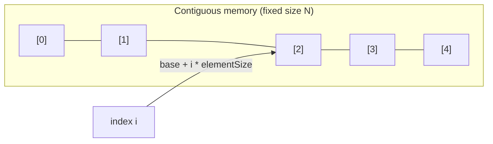
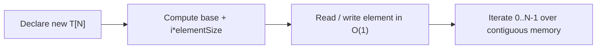

# Array

## Concept

An array is a fixed-size, contiguous block of memory holding elements of the same type, laid out one after another. Because the storage is contiguous, the address of element `i` is `base + i * sizeof(T)`, so any element can be read or written in constant time by index. In Java the length is fixed at creation time (`new int[N]`), which means you cannot grow or shrink it. Arrays excel when you know the element count up front and want zero-overhead, cache-friendly random access. They are a poor fit when you must insert or remove in the middle, since that requires shifting all subsequent elements.

## Mermaid



## Complexity

| Operation            | Time   | Notes                                        |
|----------------------|--------|----------------------------------------------|
| Access by index      | O(1)   | direct address arithmetic                    |
| Search (unsorted)    | O(n)   | must scan; O(log n) if sorted + binary search|
| Insert at end        | n/a    | fixed size; cannot grow                       |
| Insert/delete middle | O(n)   | requires shifting elements (size fixed)       |

- Space: O(n) for n elements, no per-element overhead.

## Java Code

```java
import java.util.Arrays;

public class ArrayDemo {
    public static void main(String[] args) {
        // A Java array is a fixed-size array (length set at creation).
        int[] a = {10, 20, 30, 40, 50};

        // O(1) random access by index.
        int third = a[2];                 // 30
        a[2] = 99;                        // overwrite in place, O(1)

        // Indexing is bounds-checked: out-of-range throws
        // ArrayIndexOutOfBoundsException.
        int safe = a[0];                  // 10

        // length is a final field on the array, available in O(1).
        int n = a.length;                 // 5

        // Iterate over contiguous storage.
        for (int i = 0; i < n; i++) {
            System.out.print(a[i] + " ");  // 10 20 99 40 50
        }
        System.out.println("\nthird=" + third + " safe=" + safe);
        System.out.println(Arrays.toString(a));
    }
}
```

## Mini Usage Example

```java
int[] data = {4, 2, 8, 1};
data[1] = 7;                 // O(1) update -> {4, 7, 8, 1}
int x = data[3];             // bounds-checked read -> 1
```

## Code Snippet Flow


