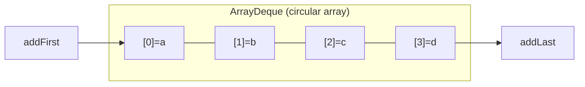
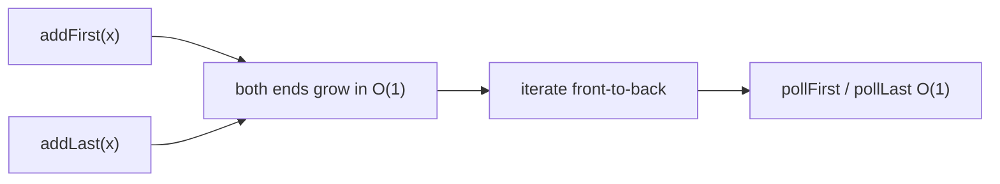

# Deque

## Concept

A deque (double-ended queue, pronounced "deck") is a sequence container that supports fast insertion and removal at both the front and the back in amortized O(1). Java's `ArrayDeque` implements this with a growable circular array: a backing array plus head and tail indices that wrap around, so it can grow at either end without shifting all elements. Note that, unlike C++'s `std::deque`, `ArrayDeque` does not offer indexed access (`get(i)`) in O(1); if you need both indexed access and growth use an `ArrayList`. Choose an `ArrayDeque` when you need queue-like or stack-like behavior at both ends; it is the recommended backing store for both stacks and queues in Java.

## Mermaid



## Complexity

| Operation                | Time           | Notes                              |
|--------------------------|----------------|------------------------------------|
| Access by index          | n/a            | ArrayDeque has no indexed get; use ArrayList |
| addFirst / addLast       | amortized O(1) | grows at either end, no full shift |
| pollFirst / pollLast     | O(1)           | removes at either end              |
| Insert/remove middle     | O(n)           | not a primary deque operation      |

- Space: O(n), with some slack in the circular array.

## Java Code

```java
import java.util.ArrayDeque;
import java.util.Deque;

public class DequeDemo {
    public static void main(String[] args) {
        Deque<Integer> d = new ArrayDeque<>();

        d.addLast(20);             // [20]
        d.addLast(30);             // [20, 30]
        d.addFirst(10);            // [10, 20, 30]  -- O(1) at the front
        d.addFirst(5);             // [5, 10, 20, 30]

        System.out.println("front=" + d.peekFirst() + " back=" + d.peekLast());  // 5, 30

        d.pollFirst();             // [10, 20, 30]
        d.pollLast();              // [10, 20]

        for (int x : d) System.out.print(x + " ");     // 10 20
        System.out.println("\nsize=" + d.size());
    }
}
```

## Mini Usage Example

```java
Deque<Integer> window = new ArrayDeque<>();
window.addLast(1);
window.addLast(2);
window.addFirst(0);   // {0, 1, 2}
window.pollLast();    // {0, 1}  -- cheap at both ends
```

## Code Snippet Flow


