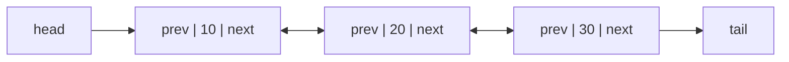
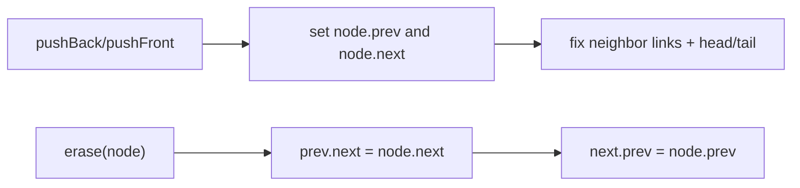

# Doubly Linked List

## Concept

A doubly linked list is a chain of nodes where each node stores a value plus two references: one to the next node and one to the previous node. The two-way links let you traverse in either direction and, crucially, remove a node in O(1) given only a reference to that node, because you can reach both of its neighbors directly. The list keeps a head and a tail reference, so insertion at either end is O(1). The cost over a singly linked list is an extra reference per node and a little more bookkeeping when rewiring. This is the structure behind Java's `LinkedList` and is ideal when you insert/remove at both ends or at arbitrary held positions.

## Mermaid



## Complexity

| Operation                | Time | Notes                                       |
|--------------------------|------|---------------------------------------------|
| Access / search by value | O(n) | traverse from head or tail                   |
| Insert at front or back  | O(1) | head/tail references maintained             |
| Insert before/after node | O(1) | rewire prev/next of neighbors               |
| Delete a known node      | O(1) | both neighbors reachable directly           |

- Space: O(n) values plus two references of overhead per node.

## Java Code

```java
public class DoublyLinkedList {

    static class Node {
        int value;
        Node prev;
        Node next;
        Node(int v) { this.value = v; this.prev = null; this.next = null; }
    }

    private Node head = null;
    private Node tail = null;

    // Append at the back: O(1).
    void pushBack(int v) {
        Node n = new Node(v);
        n.prev = tail;
        if (tail != null) tail.next = n; else head = n;   // link old tail or set head
        tail = n;
    }

    // Prepend at the front: O(1).
    void pushFront(int v) {
        Node n = new Node(v);
        n.next = head;
        if (head != null) head.prev = n; else tail = n;
        head = n;
    }

    // Remove a node we already hold: O(1) (no traversal needed).
    void erase(Node n) {
        if (n == null) return;
        if (n.prev != null) n.prev.next = n.next; else head = n.next;
        if (n.next != null) n.next.prev = n.prev; else tail = n.prev;
    }

    Node find(int v) {
        for (Node cur = head; cur != null; cur = cur.next)
            if (cur.value == v) return cur;
        return null;
    }

    void print() {
        StringBuilder sb = new StringBuilder();
        for (Node cur = head; cur != null; cur = cur.next) sb.append(cur.value).append(" <-> ");
        sb.append("null");
        System.out.println(sb);
    }

    public static void main(String[] args) {
        DoublyLinkedList list = new DoublyLinkedList();
        list.pushBack(20);
        list.pushBack(30);
        list.pushFront(10);          // 10 <-> 20 <-> 30
        list.erase(list.find(20));   // 10 <-> 30  (O(1) unlink)
        list.print();
    }
}
```

## Mini Usage Example

```java
DoublyLinkedList list = new DoublyLinkedList();
list.pushBack(1);
list.pushFront(0);      // 0 <-> 1
DoublyLinkedList.Node mid = list.find(1);
list.erase(mid);        // 0   (O(1) removal of a held node)
```

## Code Snippet Flow


