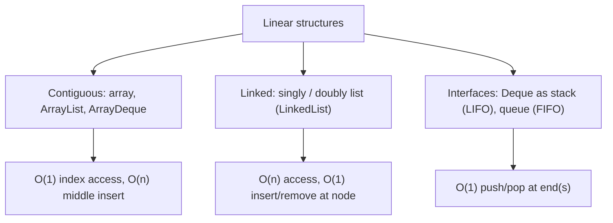
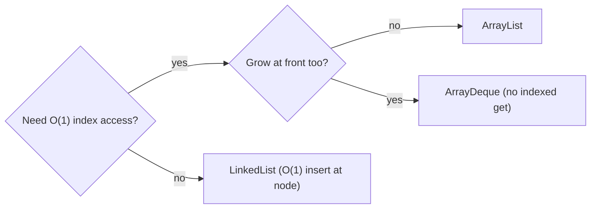

# Linear Complexity Table

## Concept

This reference compares the linear (sequence) data structures from this chapter so you can pick the right one by its operation costs. The fundamental trade-off is contiguous storage (arrays, ArrayList, ArrayDeque) versus linked nodes (linked lists). Contiguous containers give O(1) indexed access but pay O(n) to insert or remove in the middle; linked structures give O(1) insertion/removal at a held node but O(n) access. Interfaces like `Deque` restrict usage to O(1) end operations when you want strict stack or queue behavior. Use this table to match access patterns to the cheapest structure.

## Mermaid



## Complexity

| Structure          | Access | Search | Insert (front) | Insert (back)   | Insert (middle) | Delete (middle) | Notes                                  |
|--------------------|--------|--------|----------------|-----------------|-----------------|-----------------|----------------------------------------|
| Array (fixed)      | O(1)   | O(n)   | n/a            | n/a             | O(n)            | O(n)            | fixed length; no growth                |
| ArrayList          | O(1)   | O(n)   | O(n)           | amortized O(1)  | O(n)            | O(n)            | contiguous; geometric growth           |
| ArrayDeque         | n/a    | O(n)   | amortized O(1) | amortized O(1)  | O(n)            | O(n)            | fast at both ends; circular array, no indexed get |
| Singly linked list | O(n)   | O(n)   | O(1)           | O(1) w/ tail ref| O(1) at node    | O(1) at node    | find is O(n); 1 reference/node         |
| Doubly linked list (LinkedList) | O(n)   | O(n)   | O(1)           | O(1)            | O(1) at node    | O(1) at node    | bidirectional; 2 references/node       |
| Deque as stack     | O(1)*  | O(n)   | --             | O(1) push       | --              | O(1) pop top    | *top only; LIFO                        |
| Deque as queue     | O(1)*  | O(n)   | O(1) poll front| O(1) add back   | --              | --              | *front/back only; FIFO                 |

- Space: all O(n); linked lists add per-node reference overhead.

## Java Code

```java
// Picking a structure by access pattern:
import java.util.ArrayList;
import java.util.ArrayDeque;
import java.util.LinkedList;
import java.util.List;
import java.util.Deque;

class Chooser {
    void chooseByPattern() {
        List<Integer>  v = new ArrayList<>();    // need indexed access + grow at the end
        Deque<Integer> d = new ArrayDeque<>();   // need fast push/pop at BOTH ends
        List<Integer>  l = new LinkedList<>();   // need O(1) insert/remove at held positions
        Deque<Integer> s = new ArrayDeque<>();   // need strict LIFO (push/pop)
        Deque<Integer> q = new ArrayDeque<>();   // need strict FIFO (addLast/pollFirst)
    }
}
```

## Mini Usage Example

```java
// "Many inserts/removals at known list positions?" -> LinkedList (O(1) at node).
// "Random index reads, append-heavy?"              -> ArrayList (O(1) access).
// "Sliding window from both ends?"                 -> ArrayDeque.
```

## Code Snippet Flow


