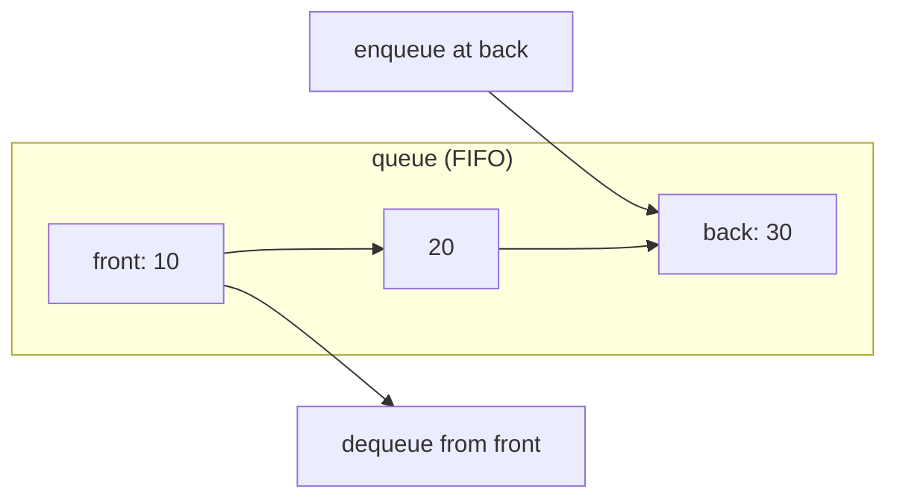
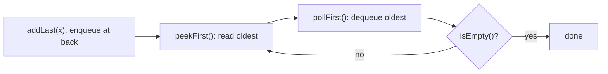

# Queue

## Concept

A queue is a FIFO (first-in, first-out) container: elements leave in the same order they arrived. You enqueue at the back and dequeue from the front, and you can inspect both ends, all in O(1). In Java the `Queue`/`Deque` interfaces describe this behavior, and `ArrayDeque` is the recommended implementation (`addLast`/`offer` to enqueue, `pollFirst`/`poll` to dequeue, `peekFirst`/`peek` to inspect). Queues model order-preserving pipelines: task schedulers, message buffers, and breadth-first traversal.

## Mermaid



## Complexity

| Operation     | Time | Notes                         |
|---------------|------|-------------------------------|
| add (enqueue) | O(1) | adds at back                  |
| poll (dequeue)| O(1) | removes from front            |
| peek / peekLast| O(1) | inspect either end            |
| search        | O(n) | not a queue operation         |

- Space: O(n) for n elements.

## Java Code

```java
import java.util.ArrayDeque;
import java.util.Deque;

public class QueueDemo {
    public static void main(String[] args) {
        Deque<Integer> q = new ArrayDeque<>();   // FIFO via Deque

        q.addLast(10);             // back -> [10]
        q.addLast(20);             // [10, 20]
        q.addLast(30);             // [10, 20, 30]

        System.out.println("front=" + q.peekFirst());   // 10 (oldest)
        System.out.println("back="  + q.peekLast());     // 30 (newest)

        q.pollFirst();             // remove front (10) -> [20, 30]
        System.out.println("front=" + q.peekFirst());    // 20

        // Drain in FIFO order: prints 20 then 30.
        while (!q.isEmpty()) {
            System.out.print(q.pollFirst() + " ");
        }
        System.out.println("\nsize=" + q.size());   // 0
    }
}
```

## Mini Usage Example

```java
Deque<String> tasks = new ArrayDeque<>();
tasks.addLast("build");
tasks.addLast("test");
String next = tasks.peekFirst();   // "build" (arrived first)
tasks.pollFirst();                 // now front is "test"
```

## Code Snippet Flow


