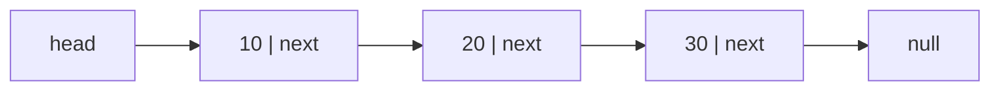
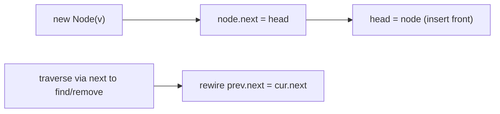

# Singly Linked List

## Concept

A singly linked list stores elements in separately allocated nodes, where each node holds a value and a reference to the next node; the last node references null. Unlike an array the nodes are not contiguous, so there is no index arithmetic and reaching the i-th element requires walking the chain (O(n)). The payoff is O(1) insertion and deletion once you already hold a reference to the relevant node, with no element shifting. A head reference marks the front of the list. Use it when you frequently insert or remove at the front (or at a known node) and rarely need random access.

## Mermaid



## Complexity

| Operation              | Time   | Notes                                          |
|------------------------|--------|------------------------------------------------|
| Access / search by value | O(n) | must traverse from head                        |
| Insert at front        | O(1)   | new node points to old head                    |
| Insert after known node| O(1)   | rewire two next references                      |
| Delete known/front node| O(1)   | (finding the node is O(n))                      |

- Space: O(n) values plus one reference of overhead per node.

## Java Code

```java
public class SinglyLinkedList {

    // A node holds a value and a reference to the next node.
    static class Node {
        int value;
        Node next;
        Node(int v) { this.value = v; this.next = null; }
    }

    private Node head = null;

    // Insert at the front: O(1).
    void pushFront(int v) {
        Node n = new Node(v);
        n.next = head;                    // new node points to old head
        head = n;                         // head now points to new node
    }

    // Find first node with a given value: O(n).
    Node find(int v) {
        for (Node cur = head; cur != null; cur = cur.next)
            if (cur.value == v) return cur;
        return null;
    }

    // Remove first node equal to v: O(n) to find, O(1) to unlink.
    boolean remove(int v) {
        Node prev = null;
        for (Node cur = head; cur != null; prev = cur, cur = cur.next) {
            if (cur.value == v) {
                if (prev == null) head = cur.next;   // unlink head
                else prev.next = cur.next;           // unlink interior node
                return true;
            }
        }
        return false;
    }

    void print() {
        StringBuilder sb = new StringBuilder();
        for (Node cur = head; cur != null; cur = cur.next) sb.append(cur.value).append(" -> ");
        sb.append("null");
        System.out.println(sb);
    }

    public static void main(String[] args) {
        SinglyLinkedList list = new SinglyLinkedList();
        list.pushFront(30);
        list.pushFront(20);
        list.pushFront(10);     // 10 -> 20 -> 30 -> null
        list.remove(20);        // 10 -> 30 -> null
        list.print();
        System.out.println(list.find(30) != null ? "found 30" : "missing");
    }
}
```

## Mini Usage Example

```java
SinglyLinkedList list = new SinglyLinkedList();
list.pushFront(5);      // 5 -> null
list.pushFront(7);      // 7 -> 5 -> null
boolean removed = list.remove(5);  // 7 -> null, removed == true
```

## Code Snippet Flow


