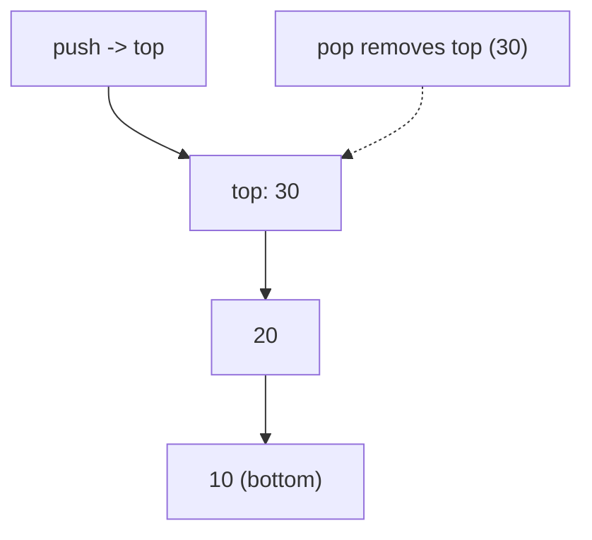
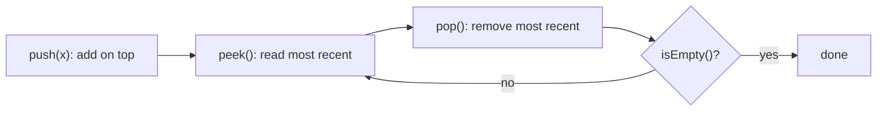

# Stack

## Concept

A stack is a LIFO (last-in, first-out) container: the only element you can read or remove is the one most recently added (the top). Its three core operations are push (add on top), pop (remove the top), and peek (inspect the top), all in O(1). In Java the recommended LIFO container is `ArrayDeque` used through the `Deque` interface (`push`, `pop`, `peek`); the legacy `java.util.Stack` class is synchronized and extends `Vector`, so it is discouraged for new code. Stacks model anything with nested or reversed order: function call frames, undo histories, expression evaluation, and depth-first traversal.

## Mermaid



## Complexity

| Operation   | Time | Notes                          |
|-------------|------|--------------------------------|
| push        | O(1) | amortized (adds to top)        |
| pop         | O(1) | removes top                    |
| peek        | O(1) | reads top without removing     |
| search      | O(n) | not a stack operation by design|

- Space: O(n) for n elements.

## Java Code

```java
import java.util.ArrayDeque;
import java.util.Deque;

public class StackDemo {
    public static void main(String[] args) {
        Deque<Integer> s = new ArrayDeque<>();   // LIFO via Deque, push/pop at head

        s.push(10);                // [10]
        s.push(20);                // [20, 10]
        s.push(30);                // [30, 20, 10]  (30 on top)

        System.out.println("top=" + s.peek());   // 30 (peek, no removal)

        s.pop();                   // remove 30 -> [20, 10]
        System.out.println("top=" + s.peek());   // 20

        // Drain the stack in LIFO order: prints 20 then 10.
        while (!s.isEmpty()) {
            System.out.print(s.pop() + " ");
        }
        System.out.println("\nsize=" + s.size());   // 0
    }
}
```

## Mini Usage Example

```java
Deque<Character> s = new ArrayDeque<>();
s.push('a');
s.push('b');
char t = s.peek();   // 'b' (most recent)
s.pop();             // back to ['a']
```

## Code Snippet Flow


