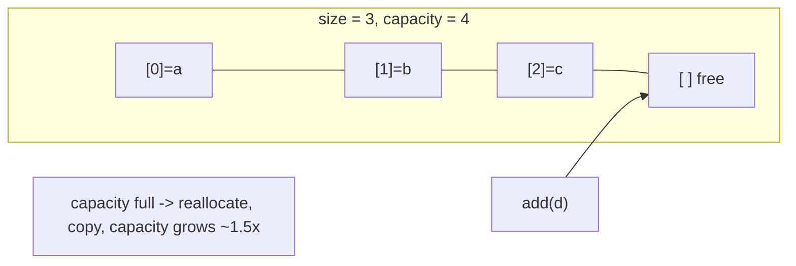
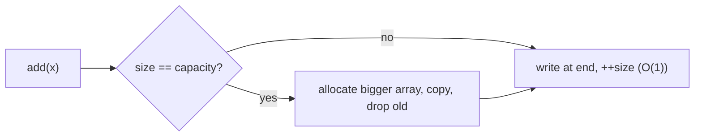

# Vector

## Concept

`ArrayList` is Java's dynamic array: a contiguous, resizable buffer that grows automatically as you append elements. Like a plain array it gives O(1) random access by index, but it also owns its backing array and can reallocate to a larger one when it runs out of capacity. To keep appends cheap, it grows its capacity geometrically (roughly 1.5x in the HotSpot implementation), which makes `add` amortized O(1) even though an individual reallocation copies all elements. Inserting or removing in the middle is O(n) because the tail must be shifted. Use an `ArrayList` as your default sequence container whenever you need indexed access plus the ability to grow.

## Mermaid



## Complexity

| Operation              | Time            | Notes                                       |
|------------------------|-----------------|---------------------------------------------|
| Access by index        | O(1)            | contiguous storage                          |
| Search (unsorted)      | O(n)            | linear scan                                 |
| add / remove last      | amortized O(1)  | occasional O(n) reallocation, geometric grow|
| Insert/remove middle   | O(n)            | shifts trailing elements                    |

- Space: O(n); capacity may exceed size, so some slack memory is reserved.

## Java Code

```java
import java.util.ArrayList;
import java.util.List;

public class VectorDemo {
    public static void main(String[] args) {
        // ensureCapacity pre-allocates the backing array to avoid reallocations.
        ArrayList<Integer> v = new ArrayList<>();
        v.ensureCapacity(8);

        v.add(10);                 // append at end, amortized O(1)
        v.add(20);
        v.add(30);                 // v = [10, 20, 30]

        v.set(0, 11);              // O(1) indexed update -> [11, 20, 30]

        // Insert in the middle: O(n), shifts later elements right.
        v.add(1, 15);              // [11, 15, 20, 30]

        // Remove from the middle: O(n), shifts later elements left.
        v.remove(2);               // [11, 15, 30] (removes index 2)

        v.remove(v.size() - 1);    // remove last, O(1) -> [11, 15]

        System.out.println("front=" + v.get(0) + " back=" + v.get(v.size() - 1));
        System.out.println("size=" + v.size());
        for (int x : v) System.out.print(x + " ");   // 11 15
        System.out.println();
    }
}
```

## Mini Usage Example

```java
List<Integer> data = new ArrayList<>(List.of(4, 2, 8, 1));
data.add(9);            // [4, 2, 8, 1, 9]
data.add(0, 0);         // [0, 4, 2, 8, 1, 9], O(n)
int n = data.size();    // 6
```

## Code Snippet Flow


