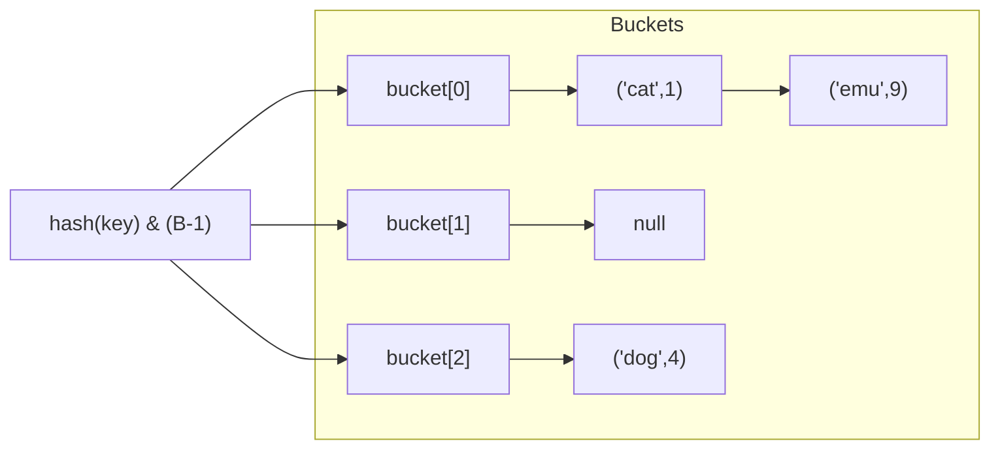
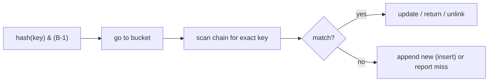

# Hash Table Chaining

## Concept

A hash table with separate chaining stores key-value pairs in an array of buckets, where a hash function maps each key to a bucket index. When two keys hash to the same bucket (a collision), they are stored together in a per-bucket linked list (the "chain"). Lookup hashes the key to find its bucket, then scans that short chain for an exact match. With a good hash function and a bounded load factor (entries / buckets), chains stay short and search, insert, and delete are all average O(1); the worst case degrades to O(n) if every key lands in one bucket. Chaining handles high load factors gracefully and never "fills up." Use it as a general-purpose associative store.

## Mermaid



## Complexity

| Operation | Average | Worst | Notes                                  |
|-----------|---------|-------|----------------------------------------|
| Search    | O(1)    | O(n)  | O(1 + load factor) expected            |
| Insert    | O(1)    | O(n)  | append to bucket chain                  |
| Delete    | O(1)    | O(n)  | scan chain, unlink node                 |

- Space: O(n + B) for n entries and B buckets.

## Java Code

```java
import java.util.ArrayList;
import java.util.LinkedList;
import java.util.List;
import java.util.Optional;

// Separate-chaining hash table: array of buckets, each a list of (key,value).
public class HashTable {
    private record Entry(String key, int value) {}

    private final List<LinkedList<Entry>> buckets;
    private int count;

    public HashTable() { this(8); }

    public HashTable(int b) {
        buckets = new ArrayList<>(b);
        for (int i = 0; i < b; i++) buckets.add(new LinkedList<>());
        count = 0;
    }

    private int indexFor(String key) {
        return (key.hashCode() & 0x7fffffff) % buckets.size();   // map key -> bucket
    }

    // Insert or update: O(1) average.
    public void put(String key, int value) {
        LinkedList<Entry> chain = buckets.get(indexFor(key));
        for (int i = 0; i < chain.size(); i++) {
            if (chain.get(i).key().equals(key)) {                // update
                chain.set(i, new Entry(key, value));
                return;
            }
        }
        chain.add(new Entry(key, value));                        // new key
        count++;
    }

    // Lookup: hash to bucket, scan its chain. O(1) average.
    public Optional<Integer> get(String key) {
        LinkedList<Entry> chain = buckets.get(indexFor(key));
        for (Entry kv : chain) {
            if (kv.key().equals(key)) return Optional.of(kv.value());
        }
        return Optional.empty();
    }

    // Delete: unlink the matching node from its chain. O(1) average.
    public boolean erase(String key) {
        LinkedList<Entry> chain = buckets.get(indexFor(key));
        var it = chain.iterator();
        while (it.hasNext()) {
            if (it.next().key().equals(key)) { it.remove(); count--; return true; }
        }
        return false;
    }

    public int size() { return count; }

    public static void main(String[] args) {
        HashTable t = new HashTable();
        t.put("cat", 1);
        t.put("dog", 4);
        t.put("cat", 7);          // updates existing key

        t.get("cat").ifPresent(v -> System.out.println("cat=" + v));   // cat=7
        t.erase("dog");
        System.out.println("size=" + t.size());                        // 1
    }
}
```

## Mini Usage Example

```java
HashTable counts = new HashTable();
counts.put("apple", 3);
Optional<Integer> n = counts.get("apple");   // n.isPresent() == true, n.get() == 3
```

## Code Snippet Flow


